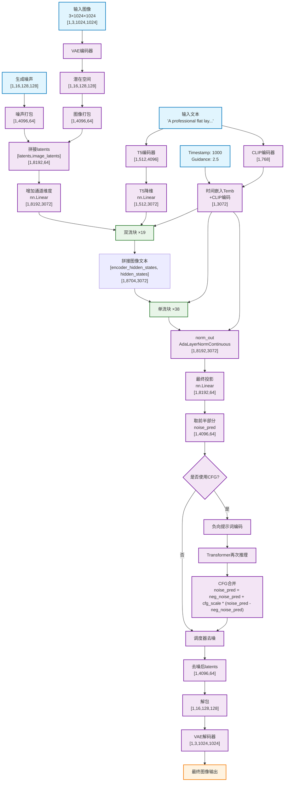
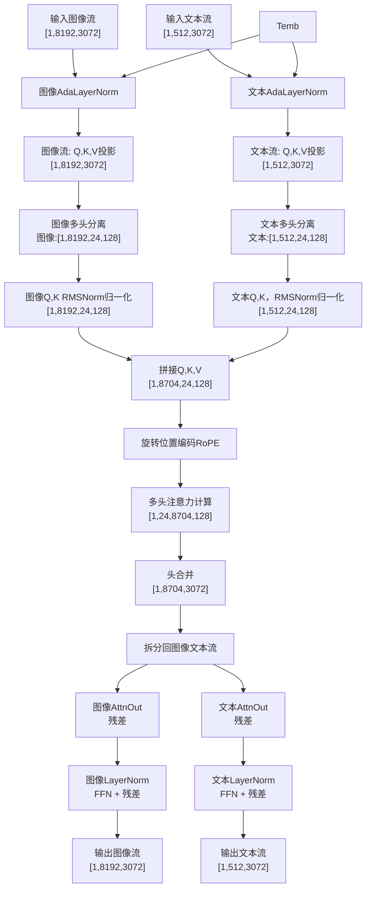
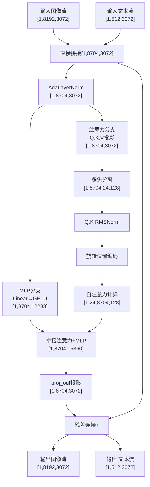

# MultiMidea多模态

# Flux Kontext 图生图(图像编辑)

## 三大组件

- text_encoder  文本编码
- Transformer or Unet  迭代去噪过程
- vae  （分为两个部分 encoder和decoder） encoder将图像压缩到潜在空间latent   decoder将latent恢复为图像

## 参数设置

假设输入图像的尺寸为3 * 512 * 512，输入文本长度为100，潜在空间latent尺寸为4 * 128 * 128

batchsize设置为4

训练数据对：原始图： condition_image  文本：prompt  目标图 target_image

## 训练过程

### 1.数据集加载 取出第一个batch

condition_image : [4, 3, 512, 512]

Target_image: [4 , 3, 512, 512]

prompt: list[str]  [4, 100]  假设所有长度都是100

### 2.编码所有输入信息

#### Text_encoder

- Clip  输入长度最大支持77  输出为768 对整个句子给出一个一维编码
  - 通过分词器 tokenizer 查词表 vocab，获取每个token的编码 例如长为100的输入，分词后不够77 通过 pad补 超出截断
  - 输入 [4, 77] 输出 [4, 768]
- T5   输入长度上限512  对每一个token进行编码，维度4096
  - 输入长度[4, 512]
  - 输出 [4, 512 ,4096]

```Plain
[步骤 1/4] 正在加载分词器...
You set `add_prefix_space`. The tokenizer needs to be converted from the slow tokenizers
分词器加载完成。

[步骤 2/4] 正在加载文本编码器模型 (可能需要一些时间)...
You are using a model of type clip_text_model to instantiate a model of type . This is not supported for all configurations of models and can yield errors.
You are using a model of type t5 to instantiate a model of type . This is not supported for all configurations of models and can yield errors.
Loading checkpoint shards: 100%|████████████████████████████████████████████████████████████████████████████████| 2/2 [00:01<00:00,  1.50it/s]
文本编码器加载完成并已移动到设备。

[步骤 3/4] 使用示例文本进行编码测试...
示例文本: '
Transform the input photo of a person wearing clothes into a professional flat lay product shot.

Extract only the clothing (top + pants set, or a single dress). Ignore body, background, shoes, jewelry, bags, and all other items.

Virtually flatten the garment: remove perspective distortion, complete hidden parts, keep contours, prints, and design features accurate and symmetrical.

Output a clean, commercial-grade image: perfectly front-facing, flat, sharp details, correct colors, with soft studio lighting.

Background must be pure white (#FFFFFF) or transparent PNG (preferred). No human remnants or AI artifacts.
'

==================================================
--- 测试第一个文本编码器 (CLIP-L) ---
==================================================

--- [输入 Token IDs] ---
输入形状: torch.Size([1, 77])
tensor([[49406, 12288,   518, 16952,  1125,   539,   320,  2533,  3309,  7080,
          1095,   320,  4774,  6313,  6360,  4306,  2000,   269, 18962,  1033,
           518,  7425,   263,  1253,   266,  5003,  1167,   267,   541,   320,
          2688,  2595,  1818, 12304,  1774,   267,  5994,   267,  4079,   267,
          6039,   267,  6136,   267,   537,   615,  1010,  6207,   269, 22475,
          1082, 32408,   518, 31418,   281,  9709,  8996, 43690,   267,  3263,
          7029,  5149,   267,  1726,  2036,  1491,   267,  7704,   267,   537,
          1681,  4643,  8858,   537,  3645, 40704, 49407]])

--- [分词详情] ---
00: '<|startoftext|>' -> 49406
01: 'transform</w>' -> 12288
02: 'the</w>' -> 518
03: 'input</w>' -> 16952
04: 'photo</w>' -> 1125
05: 'of</w>' -> 539
06: 'a</w>' -> 320
07: 'person</w>' -> 2533
08: 'wearing</w>' -> 3309
09: 'clothes</w>' -> 7080
10: 'into</w>' -> 1095
11: 'a</w>' -> 320
12: 'professional</w>' -> 4774
13: 'flat</w>' -> 6313
14: 'lay</w>' -> 6360
15: 'product</w>' -> 4306
16: 'shot</w>' -> 2000
17: '.</w>' -> 269
18: 'extract</w>' -> 18962
19: 'only</w>' -> 1033
20: 'the</w>' -> 518
21: 'clothing</w>' -> 7425
22: '(</w>' -> 263
23: 'top</w>' -> 1253
24: '+</w>' -> 266
25: 'pants</w>' -> 5003
26: 'set</w>' -> 1167
27: ',</w>' -> 267
28: 'or</w>' -> 541
29: 'a</w>' -> 320
30: 'single</w>' -> 2688
31: 'dress</w>' -> 2595
32: ').</w>' -> 1818
33: 'ignore</w>' -> 12304
34: 'body</w>' -> 1774
35: ',</w>' -> 267
36: 'background</w>' -> 5994
37: ',</w>' -> 267
38: 'shoes</w>' -> 4079
39: ',</w>' -> 267
40: 'jewelry</w>' -> 6039
41: ',</w>' -> 267
42: 'bags</w>' -> 6136
43: ',</w>' -> 267
44: 'and</w>' -> 537
45: 'all</w>' -> 615
46: 'other</w>' -> 1010
47: 'items</w>' -> 6207
48: '.</w>' -> 269
49: 'virtually</w>' -> 22475
50: 'fl' -> 1082
51: 'atten</w>' -> 32408
52: 'the</w>' -> 518
53: 'garment</w>' -> 31418
54: ':</w>' -> 281
55: 'remove</w>' -> 9709
56: 'perspective</w>' -> 8996
57: 'distortion</w>' -> 43690
58: ',</w>' -> 267
59: 'complete</w>' -> 3263
60: 'hidden</w>' -> 7029
61: 'parts</w>' -> 5149
62: ',</w>' -> 267
63: 'keep</w>' -> 1726
64: 'cont' -> 2036
65: 'ours</w>' -> 1491
66: ',</w>' -> 267
67: 'prints</w>' -> 7704
68: ',</w>' -> 267
69: 'and</w>' -> 537
70: 'design</w>' -> 1681
71: 'features</w>' -> 4643
72: 'accurate</w>' -> 8858
73: 'and</w>' -> 537
74: 'sym' -> 3645
75: 'metrical</w>' -> 40704
76: '<|endoftext|>' -> 49407

--- [输出 Embeddings] ---
1. 池化嵌入 (Pooled Embeds): 代表整个句子的宏观语义
   - 形状: torch.Size([1, 768])
2. 词元嵌入 (Token Embeds): 代表句子中每个词元的详细语义
   - 形状: torch.Size([1, 77, 768])

==================================================
--- 测试第二个文本编码器 (T5) ---
==================================================

--- [输入 Token IDs] ---
输入形状: torch.Size([1, 512])
tensor([[ 4946,  2032,     8,  3785,  1202,    13,     3,     9,   568,  5119,
          4954,   139,     3,     9,   771,  2667,  8260,   556,  2538,     5,
         18742,   163,     8,  5698,    41,  2916,  1768, 12792,   356,     6,
            42,     3,     9,   712,  3270,   137,    27,  6715,    60,   643,
             6,  2458,     6,  4439,     6,  8064,     6,  5621,     6,    11,
            66,   119,  1173,     5, 11143,   120,  2667,   324,     8, 15885,
            10,  2036,  3503, 26095,     6,   743,  5697,  1467,     6,   453,
         17643,     7,     6, 11384,     6,    11,   408,   753,  4034,    11,
             3, 23596,   138,     5,  3387,  2562,     3,     9,  1349,     6,
          1328,    18,  6801,  1023,    10,  3923,   851,    18, 20490,     6,
          2667,     6,  4816,  1030,     6,  2024,  2602,     6,    28,  1835,
          3100,  3598,     5, 23023,   398,    36,  4621,   872,    41,  4663,
          9089,  9089,  9089,    61,    42,  7237,   276, 12531,    41,   102,
          4822,   137,   465,   936, 28447,     7,    42,  7833,   768,    23,
          8717,     7,     5,     1,     0,     0,     0,     0,     0,     0,
             0,     0,     0,     0,     0,     0,     0,     0,     0,     0,
             0,     0,     0,     0,     0,     0,     0,     0,     0,     0,
             0,     0,     0,     0,     0,     0,     0,     0,     0,     0,
             0,     0,     0,     0,     0,     0,     0,     0,     0,     0,
             0,     0,     0,     0,     0,     0,     0,     0,     0,     0,
             0,     0,     0,     0,     0,     0,     0,     0,     0,     0,
             0,     0,     0,     0,     0,     0,     0,     0,     0,     0,
             0,     0,     0,     0,     0,     0,     0,     0,     0,     0,
             0,     0,     0,     0,     0,     0,     0,     0,     0,     0,
             0,     0,     0,     0,     0,     0,     0,     0,     0,     0,
             0,     0,     0,     0,     0,     0,     0,     0,     0,     0,
             0,     0,     0,     0,     0,     0,     0,     0,     0,     0,
             0,     0,     0,     0,     0,     0,     0,     0,     0,     0,
             0,     0,     0,     0,     0,     0,     0,     0,     0,     0,
             0,     0,     0,     0,     0,     0,     0,     0,     0,     0,
             0,     0,     0,     0,     0,     0,     0,     0,     0,     0,
             0,     0,     0,     0,     0,     0,     0,     0,     0,     0,
             0,     0,     0,     0,     0,     0,     0,     0,     0,     0,
             0,     0,     0,     0,     0,     0,     0,     0,     0,     0,
             0,     0,     0,     0,     0,     0,     0,     0,     0,     0,
             0,     0,     0,     0,     0,     0,     0,     0,     0,     0,
             0,     0,     0,     0,     0,     0,     0,     0,     0,     0,
             0,     0,     0,     0,     0,     0,     0,     0,     0,     0,
             0,     0,     0,     0,     0,     0,     0,     0,     0,     0,
             0,     0,     0,     0,     0,     0,     0,     0,     0,     0,
             0,     0,     0,     0,     0,     0,     0,     0,     0,     0,
             0,     0,     0,     0,     0,     0,     0,     0,     0,     0,
             0,     0,     0,     0,     0,     0,     0,     0,     0,     0,
             0,     0,     0,     0,     0,     0,     0,     0,     0,     0,
             0,     0,     0,     0,     0,     0,     0,     0,     0,     0,
             0,     0,     0,     0,     0,     0,     0,     0,     0,     0,
             0,     0,     0,     0,     0,     0,     0,     0,     0,     0,
             0,     0,     0,     0,     0,     0,     0,     0,     0,     0,
             0,     0,     0,     0,     0,     0,     0,     0,     0,     0,
             0,     0,     0,     0,     0,     0,     0,     0,     0,     0,
             0,     0,     0,     0,     0,     0,     0,     0,     0,     0,
             0,     0]])

--- [分词详情] ---
000: '▁Trans' -> 4946
001: 'form' -> 2032
002: '▁the' -> 8
003: '▁input' -> 3785
004: '▁photo' -> 1202
005: '▁of' -> 13
006: '▁' -> 3
007: 'a' -> 9
008: '▁person' -> 568
009: '▁wearing' -> 5119
010: '▁clothes' -> 4954
011: '▁into' -> 139
012: '▁' -> 3
013: 'a' -> 9
014: '▁professional' -> 771
015: '▁flat' -> 2667
016: '▁lay' -> 8260
017: '▁product' -> 556
018: '▁shot' -> 2538
019: '.' -> 5
020: '▁Extract' -> 18742
021: '▁only' -> 163
022: '▁the' -> 8
023: '▁clothing' -> 5698
024: '▁(' -> 41
025: 'top' -> 2916
026: '▁+' -> 1768
027: '▁pants' -> 12792
028: '▁set' -> 356
029: ',' -> 6
030: '▁or' -> 42
031: '▁' -> 3
032: 'a' -> 9
033: '▁single' -> 712
034: '▁dress' -> 3270
035: ').' -> 137
036: '▁I' -> 27
037: 'gno' -> 6715
038: 're' -> 60
039: '▁body' -> 643
040: ',' -> 6
041: '▁background' -> 2458
042: ',' -> 6
043: '▁shoes' -> 4439
044: ',' -> 6
045: '▁jewelry' -> 8064
046: ',' -> 6
047: '▁bags' -> 5621
048: ',' -> 6
049: '▁and' -> 11
050: '▁all' -> 66
051: '▁other' -> 119
052: '▁items' -> 1173
053: '.' -> 5
054: '▁Virtual' -> 11143
055: 'ly' -> 120
056: '▁flat' -> 2667
057: 'ten' -> 324
058: '▁the' -> 8
059: '▁garment' -> 15885
060: ':' -> 10
061: '▁remove' -> 2036
062: '▁perspective' -> 3503
063: '▁distortion' -> 26095
064: ',' -> 6
065: '▁complete' -> 743
066: '▁hidden' -> 5697
067: '▁parts' -> 1467
068: ',' -> 6
069: '▁keep' -> 453
070: '▁contour' -> 17643
071: 's' -> 7
072: ',' -> 6
073: '▁prints' -> 11384
074: ',' -> 6
075: '▁and' -> 11
076: '▁design' -> 408
077: '▁features' -> 753
078: '▁accurate' -> 4034
079: '▁and' -> 11
080: '▁' -> 3
081: 'symmetric' -> 23596
082: 'al' -> 138
083: '.' -> 5
084: '▁Out' -> 3387
085: 'put' -> 2562
086: '▁' -> 3
087: 'a' -> 9
088: '▁clean' -> 1349
089: ',' -> 6
090: '▁commercial' -> 1328
091: '-' -> 18
092: 'grade' -> 6801
093: '▁image' -> 1023
094: ':' -> 10
095: '▁perfectly' -> 3923
096: '▁front' -> 851
097: '-' -> 18
098: 'facing' -> 20490
099: ',' -> 6
100: '▁flat' -> 2667
101: ',' -> 6
102: '▁sharp' -> 4816
103: '▁details' -> 1030
104: ',' -> 6
105: '▁correct' -> 2024
106: '▁colors' -> 2602
107: ',' -> 6
108: '▁with' -> 28
109: '▁soft' -> 1835
110: '▁studio' -> 3100
111: '▁lighting' -> 3598
112: '.' -> 5
113: '▁Background' -> 23023
114: '▁must' -> 398
115: '▁be' -> 36
116: '▁pure' -> 4621
117: '▁white' -> 872
118: '▁(' -> 41
119: '#' -> 4663
120: 'FF' -> 9089
121: 'FF' -> 9089
122: 'FF' -> 9089
123: ')' -> 61
124: '▁or' -> 42
125: '▁transparent' -> 7237
126: '▁P' -> 276
127: 'NG' -> 12531
128: '▁(' -> 41
129: 'p' -> 102
130: 'referred' -> 4822
131: ').' -> 137
132: '▁No' -> 465
133: '▁human' -> 936
134: '▁remnant' -> 28447
135: 's' -> 7
136: '▁or' -> 42
137: '▁AI' -> 7833
138: '▁art' -> 768
139: 'i' -> 23
140: 'fact' -> 8717
141: 's' -> 7
142: '.' -> 5
143: '</s>' -> 1
144: '<pad>' -> 0
145: '<pad>' -> 0
146: '<pad>' -> 0
147: '<pad>' -> 0
148: '<pad>' -> 0
149: '<pad>' -> 0
150: '<pad>' -> 0
151: '<pad>' -> 0
152: '<pad>' -> 0
153: '<pad>' -> 0
154: '<pad>' -> 0
...
505: '<pad>' -> 0
506: '<pad>' -> 0
507: '<pad>' -> 0
508: '<pad>' -> 0
509: '<pad>' -> 0
510: '<pad>' -> 0
511: '<pad>' -> 0

--- [输出 Embeddings] ---
1. 词元嵌入 (Token Embeds): 代表句子中每个词元的详细、深层语义
   - 形状: torch.Size([4, 512, 4096])
```

#### image_encoder

输入condition_image [4, 3, 512, 512]

使用VAE编码,下采样因子是8 ---->  512//8=64  ----> latent: [4, 16, 64, 64] ----> 归一化 [4, 16, 64, 64]

打包：Condition_input 将二维latent 转为1维 作为transformer输入 ---->输出 [4, 1024, 64]  [B, S, D]. 序列长度：将原图2x2的块作为一个token

- 序列长度S1024 = (64/ 2) * (64/ 2) =32* 32
- 维度D = latent通道数16 * 图块宽度 2* 图块高度 2 = 64

Image_ids ---> [4, 1024, 3]

### 3. 加噪声

对正确答案（目标图像）加噪声

Target_image  [4, 3 , 512, 512] ----> vae编码 [4, 16, 64, 64]  model_input

生成噪声 Noise [4, 16, 64, 64]

从[0, 1]随机采样一个噪声强度 [4, ]  sigma 假设是[0.1, 0.3, 0.5, 0.7]

Noise_input = (1-sigma)*target_image+ sigma * Noise  [4, 16, 64, 64]

打包：[4, 1024, 64]

Latent_ids---->[4, 1024, 3]

### 4. 正向推理

拼接All_input  [Noise_input, Condition_input]  ---> [4, 2048, 64]  dim=1

图像id拼接 [latent_ids, image_ids] dim=0

输入All_input+文本嵌入 --->model_pred [4, 2048,64]

Model_pred = model_pred[:, :1024] 只保留对噪声部分预测--> [4, 1024, 64]

解包---> [4, 16, 64, 64]

### 5.计算损失

target = model_input - noise

Loss = 带权重的MSE （model_pred, target)

## 推理过程

### 1.输入

condition_image: 输入图像 [1, 3, 512,512]

Prompt: list[str]

### 2.编码

文本编码：

- clip ---> [1, 768]
- T5 --->  [1, 512, 4096]

图像编码:

- vae编码+打包 image_latent ---> [1, 1024, 64]
- Image_ids: ----> [1, 1024, 3]

### 3.初始随机噪声

noise_latent: [1, 16, 64, 64]

### 4.迭代循环

按照调度器设置的时间步从t=1.0 到t =0 共20步 进行循环

每一个时间步 t中：

- 打包 noise_latent  [1, 16, 64, 64] ---> [1, 1024, 64]

- 创建Latent_ids : [1，1024， 3]

- 拼接输入 latents: [1, 2048, 64] 

- 调用transformer预测 [1, 2048, 64]

- 裁剪解包：[1, 1024, 64] ---> [1, 16, 64, 64] model_pred

- 更新Noise_latent = scheduler.step(model_pred, t, noise_latent)

  

### 5.vae解码

拿到干净的latent ---> [1, 3, 512, 512]

## 细节理解

SD3 / flux kontext: flow matching其他细节：

训练时，时间步有1000步，t=[0, 999] 假设t=0为清晰图像，t=999为纯噪声图像

训练时对于一张图像随机从[0,999]采样一个点作为当前输入，flow_matching学习当前噪声到清晰图像的向量

训练目标：对于一张图像，无论它被扔到[0, 999]任意的时间步上，即无论看到多大的噪声，都会学会预测正确的指令（从该点指向清晰图像的向量）

训练时候, [4, ]  [100, 200 ,300 ,400 ]. 

推理时，设置少量步数比如20步

从起点[999]出发，到达终点[0],调度器会规划出一条包含20个点的从999到0的路径，通常是非均匀间隔的，会在噪声等级高的地方采样频繁，从噪声等级低的地方少量采样

1000 //20 = 50

噪声更新公式：

$$x_{t-Δt} = x_t + v * Δt$$ 

$$Δt$$无单位，可以理解为比例，或者步长，如果Δt为1，则直接一步生成原图。实际为 10.05 走小步

t为[0, 999] t=0代表清晰图像 t=999 代表纯噪声       或者t= [0,1]

从 $ x_t $出发，$v$即transformer目标，表示从当前噪声到清晰图像的向量，可以理解为速度，$ Δt $是时间步长，是负数，时间倒退

如果从t=1.0开始，总共推理20步，步长$Δt$为-1.0 /20 =-0.05 

模型学习的是一个函数 $$dx/dt = v(x(t),t$$

之前SD1.5/2.1:  直接预测噪声

训练过程：

1. 原图$X_0$ , 与原图同样大小的噪声图像$$$$
2. 随机从[0, 999]采样一个时间步 比如t=534
3. 直接生成加噪声的图像

$$X_t = \alpha * X_0 + \beta * N$$

其中的alpha和beta都是根据t预先计算好的常量 （代表信号和噪声相关的参数）

1. 预测噪声， 输入$X_t$ 和时间步 $$T$$ 给模型（通常是Unet架构) ， 输出是预测噪声 noise_pred
2. 计算损失  均方误差 MSE(noise_pred, N)
3. 重复个上百万次，模型学习在任何噪声水平下预测出添加的噪声

推理过程：

1. 生成噪声$X_{999}$ 完全的纯噪声
2. 迭代：从当前帧 $$X_t$$ 和时间步$t$ 输入模型，得到noise_pred
3.  调度器工作：根据$X_t$和noise_pred， 计算出前一帧 $$X_{t-1}$$, $$X_{t-1}$$当作下一轮的$X_t$  直到t=0

调度器变化：

**DDPM (初代，对应训练过程)**: 一步一步挪

- 最早的 DDPM 采样器确实需要走很多步（例如 1000 步），因为它严格模拟了训练时的马尔可夫链过程。它的推理非常慢。

**DDIM (第一次飞跃)**:

- DDIM 算法发现，这个过程可以被看作一个常微分方程（ODE），而解这个方程可以走更大的步子。它允许我们从 `t=1000` 直接跳到 `t=950`，而不是 `t=999`。模型因为在训练时已经学过 `t=1000` 和 `t=950` 附近的情况，所以它有能力预测出这个“大跳跃”的正确方向。这就使得推理步数可以减少到 100-200 步。

**DPM-Solver / DPM++ (更高阶的飞跃)**:

- 这是更先进的 ODE 求解器。它不仅看当前点，还会参考前几步的信息，来更精确地预测下一步的大跳跃方向。这使得推理步数可以进一步降低到 **20-50 步**，同时保持非常高的图像质量。

**Flow Matching (****范式****转移 )**:

- 这种方法更进一步。它在**训练阶段**就刻意让模型去学习一条从噪声到图像的、非常平滑简单的“高速公路”（即一个简单的 ODE 向量场）。
- 因为这条“路”本身就非常笔直、好走，所以即使使用最简单的欧拉法（Euler）采样器，也可以迈出非常大的步子而不会“翻车”。
- 这就是为什么像 Flux 和 SD3 这样的模型，可以用**极少的步数（甚至少于 10 步）** 就能产生惊人效果的根本原因。

DDIM推理时更新的过程：

假设只推理20步，规划好一条20步序列 `T = [999, 949, 899, ..., 99, 49, 0]`

现在我们需要从949直接跳到899  从当前帧 $$X_t$$ 和时间步 $T$ 输入模型，得到noise_pred

1. DDIM通过下面的公式直接预测清晰原图

$$Pred X_0 = (X_{949} - \beta_{949} * noisepred) / \alpha_{949}$$

1. 我们并不想直接跳到 $X_0$ , 会损失很多细节 而是想办法跳到下一步 $$X_{899}$$

$$X_{899} = \alpha_{899} * PredX_0 + \beta * noisepred + (optional \space new \space noise)$$

## 核心Transformer模型

**输入****通道数** **(**`in_channels`)**: 64

**注意力头数 (**`num_attention_heads`)**: 24

**每个头的维度 (**`attention_head_dim`)**: 128.     24*128=3072

**联合注意力维度 (**`joint_attention_dim`)**: 4096 (这是文本嵌入的维度)

**“联合”Transformer层数 (**`num_layers`)**: 19

**“独立”Transformer层数 (**`num_single_layers`)**: 38

```JSON
{
  "_class_name": "FluxTransformer2DModel",
  "_diffusers_version": "0.34.0.dev0",
  "_name_or_path": "../checkpoints/flux-dev/transformer",
  "attention_head_dim": 128,
  "axes_dims_rope": [
    16,
    56,
    56
  ],
  "guidance_embeds": true,
  "in_channels": 64,
  "joint_attention_dim": 4096,
  "num_attention_heads": 24,
  "num_layers": 19,
  "num_single_layers": 38,
  "out_channels": null,
  "patch_size": 1,
  "pooled_projection_dim": 768
}
```

Pos_embed 生成旋转位置编码

time_text_embed： 时间步和Clip文本嵌入

x_embedder将图像latent的维度映射到transformer工作维度. Context_embedder同样将T5的输出文本映射到工作维度

transformer_blocks 双流块 块内部进行初步的交叉注意力交互

Single_transformer_blocks 单流 

经过19个双流块，再经过38个单流块

双流：图像流 IMG  文本流txt

调用to_q to_k to_v生成Q_img K_img V_img

文本流调用另外一套生成 Q_txt K_txt V_txt

合并K,V : K = torch.cat([K_img, K_txt], dim=1).  V = torch.cat([v_img, v_txt], dim=1)

交叉注意力计算：Q_img 查询与K V做交叉注意力. Q_txt同样与K,V做交叉注意力

独立返回更新后的2个流

重复19次

单流：将图像流和文本流 拼接起来 做多头自注意力

## 更详细的推理过程

输入图像 3* 1024 * 1024  [1, 3, 1024, 1024]

输入文本："A professional flat lay product shot of a single t-shirt on a pure white background."

其他参数：推理步数：1步

经过 Clip文本编码：[ 1, 768 ]

经过 T5文本编码：[ 1，512，4096]

图像经过VAE Encoder压缩到潜在空间：[1, 16, 128, 128]. 160MB

图像打包作为 transformer输入形状 image_latents：[1, 4096, 64]   4096 = （128//2）* (128 //2)   64= 16*4

生成噪声形状和图像类似：latents [1, 4096, 64]

图像块拼接hidden_states：[latents, image_latents] = [1, 8192, 64]。torch.randn

正式进入Transformer：

增加图像通道数: hidden_states经过nn.Linear() ===> [1, 8192, 3072]

Timestamp: 1000  guidance: 2.5

Temb ：将timestamp, guidance, clip文本编码 映射到 [1, 3072]

将T5编码 encoder_hidden_states：[1, 512, 4096] ===> [1, 512, 3072]  经过nn.Linear()

进行双流块：

首先进行LayerNorm:

(hidden_states, temb) ==> AdaLayerNorm ===> norm_hidden_states [1, 8192, 3072]

(encoder_hidden_states, temb) ===>AdaLayerNorm ===> norm_encoder_states [1, 512, 3072]

图像Q ，K， V. [1， 8192，3072]    文本Q, K, V [1, 512, 3072]

图像Q, K, V分头 ===> [1, 8192, 24, 128]  分24个头，每个头维度是128

对图像的Q和K进行 RMSNorm，尺寸不变

对文本Q，K，V分头：===> [1, 512, 24, 128]

同样对文本的Q和K进行 RMSNorm，尺寸不变

将图像和文本，Q，K，V分别拼接 ===> [1, 8704, 24, 128]

对Q和K进行旋转位置嵌入：尺寸不变

不额外配置的情况下，使用native attention （还有很多种Attention可选）

下面计算标准的点积自注意力：

Q,K,V 形状变化 ===> [1, 24, 8704, 128]

$$selfAttention = softmax(Q*K^T/\sqrt(d))*V$$

Out = [1, 24, 8704, 128] ===> [1, 8704, 24, 128]

头合并：[1, 8704, 24,128] ==> [1, 8704, 3072]

拆回原来的encoder_hidden_states: [1, 512, 3072]  hidden_states:[1, 8192, 3072]

Hidden_states 过后面两个层：nn.Linear() + dropout

encoder_hidden_states同样经过一个 nn.Linear()

hidden_states 再过一个LayerNorm ==> norm_hidden_states ===>ffn  残差连接

encoder_hidden_states同样过layernorm， ffn ，残差连接

输出hidden_states和encoder_hidden_states

此时一个双流块结束了

这样的双流块共有19个。

接下来进入单流块：一共38个

输入hidden_states, encoder_hidden_states

直接将图像块和文本块拼接起来

hidden_states = [encoder_hidden_states, hidden_states]

Res = hidden_states

先过AdaLayerNorm(hidden_states, temb)得到norm_hidden_states

计算mlp_hidden_states，先过nn.Linear()再 nn.GELU()  [1, 8704, 3072*4]  [1, 8704, 12288]

计算Attn: 

获取Q，K，V 形状都是[1, 8704, 3072]

分头变形为: [1, 8704, 24, 128]

Q和K都经过nn.RMSNorm()

Q和K再添加旋转位置编码

计算标准自注意力：

Q,K,V变形==>[ 1, 24, 8704, 128]

计算点积自注意力

AttnOut: [1, 24, 8704, 128] ==> [1, 8704, 24, 128]

展平：[1, 8704, 3072]

hidden_states = cat[AttnOut, mlp_hidden_states]   [1, 8704, 15360]

hidden_states 经过proj_out ==》[1, 8704, 3072]  其实也是nn.Linear()

残差连接：hidden_states =  res+hidden_states

将hidden_states拆回图像块和文本块后返回

此时1个单流块计算完成

这样的块还有38块

接下来：

(hidden_states, temb)经过norm_out, norm_out是一个AdaLayerNormContinuous，

输出hidden_states [1, 8192, 3072]

再经过最后的proj_out：一个nn.Linear() ===> [1, 8192, 64]

取出8192左侧那一半：[1, 4096, 64] noise_pred

此时Transformer已经正向推理完成了一次。

如果有cfg：即提供了反向提示词。则会使用clip和t5对该提示词进行编码，再次使用Transformer再推理一次

得到neg_noise_pred

使用下面公式进行更新： noise_pred = neg_noise_pred + cfg_scale * (noise_pred - neg_noise_pred)

然后调度器进行工作：

Latents = self.scheduler.step(noise_pred, t, latents) 得到去噪后的图像 [1, 4096, 64]

解包：[1, 16, 128, 128]

VAE decoder: [1, 3, 1024, 1024]

结束！

10步：

10个transformer

单个transformer：19双流+38个单流

## 可视化推理过程

### 总流程




### 双流块




### 单流块



