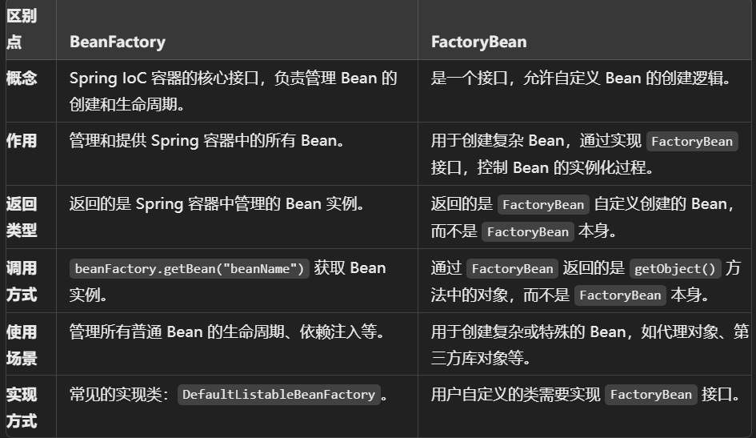
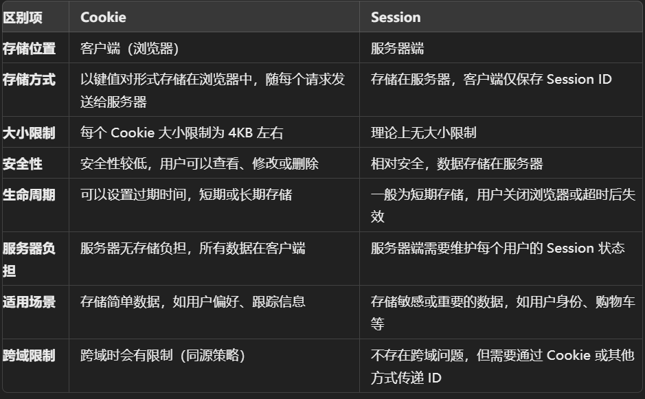

# 常见问题

- 1.SpringBoot相比Spring有哪些优点和改进

  - 自动配置  开发者不需要编写大量的XML和Java配置类
  - 嵌入式服务器 打成jar包可以一键部署
  - 简化依赖配置提供了许多starter POM, 可以快速引入所需所有依赖,不用逐个导入. 例如spring-boot-starter-web
  - 提供集成开发体验 Spring Devtools,实现热部署,加速开发和调试
  - ...

- 2.springboot中一个接口只有一个实现类，注入实现类后，直接使用接口名创建对象调用接口方法，为何会直接用实现类的方法呢

  - Spring DI机制，如果只有一个实现类，自动注入该类。有多个实现类，需要额外配置。+ 多态性。直接使用接口名可以减少后续代码修改，便于维护

- 2.1多个实现类如何配置

  - @Primary 注解。优先注入

  ```java
  public interface MyService {
      void performAction();
  }
  
  @Service
  @Primary  // 标记为主要实现类
  public class MyServiceImpl1 implements MyService {
      @Override
      public void performAction() {
          System.out.println("Action in MyServiceImpl1");
      }
  }
  
  @Service
  public class MyServiceImpl2 implements MyService {
      @Override
      public void performAction() {
          System.out.println("Action in MyServiceImpl2");
      }
  }
  
  ```

  ```java
  @RestController
  public class MyController {
  
      @Autowired
      private MyService myService;
  
      @GetMapping("/test")
      public void test() {
          myService.performAction();  // 调用 MyServiceImpl1 的方法
      }
  }
  ```

  - @Qualifier 显示指定注入哪个类

  ```java
  @Service("service1")
  public class MyServiceImpl1 implements MyService {
      @Override
      public void performAction() {
          System.out.println("Action in MyServiceImpl1");
      }
  }
  
  @Service("service2")
  public class MyServiceImpl2 implements MyService {
      @Override
      public void performAction() {
          System.out.println("Action in MyServiceImpl2");
      }
  }
  
  
  @RestController
  public class MyController {
  
      @Autowired
      @Qualifier("service2")  // 指定注入 MyServiceImpl2
      private MyService myService;
  
      @GetMapping("/test")
      public void test() {
          myService.performAction();  // 调用 MyServiceImpl2 的方法
      }
  }
  
  ```

- 3.FactoryBean和BeanFactory区别

  - `BeanFactory` 
    - 是 Spring IoC 容器的最基本接口，负责管理 Spring 应用中的 Bean 的创建和获取。它是 Spring 容器的核心，用于管理 Bean 的生命周期、依赖注入等功能。
    - **常用方法**：
      - `getBean(String name)`：根据 Bean 的名称获取实例。
      - `getBean(Class<T> requiredType)`：根据 Bean 类型获取实例。
    - **作用**：
      - `BeanFactory` 是容器，它负责装载、配置、管理 Bean，并提供懒加载的机制，即只有在第一次请求 `getBean()` 时才实例化 Bean。
      - 管理单例、多例（prototype） Bean，处理 Bean 的作用域、生命周期回调等。
    - ApplicationContext继承自BeanFactory
  - FactoryBean
    - `FactoryBean` 是一个特殊的 Bean，允许用户定制 Bean 的实例化逻辑。它本身是一个接口，当某个类实现了 `FactoryBean` 接口后，该类就可以用于创建一个或多个复杂的 Bean 实例。
    - **定义**：`FactoryBean` 是 Spring 的一个接口，它的实现类可以用来自定义创建 Bean 的逻辑。
    - **常用方法**：
      - `Object getObject()`：返回该 `FactoryBean` 所生产的 Bean 实例。
      - `Class<?> getObjectType()`：返回该 `FactoryBean` 所生产 Bean 的类型。
      - `boolean isSingleton()`：指定该 `FactoryBean` 所生产的 Bean 是否是单例。

  

- 4.cookie和session

  

- 5分布式架构下 session失效原因
  - 负载均衡导致的会话不一致
    - **问题描述**：在分布式微服务架构中，通常有多个服务实例来处理用户请求，负载均衡器会根据某种策略（如轮询、最小连接数等）将请求分发到不同的实例。如果每个实例都有各自独立的 Session 存储，那么用户的请求可能被分发到不同的服务实例，导致无法访问之前的会话状态，从而导致 Session 失效。
    - **例子**：假设用户的第一次请求被路由到服务器 A，Session 被存储在 A 的内存中。第二次请求时，负载均衡器将请求路由到服务器 B，而 B 无法访问 A 中的 Session，导致用户的会话失效。
  - 微服务的设计原则之一是无状态（stateless），即**每个服务实例不应依赖于会话状态**。这是为了提高系统的扩展性和可维护性。无状态的服务实例不会维护用户的 Session 数据，导致传统的基于服务器内存的 Session 存储机制在微服务中不可用
  - 服务实例动态扩展或缩减
  - Session 过期问题
- 6@Autowired和@Resource有何区别
  - @Autowired按照类型注入  如果有多个符合条件的bean，需要用@Qualifier来指定。Spring框架中的
  - @Resource根据名称注入

- 7.jdk8中接口有了哪些变化?

  - 默认方法 (default methods): 允许在接口中定义带有具体实现的方法,不会破坏原有实现类的代码,保证向后兼容

    ```java
    public interface MyInterface {
        // 默认方法
        default void printMessage() {
            System.out.println("This is a default method in an interface.");
        }
    }
    
    public class MyClass implements MyInterface {
        // 可以使用默认实现或重写
        @Override
        public void printMessage() {
            System.out.println("Overriding the default method.");
        }
    }
    
    public class Main {
        public static void main(String[] args) {
            MyInterface obj = new MyClass();
            obj.printMessage();  // 输出: Overriding the default method.
        }
    }
    
    ```

  - 静态方法 staic method: jdk8之前,接口中只能定义抽象方法,不能包含任何静态方法. jdk8后,有些工具方法可以直接在接口中实现,不依赖于类

    ```java
    public interface MyInterface {
        // 静态方法
        static void staticMethod() {
            System.out.println("This is a static method in an interface.");
        }
    }
    
    public class Main {
        public static void main(String[] args) {
            // 通过接口名调用静态方法
            MyInterface.staticMethod();
        }
    }
    ```

  - 引入函数式接口. 建议使用@FunctionInterface接口标注,只有一个抽象方法的接口,作为lambda表达式的目标类型

  - jdk9中,接口可以定义私有方法,私有实例方法只能被同一个接口的默认方法调用,私有静态方法只能被统一接口的静态方法调用