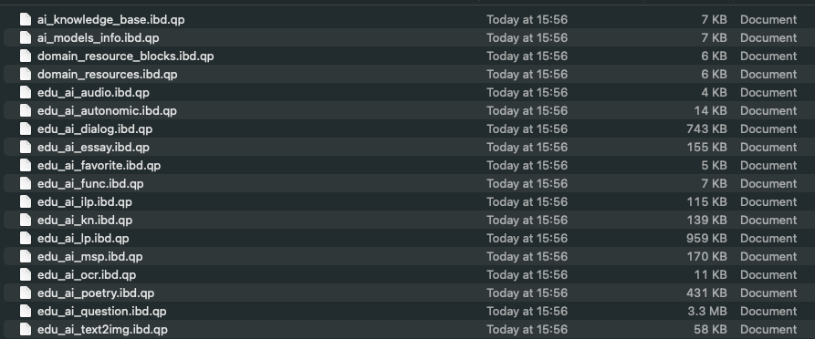
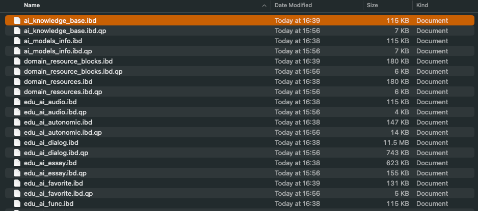
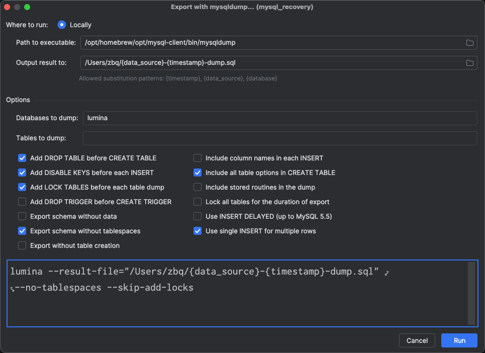

## MySQL数据备份恢复

> 事情发生在2025年12月24日，公司业务的测试服环境MySQL数据库被一位开发人员使用某可视化工具右键删除了,测试服直接瘫痪，无法登陆... 该数据库使用的是百度云机器，之前网页开启了每日凌晨4点备份
>
> 时隔将近一个月，记录一下恢复的过程

之前从来没遇到过，着手开始恢复，目标是找到 xxx.sql， 然后登录到远程mysql中执行即可

### 第一步

下载最新的备份，下载后看到名称为package.tar.gz

直接在本地终端中：

```shell
tar -zxvf package.tar.gz

结果：tar: Error opening archive: Unrecognized archive format
```

说明虽然名称是tar.gz 实际上并不是

通过询问gemini，发现其内部是Percona XtraBackup生成的xbstream或者经过qpress压缩的格式

```shell
file package.tar.gz

package.tar.gz: data
```

确定了就是xbstream格式

### 第二步

安装percona-xtrabackup@8.0， 版本号和数据库版本保持一致 （这个先踩的坑直接装没写版本装的8.4 后面发现不对

```shell
# 我Mac中使用brew来安装常用的软件
brew install percona-xtrabackup@8.0
```

该安装包里面有xbstream和xtrabackup 这两个工具

xtrabackup： 该工具是备份核心工具。负责连接数据库、拷贝数据文件、重做日志（Redo Log）以及管理备份过程。

xbstream： **流式数据管理工具**。由于 XtraBackup 支持并行压缩和打包，它使用一种自定义的 `xbstream` 格式。该工具负责将备份数据打包成流，或者在恢复时从流中解压/提取文件。

2.1  解开 xbstream包

```shell
mkdir -p /data/mysql_backup

xbstream -x -C /data/mysql_backup < package.tar.gz
```

2.2 解压文件 （里面打开是.qp后缀）



```shell
xtrabackup --decompress --target-dir=/data/mysql_backup
2026-01-19T16:14:52.045993+08:00 0 [Note] [MY-011825] [Xtrabackup] recognized client arguments: --decompress=1 --target-dir=/data/mysql_backup
/opt/homebrew/Cellar/percona-xtrabackup@8.0/8.0.35-34_10/libexec/bin/xtrabackup version 8.0.35-34 based on MySQL server 8.0.35 macos15.7 (arm64) (revision id: c8a25ff9)
2026-01-19T16:14:52.048324+08:00 0 [Note] [MY-011825] [Xtrabackup] decompressing ./backup-my.cnf.qp
sh: qpress: command not found
cat: stdout: Broken pipe
```

报错如上：sh: qpress: command not found

遂：

```shell
zbq@HUAWEI-MateBook-Air mysql_backup % brew install qpress
✔︎ JSON API formula.jws.json                                                               Downloaded   32.0MB/ 32.0MB
✔︎ JSON API cask.jws.json                                                                  Downloaded   15.3MB/ 15.3MB
Warning: No available formula with the name "qpress".
==> Searching for similarly named formulae and casks...
Error: No formulae or casks found for qpress.
```

brew下载不了qpress

```shell
# google后
brew tap mhorbul/qpress
brew install qpress
# 成功安装
```

重新执行：

```shell
xtrabackup --decompress --target-dir=/data/mysql_backup

[Note] [MY-011825] [Xtrabackup] completed OK!
```

重新查看文件夹，发现出现了没有.qp的文件



2.3 准备备份

这是物理恢复的关键步骤，目的是回滚未提交的事务，使数据文件达到一致性状态：

```shell
xtrabackup --prepare --target-dir=/data/mysql_backup

2026-01-19T16:42:20.918265+08:00 0 [Note] [MY-011825] [Xtrabackup] Completed loading of 323 tablespaces into cache in 0.0559716 seconds
2026-01-19T16:42:20.932922+08:00 0 [Note] [MY-011825] [Xtrabackup] Time taken to build dictionary: 0.0146314 seconds
2026-01-19T16:42:20.938687+08:00 1 [ERROR] [MY-012592] [InnoDB] Operating system error number 24 in a file operation.
2026-01-19T16:42:20.938695+08:00 1 [ERROR] [MY-012596] [InnoDB] Error number 24 means 'Too many open files'
2026-01-19T16:42:20.938699+08:00 1 [Note] [MY-012597] [InnoDB] Refer to your operating system documentation for operating system error code information.
2026-01-19T16:42:20.938703+08:00 1 [ERROR] [MY-012646] [InnoDB] File ./prod_lumina/rag_term_statistics#p#p7.ibd: 'open' returned OS error 83. Cannot continue operation
2026-01-19T16:42:20.938706+08:00 1 [ERROR] [MY-012981] [InnoDB] Cannot continue operation.
```

询问gemini，发现为超出macos的默认单个进程打开的句柄限制

```shell
# 查看默认数值
zbq@HUAWEI-MateBook-Air mysql_backup % ulimit -n
256
# 临时调大
zbq@HUAWEI-MateBook-Air mysql_backup % ulimit -n 4096
# 重新执行
xtrabackup --prepare --target-dir=/data/mysql_backup

[Note] [MY-011825] [Xtrabackup] completed OK!
```

### 第三步

本地启动一个mysql的docker容器，挂载上面路径为mysql数据路径

```shell
docker run -d \                   
  --name mysql_recovery \
  -v /data/mysql_backup:/var/lib/mysql \
  -p 3306:3306 \
  mysql:8.0 \
  --lower-case-table-names=1
```

使用原先的账号密码即可登录，登录成功后可以执行mysqldump进行导出

### 第四步

我常用datagrip这一可视化工具，当然也可以使用命令行导出，这里为了方便，按图中勾选即可



使用mysqldump导出，得到

mysql_recovery-2026_01_19_17_12_07-dump.sql 

该文件可能非常大，务必使用命令行导入

### 第五步

打开本地终端，使用mysql命令连接百度云数据库，然后使用source命令导入

```shell
mysql -h ip -uroot -p

source ~/mysql_recovery-2026_01_19_17_12_07-dump.sql
```

等待执行完毕即可
