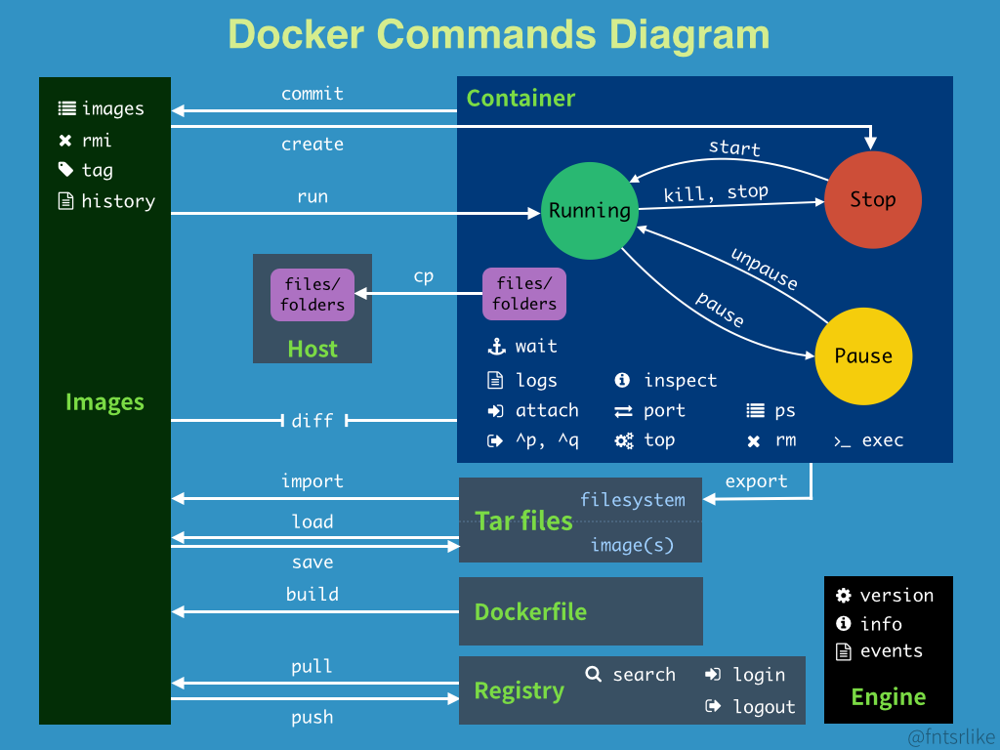

# docker 进阶
参考文档: <https://docs.docker.com/reference/>
## Part1 常用命令总结


### docker version 查看docker客户端和服务端信息
```yaml
Client:
 Version:           20.10.11
 API version:       1.41
 Go version:        go1.16.13
 Git commit:        dea9396
 Built:             Mon Sep 20 23:44:39 2021
 OS/Arch:           linux/amd64
 Context:           default
 Experimental:      true

Server:
 Engine:
  Version:          20.10.11
  API version:      1.41 (minimum version 1.12)
  Go version:       go1.16.13
  Git commit:       dea9396
  Built:            Mon Sep 20 23:43:19 2021
  OS/Arch:          linux/amd64
  Experimental:     false
 containerd:
  Version:          1.4.3
  GitCommit:        269548fa27e0089a8b8278fc4fc781d7f65a9397
 runc:
  Version:          1.0.2
  GitCommit:        v1.0.2-0.3.3
 docker-init:
  Version:          0.19.0
  GitCommit:        de40ad0
```
### docker info 查看更加详细信息
```yaml
Client:
 Context:    default
 Debug Mode: false
 Plugins:
  app: Docker App (Docker Inc., v0.10.0)
  buildx: Build with BuildKit (Docker Inc., v0.5.1-docker)
  scan: Docker Scan (Docker Inc., v0.9.0)

Server:
 Containers: 2
  Running: 2
  Paused: 0
  Stopped: 0
 Images: 3
 Server Version: 20.10.11
 Storage Driver: overlay2
  Backing Filesystem: extfs
  Supports d_type: true
  Native Overlay Diff: true
 Logging Driver: json-file
 Cgroup Driver: cgroupfs
 Cgroup Version: 1
 Plugins:
  Volume: local
  Network: bridge host ipvlan macvlan null overlay
  Log: awslogs fluentd gcplogs gelf journald json-file local logentries splunk syslog
 Swarm: inactive
 Runtimes: runc
 Default Runtime: runc
 Init Binary: docker-init
 containerd version: 1.4.3
 runc version: v1.0.2-0.3.3
 init version: de40ad0
 Security Options:
  seccomp
   Profile: default
 Kernel Version: 3.10.0-1160.24.1.el7.x86_64
 Operating System: CentOS Linux 7 (Core)
 OSType: linux
 Architecture: x86_64
 CPUs: 2
 Total Memory: 1.796GiB
 Name: your-server-name
 ID: 3YCE:DCSC:JOFB:RH53:AO2L:KXIO:5LS3:EN77:BR3W:75AQ:O7RF:6M5N
 Docker Root Dir: /var/lib/docker
 Debug Mode: false
 Registry: https://index.docker.io/v1/
 Labels:
 Experimental: true
 Insecure Registries:
  127.0.0.0/8
 Live Restore Enabled: false
 Product License: Community Engine

WARNING: No swap limit support
```

这是关于 Docker 服务器的信息，包括正在运行的容器、镜像、存储驱动、网络设置和操作系统信息等。
### docker images 列出所有镜像
`docker images` 命令用于列出 Docker 主机上所有可用的镜像。Docker 镜像是用于创建容器的模板，它包含了一个文件系统、运行时和系统工具，以及用于执行容器的应用程序。通过运行 `docker images` 命令，您可以查看已经下载或构建的 Docker 镜像列表。

以下是 `docker images` 命令的示例用法以及一些常用选项：

#### 基本用法
1. 列出所有可用的 Docker 镜像：
   ```
   docker images
   ```

2. 显示镜像的详细信息，包括大小和标签：
   ```
   docker images -a
   ```

3. 显示某个特定镜像的信息，通过镜像的名称或 ID：
   ```
   docker images imagename
   ```

#### 常用选项
- `-a` 或 `--all`: 显示所有镜像，包括中间层镜像（intermediate images）。
- `--quiet` 或 `-q`: 仅显示镜像的 ID，而不是完整的详细信息。
- `--no-trunc`: 显示完整的镜像 ID，而不是截短的 ID。
- `--filter`: 根据条件筛选镜像，例如 `--filter "dangling=true"` 可以显示悬空镜像（没有与容器关联的镜像）。
- `--format`: 自定义输出格式。

示例用法：

1. 仅显示镜像的 ID，而不是详细信息：
   ```
   docker images -q
   ```

2. 使用 `--filter` 选项显示特定条件的镜像，例如，显示悬空镜像：
   ```
   docker images --filter "dangling=true"
   ```

3. 使用 `--format` 自定义输出格式，仅显示镜像名称和标签：
   ```
   docker images --format "{{.Repository}}:{{.Tag}}"
   ```

`docker images` 命令对于了解 Docker 主机上可用的镜像非常有用，以及检查它们的大小和标签。这有助于管理和维护 Docker 镜像，尤其是在构建和部署容器化应用程序时。
```
REPOSITORY          TAG                 IMAGE ID            CREATED             SIZE
nginx               latest              4d3b74518f72        2 weeks ago         133MB
ubuntu              20.04               d70eaf7277ea        4 weeks ago         72.9MB
hello-world         latest              bf756fb1ae65        15 months ago       13.3kB
```

这是您系统上已经下载的 Docker 镜像列表，显示了镜像的名称、标签、ID、创建时间和大小。

### docker search 搜索镜像
`docker search` 命令用于在 Docker Hub 或其他 Docker 镜像仓库中搜索可用的 Docker 镜像。这可以帮助您查找感兴趣的镜像，以便后续拉取或使用它们来运行容器。

以下是 `docker search` 命令的基本用法以及一些示例：

#### 基本用法
1. 在 Docker Hub 中搜索镜像，替换 `keyword` 为您感兴趣的关键词：
   ```
   docker search keyword
   ```

#### 示例用法
1. 搜索 Docker Hub 中与 "nginx" 相关的镜像：
   ```
   docker search nginx
   ```

2. 查找与 "mysql" 相关的镜像：
   ```
   docker search mysql
   ```

3. 搜索 Docker Hub 中的 CentOS 镜像：
   ```
   docker search centos
   ```

4. 搜索包含 "python" 关键词的镜像：
   ```
   docker search python
   ```

5. 查找 Ubuntu 镜像：
   ```
   docker search ubuntu
   ```

6. 搜索 Alpine Linux 镜像：
   ```
   docker search alpine
   ```

`docker search` 命令是一个有用的工具，可以帮助您在 Docker 镜像仓库中查找符合您需求的镜像。一旦找到感兴趣的镜像，您可以使用 `docker pull` 命令将其下载到本地，然后使用 `docker run` 命令运行容器。这对于快速查找并使用可用的 Docker 镜像非常有帮助。

### docker pull 拉取镜像
`docker pull` 命令用于从 Docker 镜像仓库中下载（拉取）Docker 镜像到本地系统。一旦您下载了镜像，您就可以使用它来运行 Docker 容器。

以下是 `docker pull` 命令的基本用法以及一些示例：

#### 基本用法
1. 从 Docker 镜像仓库中拉取特定镜像，其中 `imagename` 是您要拉取的镜像名称：
   ```
   docker pull imagename
   ```

#### 示例用法
1. 从 Docker Hub 拉取官方的 Ubuntu 镜像：
   ```
   docker pull ubuntu
   ```

2. 从 Docker Hub 拉取官方的 Nginx 镜像：
   ```
   docker pull nginx
   ```

3. 从 Docker Hub 拉取官方的 MySQL 镜像：
   ```
   docker pull mysql
   ```

4. 从 Docker Hub 拉取官方的 Python 镜像：
   ```
   docker pull python
   ```

5. 从 Docker Hub 拉取官方的 Alpine Linux 镜像：
   ```
   docker pull alpine
   ```

6. 从 Docker Hub 拉取官方的 CentOS 镜像：
   ```
   docker pull centos
   ```

请注意，您可以替换 `imagename` 为您感兴趣的镜像名称，以从 Docker 镜像仓库中拉取特定的镜像。一旦下载完成，您可以使用 `docker run` 命令创建和运行容器，使用该镜像为容器的基础。这是使用 Docker 镜像和容器的常见工作流程之一。

### docker rmi 删除镜像
`docker rmi` 命令用于删除本地系统上的一个或多个 Docker 镜像。这个命令可以帮助您释放磁盘空间，清理不再需要的镜像。

以下是 `docker rmi` 命令的基本用法以及一些示例：

#### 基本用法
1. 删除一个或多个 Docker 镜像，其中 `image_name` 是要删除的镜像的名称或 ID。您可以一次删除多个镜像，将它们的名称或 ID 列在命令中。
   ```
   docker rmi image_name1 image_name2 ...
   ```

#### 示例用法
1. 删除名为 `myapp` 的镜像：
   ```
   docker rmi myapp
   ```

2. 删除名为 `myapp` 和 `myapp2` 的两个镜像：
   ```
   docker rmi myapp myapp2
   ```

3. 删除具有特定镜像 ID（例如，`12a1b3c45d6e`）的镜像：
   ```
   docker rmi 12a1b3c45d6e
   ```

4. 删除所有未被使用的镜像（悬空镜像）：
   ```
   docker image prune
   ```

5. 强制删除镜像，即使有容器在使用它：
   ```
   docker rmi -f image_name
   ```

请谨慎使用 `docker rmi` 命令，因为它会永久删除镜像。确保在删除之前不再需要这些镜像，并了解这个命令的风险。如果您删除了一个正在被容器使用的镜像，相关容器可能会变得不可用。在这种情况下，您需要停止或删除容器，然后再删除镜像。

### docker run 启动容器
当使用 `docker run` 命令时，您可以使用多种选项来配置和启动容器。以下是一些常见选项和示例用法：

#### 基本用法
```
docker run [OPTIONS] IMAGE [COMMAND] [ARG...]
```

- `IMAGE`: 要使用的 Docker 镜像。
- `COMMAND`: 要在容器内部执行的命令。
- `ARG...`: 传递给容器中命令的参数。

#### 常见选项
1. `-d`：以后台模式（守护进程）运行容器。
   ```
   docker run -d image_name
   ```

2. `-i`：交互式模式，允许您与容器进行交互。
   ```
   docker run -i -t image_name
   ```

3. `-t`：为容器分配一个伪终端。
   ```
   docker run -t image_name
   ```

4. `--name`：为容器指定一个名称。
   ```
   docker run --name my_container image_name
   ```

5. `--rm`：容器退出后立即删除容器。
   ```
   docker run --rm image_name
   ```

6. `-e`：设置环境变量。
   ```
   docker run -e "MYVAR=myvalue" image_name
   ```

7. `--volume` 或 `-v`：挂载主机目录到容器。
   ```
   docker run -v /host/path:/container/path image_name
   ```

8. `--network`：将容器连接到指定的网络。
   ```
   docker run --network=my_network image_name
   ```

9. `--port` 或 `-p`：将容器端口映射到主机端口。
   ```
   docker run -p 8080:80 image_name
   ```

10. `--link`：链接容器到其他容器。
    ```
    docker run --link container_name:image_alias image_name
    ```

11. `--memory`：限制容器可用内存。
    ```
    docker run --memory 512m image_name
    ```

12. `--cpu-shares`：为容器分配 CPU 时间份额。
    ```
    docker run --cpu-shares 512 image_name
    ```

这只是一些常见选项和示例用法。`docker run` 支持更多选项，具体取决于您的需求和容器的配置。这些选项可用于定制容器的运行时行为，以适应不同的应用程序和用例。

### docker ps
`docker ps` 命令用于列出当前正在运行的 Docker 容器。这个命令默认只显示运行中的容器，通常用于查看正在活动的容器实例。

以下是 `docker ps` 命令的基本用法和一些示例：

#### 基本用法
```
docker ps [OPTIONS]
```

#### 示例用法
1. 列出当前正在运行的容器（默认只显示运行中的容器）：
   ```
   docker ps
   ```

2. 列出包括已经停止的容器在内的所有容器，使用 `-a` 或 `--all` 选项：
   ```
   docker ps -a
   ```

#### 常见选项
1. `-a` 或 `--all`：显示所有容器，包括已经停止的容器。
   ```
   docker ps -a
   ```

2. `-q`：仅显示容器的 ID，而不是完整的容器信息。
   ```
   docker ps -q
   ```

3. `--no-trunc`：显示完整的容器 ID，而不是截断的 ID。
   ```
   docker ps --no-trunc
   ```

4. `--filter`：根据条件筛选容器，例如，显示处于运行状态的容器：
   ```
   docker ps --filter "status=running"
   ```

5. `--format`：自定义输出格式。
   ```
   docker ps --format "ID: {{.ID}}, Name: {{.Names}}"
   ```

6. `-s` 或 `--size`：显示容器的磁盘使用情况。
   ```
   docker ps -s
   ```

`docker ps` 命令对于查看当前正在运行的容器非常有用，以及了解容器的状态和其他详细信息。可以使用不同的选项来满足您的需求，例如查看所有容器，筛选容器，以及自定义输出格式。
### docker rm
`docker rm` 命令用于删除一个或多个已停止的 Docker 容器。容器是 Docker 中的运行实例，当您不再需要它们时，可以使用 `docker rm` 命令清除它们。

以下是 `docker rm` 命令的基本用法以及一些示例：

#### 基本用法
```
docker rm [OPTIONS] CONTAINER [CONTAINER...]
```

- `CONTAINER`：要删除的容器的名称或 ID。您可以一次删除多个容器，将它们的名称或 ID 列在命令中。

#### 示例用法
1. 删除一个已停止的容器，其中 `container_name_or_id` 是容器的名称或 ID：
   ```
   docker rm container_name_or_id
   ```

2. 删除多个已停止的容器：
   ```
   docker rm container1 container2 container3
   ```

#### 常见选项
1. `-v`：删除容器时同时删除与容器关联的卷（volumes）。
   ```
   docker rm -v container_name
   ```

2. `--force` 或 `-f`：强制删除运行中的容器，即使容器正在运行。
   ```
   docker rm -f container_name
   ```

3. `--link`：链接到容器的其他容器将不再能够链接到已删除的容器。
   ```
   docker rm container_name
   ```

4. `--volumes` 或 `-v`：删除与容器关联的卷，即使容器正在运行。
   ```
   docker rm -v container_name
   ```

请注意，`docker rm` 命令用于删除已停止的容器。如果要删除运行中的容器，您可以使用 `-f` 选项来强制删除它们。确保在删除之前不再需要这些容器，因为删除后的容器将不可恢复。
### docker start
`docker start` 命令用于启动已停止的 Docker 容器。当您使用 `docker stop` 命令停止容器后，可以使用 `docker start` 命令重新启动它。

以下是 `docker start` 命令的基本用法和一些示例：

#### 基本用法
```
docker start [OPTIONS] CONTAINER [CONTAINER...]
```

- `CONTAINER`：要启动的容器的名称或 ID。您可以一次启动多个容器，将它们的名称或 ID 列在命令中。

#### 示例用法
1. 启动一个已停止的容器，其中 `container_name_or_id` 是容器的名称或 ID：
   ```
   docker start container_name_or_id
   ```

2. 启动多个已停止的容器：
   ```
   docker start container1 container2 container3
   ```

#### 常见选项
1. `-i`：以交互模式运行容器，允许用户输入。
   ```
   docker start -i container_name_or_id
   ```

2. `--attach` 或 `-a`：附加到容器的标准输入、标准输出和标准错误。
   ```
   docker start -a container_name_or_id
   ```

3. `--detach-keys`：指定分离容器的键盘序列。
   ```
   docker start --detach-keys "ctrl-p" container_name_or_id
   ```

4. `--interactive` 或 `-i`：以交互模式运行容器，允许用户输入。
   ```
   docker start --interactive container_name_or_id
   ```

请注意，`docker start` 命令用于重新启动已停止的容器。您可以选择使用 `-i` 或 `-a` 选项来控制容器的交互性。根据您的需求，您可以一次启动多个容器，并使用不同的选项来自定义容器的启动行为。
### docker stop
`docker stop` 命令用于停止正在运行的 Docker 容器。当您不再需要一个容器或需要对其进行维护时，可以使用 `docker stop` 命令来安全地停止容器的运行。

以下是 `docker stop` 命令的基本用法和一些示例：

#### 基本用法
```
docker stop [OPTIONS] CONTAINER [CONTAINER...]
```

- `CONTAINER`：要停止的容器的名称或 ID。您可以一次停止多个容器，将它们的名称或 ID 列在命令中。

#### 示例用法
1. 停止一个正在运行的容器，其中 `container_name_or_id` 是容器的名称或 ID：
   ```
   docker stop container_name_or_id
   ```

2. 停止多个正在运行的容器：
   ```
   docker stop container1 container2 container3
   ```

#### 常见选项
1. `-t` 或 `--time`：指定停止容器前的等待时间（秒）。默认为 10 秒。
   ```
   docker stop -t 5 container_name_or_id
   ```

2. `--time=0`：立即停止容器，不等待。
   ```
   docker stop --time=0 container_name_or_id
   ```

3. `-f` 或 `--force`：强制停止容器，即使容器在运行中。
   ```
   docker stop -f container_name_or_id
   ```

4. `--no-wait`：不等待容器停止，立即返回。
   ```
   docker stop --no-wait container_name_or_id
   ```

`docker stop` 命令用于安全地停止容器的运行。您可以选择设置停止容器前的等待时间或强制停止容器。根据您的需求，您可以一次停止多个容器，并使用不同的选项来控制停止行为。
### docker restart
`docker restart` 命令用于重新启动正在运行的 Docker 容器。它相当于执行 `docker stop` 命令来停止容器，然后立即执行 `docker start` 命令来启动容器。

以下是 `docker restart` 命令的基本用法和一些示例：

#### 基本用法
```
docker restart [OPTIONS] CONTAINER [CONTAINER...]
```

- `CONTAINER`：要重新启动的容器的名称或 ID。您可以一次重新启动多个容器，将它们的名称或 ID 列在命令中。

#### 示例用法
1. 重新启动一个正在运行的容器，其中 `container_name_or_id` 是容器的名称或 ID：
   ```
   docker restart container_name_or_id
   ```

2. 重新启动多个正在运行的容器：
   ```
   docker restart container1 container2 container3
   ```

#### 常见选项
`docker restart` 命令不支持额外的选项，它主要用于重新启动一个或多个容器。

`docker restart` 命令是一种方便的方式来重新启动容器，尤其是当您需要容器重新加载配置或应用程序更新时。它会停止容器，然后立即启动它，而无需手动执行两个命令。
### docker kill
`docker kill` 命令用于强制终止运行中的 Docker 容器。与 `docker stop` 命令不同，`docker kill` 不会等待容器进行清理或优雅地停止，而是立即终止容器的运行。

以下是 `docker kill` 命令的基本用法和一些示例：

#### 基本用法
```
docker kill [OPTIONS] CONTAINER [CONTAINER...]
```

- `CONTAINER`：要终止的容器的名称或 ID。您可以一次终止多个容器，将它们的名称或 ID 列在命令中。

#### 示例用法
1. 强制终止一个正在运行的容器，其中 `container_name_or_id` 是容器的名称或 ID：
   ```
   docker kill container_name_or_id
   ```

2. 强制终止多个正在运行的容器：
   ```
   docker kill container1 container2 container3
   ```

#### 常见选项
`docker kill` 命令不支持额外的选项，它主要用于强制终止容器，而不等待容器进行清理或优雅地停止。

请注意，使用 `docker kill` 命令将立即终止容器，这可能导致数据损失或不一致性。通常情况下，首选使用 `docker stop` 命令来优雅地停止容器，只有在必要时才使用 `docker kill` 命令。

### docker logs
`docker logs` 命令用于检查 Docker 容器的日志输出。容器通常会生成日志，其中包括应用程序的标准输出和标准错误。使用 `docker logs` 命令，您可以查看容器的日志，以便调试、故障排除或监视容器的运行情况。

以下是 `docker logs` 命令的基本用法和一些示例：

#### 基本用法
```
docker logs [OPTIONS] CONTAINER
```

- `CONTAINER`：要检查日志的容器的名称或 ID。

#### 示例用法
1. 查看容器日志，其中 `container_name_or_id` 是容器的名称或 ID：
   ```
   docker logs container_name_or_id
   ```

#### 常见选项
1. `--since`：仅显示自指定时间点之后的日志。可以使用相对时间（如 `3h` 表示3小时前）或特定的时间戳。
   ```
   docker logs --since="3h" container_name_or_id
   ```

2. `--until`：仅显示自指定时间点之前的日志。也可以使用相对时间或时间戳。
   ```
   docker logs --until="2023-10-30T12:00:00" container_name_or_id
   ```

3. `-t` 或 `--timestamps`：显示时间戳，以便查看日志中的时间信息。
   ```
   docker logs -t container_name_or_id
   ```

4. `--tail`：仅显示最后几行日志，默认为所有行。
   ```
   docker logs --tail=10 container_name_or_id
   ```

5. `-f` 或 `--follow`：跟随容器的输出，实时查看日志，类似于 `tail -f`。
   ```
   docker logs -f container_name_or_id
   ```

`docker logs` 命令对于查看容器的标准输出和标准错误非常有用，以便了解容器的运行状态和故障排除。您可以根据需要使用不同的选项来筛选和查看容器的日志信息。

### docker top
`docker top` 命令用于查看正在运行的 Docker 容器中的进程信息。它允许您查看容器内部运行的进程，包括进程的名称、进程 ID、CPU 使用情况、内存使用情况等。

以下是 `docker top` 命令的基本用法和一些示例：

#### 基本用法
```
docker top CONTAINER [OPTIONS]
```

- `CONTAINER`：要查看进程信息的容器的名称或 ID。

#### 示例用法
1. 查看容器内部运行的进程信息，其中 `container_name_or_id` 是容器的名称或 ID：
   ```
   docker top container_name_or_id
   ```

#### 常见选项
1. `-o` 或 `--format`：自定义输出格式，以显示特定的列。
   ```
   docker top -o pid,ppid,command container_name_or_id
   ```

`docker top` 命令对于查看容器内部运行的进程非常有用，特别是在需要了解容器内部的进程状态时。您可以使用 `-o` 选项来自定义输出格式以满足您的需求。这可以帮助您监视容器中的运行时行为和进程。

### docker inspect
`docker inspect` 命令用于检查 Docker 中的容器、镜像、卷、网络或其他 Docker 对象的详细信息。这个命令返回一个 JSON 格式的输出，其中包含了有关指定对象的各种配置和状态信息。

以下是 `docker inspect` 命令的基本用法和一些示例：

#### 基本用法
```
docker inspect [OPTIONS] OBJECT [OBJECT...]
```

- `OBJECT`：要检查的 Docker 对象的名称或 ID。您可以一次检查多个对象，将它们的名称或 ID 列在命令中。

#### 示例用法
1. 检查一个容器的详细信息，其中 `container_name_or_id` 是容器的名称或 ID：
   ```
   docker inspect container_name_or_id
   ```

2. 检查多个容器的详细信息：
   ```
   docker inspect container1 container2 container3
   ```

#### 常见选项
1. `--format`：自定义输出格式，以便仅显示您感兴趣的信息。
   ```
   docker inspect --format '{{.State.Status}}' container_name_or_id
   ```

2. `-f` 或 `--filter`：使用筛选条件来限制输出，例如，仅显示特定标签的容器信息。
   ```
   docker inspect -f '{{.Config.Labels.mylabel}}' container_name_or_id
   ```

`docker inspect` 命令对于获取 Docker 对象的详细信息非常有用，可以用于检查容器、镜像、卷、网络等的配置和状态。您可以使用 `--format` 和 `--filter` 选项来进一步定制输出，以满足您的需求。这对于调试和监视 Docker 环境非常有帮助。
以下是使用 `docker inspect mysql` 命令获取有关 MySQL 容器的信息的示例输出。请注意，输出可能会根据您的环境和容器配置而有所不同：

```json
[
    {
        "Id": "b6c7318caed5d4a0a5b1cdebe1c1f1d5457ad10322b5123b72ecbb8a6d5e50d3",
        "Created": "2023-10-31T14:00:00.154514228Z",
        "Path": "docker-entrypoint.sh",
        "Args": [
            "mysqld"
        ],
        "State": {
            "Status": "running",
            "Running": true,
            "Paused": false,
            "Restarting": false,
            "OOMKilled": false,
            "Dead": false,
            "Pid": 12345,
            "ExitCode": 0,
            "Error": "",
            "StartedAt": "2023-10-31T14:00:05.984197867Z",
            "FinishedAt": "0001-01-01T00:00:00Z"
        },
        // 其他容器详细信息...
    }
]
```

此输出包含容器的ID、创建时间、执行命令、当前状态等详细信息。请注意，这只是示例输出，实际输出可能会因容器的配置和状态而有所不同。

### docker exec 
`docker exec` 命令用于在正在运行的 Docker 容器内部执行命令。这允许您与容器进行交互，运行附加的进程或执行特定的任务，而不需要停止或重新创建容器。

以下是 `docker exec` 命令的基本用法和一些示例：

#### 基本用法
```
docker exec [OPTIONS] CONTAINER COMMAND [ARG...]
```

- `CONTAINER`：要在其中执行命令的容器的名称或 ID。
- `COMMAND`：要在容器内部执行的命令。
- `ARG...`：传递给命令的参数。

#### 示例用法
1. 在运行中的容器内部执行一个命令，其中 `container_name_or_id` 是容器的名称或 ID：
   ```
   docker exec container_name_or_id ls
   ```

2. 在容器内部打开一个交互式 Shell 会话：
   ```
   docker exec -it container_name_or_id /bin/bash
   ```

3. 在容器内部执行带参数的命令：
   ```
   docker exec container_name_or_id echo "Hello, Docker!"
   ```

#### 常见选项
1. `-i`：以交互模式运行命令，允许用户输入。
   ```
   docker exec -i container_name_or_id command
   ```

2. `-t`：为容器分配伪终端。
   ```
   docker exec -t container_name_or_id command
   ```

3. `-u`：指定执行命令的用户或用户组。
   ```
   docker exec -u username container_name_or_id command
   ```

4. `--workdir`：指定在容器内部执行命令的工作目录。
   ```
   docker exec --workdir /app container_name_or_id command
   ```

`docker exec` 命令非常有用，因为它允许您在运行中的容器内部执行命令，而不需要停止或重新创建容器。您可以使用 `-i` 和 `-t` 选项来创建交互式 Shell 会话，执行特定任务，或者进行容器内部的调试和维护。
### docker attach
`docker attach` 命令用于附加到正在运行的 Docker 容器，与容器的标准输入、标准输出和标准错误进行交互。这允许您与容器中的进程进行实时交互，就像使用终端一样。请注意，`docker attach` 不会启动新的进程，而是附加到容器中已经在运行的进程。

以下是 `docker attach` 命令的基本用法和一些示例：

#### 基本用法
```
docker attach [OPTIONS] CONTAINER
```

- `CONTAINER`：要附加到的容器的名称或 ID。

#### 示例用法
1. 附加到一个正在运行的容器，其中 `container_name_or_id` 是容器的名称或 ID：
   ```
   docker attach container_name_or_id
   ```

#### 常见选项
1. `-t`：分配一个伪终端（tty），允许用户输入。
   ```
   docker attach -t container_name_or_id
   ```

2. `--sig-proxy`：将信号传递给容器，以便容器可以响应 Ctrl+C 等信号。
   ```
   docker attach --sig-proxy=false container_name_or_id
   ```

请注意，使用 `docker attach` 命令附加到容器后，您将与容器内部的进程进行交互。这对于调试或查看容器中的实时输出非常有用。要分离（detach）从容器中退出，通常需要使用 `Ctrl+P` 和 `Ctrl+Q` 组合键。如果您需要在容器中运行新的进程，而不是附加到已经运行的进程，可以使用 `docker exec` 命令。

### docker cp
`docker cp` 命令用于在本地文件系统和正在运行的 Docker 容器之间复制文件或目录。这个命令允许您将文件从主机系统复制到容器内部或从容器内部复制到主机系统。

以下是 `docker cp` 命令的基本用法和一些示例：

#### 基本用法
```
docker cp [OPTIONS] CONTAINER:SRC_PATH DEST_PATH
docker cp [OPTIONS] SRC_PATH CONTAINER:DEST_PATH
```

- `CONTAINER`：要从中复制文件的容器的名称或 ID。
- `SRC_PATH`：容器内部的源文件或目录路径。
- `DEST_PATH`：本地主机系统上的目标路径或容器内部的目标路径。

#### 示例用法
1. 从容器复制文件到主机系统：
   ```
   docker cp container_name_or_id:/path/to/container/file /path/on/host
   ```

2. 将本地文件复制到容器内部：
   ```
   docker cp /path/on/host container_name_or_id:/path/to/container
   ```

#### 常见选项
1. `-L`：将符号链接复制为链接目标的文件。
   ```
   docker cp -L container_name_or_id:/path/to/link /path/on/host
   ```

2. `-v`：启用详细输出，显示复制过程的详细信息。
   ```
   docker cp -v container_name_or_id:/path/to/file /path/on/host
   ```

`docker cp` 命令对于在主机系统和容器之间传输文件非常有用，可以用于备份、恢复、配置文件更改等操作。您可以在容器和主机之间双向复制文件，根据需要使用 `-L` 选项以及详细输出来控制复制行为。

### docker commit
`docker commit` 命令用于创建新的 Docker 镜像，该镜像是通过在运行中的容器上进行更改（例如安装新软件、修改文件等）生成的。这个命令允许您将容器的当前状态保存为一个新的镜像，以便后续可以使用这个镜像创建新的容器。

以下是 `docker commit` 命令的基本用法和一些示例：

#### 基本用法
```
docker commit [OPTIONS] CONTAINER [REPOSITORY[:TAG]]
```

- `CONTAINER`：要保存为镜像的容器的名称或 ID。
- `REPOSITORY[:TAG]`：要创建的新镜像的名称和标签。如果不指定标签，将使用默认的 "latest" 标签。

#### 示例用法
1. 从正在运行的容器创建新镜像，其中 `container_name_or_id` 是容器的名称或 ID，`my-new-image` 是新镜像的名称：
   ```
   docker commit container_name_or_id my-new-image
   ```

2. 为新镜像指定标签：
   ```
   docker commit container_name_or_id my-new-image:tag1
   ```

#### 常见选项
`docker commit` 命令的选项通常较少，但以下是一些可能用到的选项：

- `-a`：设置作者信息。
- `-m`：设置镜像的描述信息。

请注意，`docker commit` 命令是一种相对简单的方法来创建新的 Docker 镜像，但它通常不是最佳的实践。更好的方式是使用 Dockerfile 来定义镜像的构建过程，以便能够版本控制和自动化构建过程，这样更容易维护和管理镜像。使用 `docker build` 命令和 Dockerfile 更推荐，特别是在生产环境中。
### docker volumn
在 Docker 中，卷（Volume）是用于持久化数据的一种机制。容器本质上是短暂的，它们在启动、停止或删除后，通常会丢失其中的数据。但有时候，您需要在容器之间或跨多个容器之间共享和保留数据。这就是 Docker 卷的作用。Docker 卷是独立于容器的一种存储机制，可以在容器之间共享和重用。

以下是 Docker 卷的基本用法和一些示例：

#### 创建一个 Docker 卷
要创建一个 Docker 卷，您可以使用 `docker volume create` 命令：

```bash
docker volume create my-volume
```

#### 列出所有 Docker 卷
您可以使用 `docker volume ls` 命令来列出系统中的所有 Docker 卷：

```bash
docker volume ls
```

#### 启动容器并附加卷
要在容器中使用卷，您可以在启动容器时使用 `-v` 或 `--volume` 标志，将卷附加到容器：

```bash
docker run -d -v my-volume:/path/in/container my-image
```

这会将 `my-volume` 卷附加到正在运行的容器，并将卷挂载到容器内的 `/path/in/container` 目录。这样，容器就可以读取和写入卷中的数据。

#### 删除 Docker 卷
要删除不再需要的 Docker 卷，可以使用 `docker volume rm` 命令：

```bash
docker volume rm my-volume
```

#### 查看卷详细信息
要查看 Docker 卷的详细信息，可以使用 `docker volume inspect` 命令：

```bash
docker volume inspect my-volume
```

Docker 卷是非常有用的，特别是在以下情况下：

- 数据共享：多个容器需要访问相同的数据，例如数据库卷。
- 数据备份：持久化存储数据以便备份。
- 数据持久性：确保数据在容器停止或删除后仍然存在。

Docker 卷提供了持久性数据存储的方式，允许容器之间共享和访问数据。它们在容器化应用程序的开发和运维中扮演着重要的角色。
### docker build
`docker build` 命令用于构建 Docker 镜像。它从一个包含构建上下文和 Dockerfile 的目录中创建一个新的镜像。Dockerfile 是一个文本文件，其中包含了构建镜像所需的指令和配置信息。

以下是 `docker build` 命令的基本用法和一些示例：

#### 基本用法
```
docker build [OPTIONS] PATH | URL | -
```

- `PATH`：包含构建上下文和 Dockerfile 的目录路径。
- `URL`：包含构建上下文和 Dockerfile 的远程 URL。
- `-`：从标准输入读取构建上下文。

#### 示例用法
1. 从当前目录中的 Dockerfile 构建镜像：
   ```
   docker build -t my-image .
   ```

   这会在当前目录中查找 Dockerfile 并使用它构建一个名为 `my-image` 的镜像。

2. 从远程 Git 存储库的 Dockerfile 构建镜像：
   ```
   docker build -t my-image https://github.com/username/repo.git
   ```

   这会从指定的 Git 存储库中获取 Dockerfile 并构建镜像。

#### 常见选项
`docker build` 命令支持许多选项，这些选项允许您自定义构建过程。以下是一些常见的选项：

- `-t`：为生成的镜像设置名称和可选的标签。
- `--build-arg`：设置构建时的构建参数，可以在 Dockerfile 中使用。
- `--no-cache`：禁用构建时的缓存，强制重新构建。
- `--file`：指定不同于默认名称的 Dockerfile。


`docker build` 命令允许您根据需要自定义镜像的构建过程，这是创建自定义容器化应用程序的关键步骤。通过编写适当的 Dockerfile，您可以构建符合您的需求的镜像。
### docker history
`docker history` 命令用于查看 Docker 镜像的历史记录。它显示构建镜像时每一层的详细信息，包括每一层的创建者、创建时间、指令等。

以下是 `docker history` 命令的基本用法和一些示例：

#### 基本用法
```
docker history IMAGE
```

- `IMAGE`：要查看历史记录的 Docker 镜像的名称或 ID。

#### 示例用法
1. 查看镜像 `my-image` 的历史记录：
   ```
   docker history my-image
   ```

#### 示例输出
```
IMAGE          CREATED        CREATED BY                                      SIZE
my-image       3 days ago     /bin/sh -c #(nop) CMD ["node" "app.js"]         0B
<layer_id>     3 days ago     /bin/sh -c #(nop) EXPOSE 8080                    0B
<layer_id>     3 days ago     /bin/sh -c #(nop) ENTRYPOINT ["npm" "start"]    0B
<layer_id>     3 days ago     /bin/sh -c #(nop) WORKDIR /app                   0B
<layer_id>     3 days ago     /bin/sh -c #(nop) COPY file:ae6d9b0e88d18983c…   249B
<layer_id>     3 days ago     /bin/sh -c #(nop)  CMD ["/bin/sh"]              0B
<layer_id>     3 days ago     /bin/sh -c #(nop) ADD file:4c1c9d777e0ad3c6b…   74.3MB
```

以上输出显示了镜像 `my-image` 的构建历史记录。每一层都有一个唯一的标识符，创建者、创建时间、构建指令以及该层的大小。这对于了解镜像的构建过程、查找潜在问题和最小化镜像大小非常有用。

`docker history` 命令可用于审查镜像的构建历史，以便更好地了解镜像的组成和优化构建过程。此信息有助于优化和减小镜像的大小，以加速部署和降低资源消耗。
## Part2 安装常用软件
### 安装mysql
#### 安装过程
要在Docker中安装MySQL容器，你可以按照以下步骤进行操作：
1. 使用`docker pull`命令从Docker Hub下载MySQL镜像。MySQL官方镜像的名称是`mysql`。你可以通过指定版本来选择特定的MySQL版本。例如，要安装MySQL 5.7，可以运行以下命令：

   ```bash
   docker pull mysql:5.7
   ```

   如果你不指定版本，默认将下载最新的MySQL版本。

2. 创建MySQL容器并运行：

   使用以下命令来创建和运行MySQL容器：

   ```bash
   docker run -d --name mysql-container -e MYSQL_ROOT_PASSWORD=your_password -p 3306:3306 mysql:5.7
   ```

   这个命令的各个部分的含义如下：
   - `-d`：表示在后台运行容器。
   - `--name mysql-container`：为容器指定一个名称（可以根据你的需求更改名称）。
   - `-e MYSQL_ROOT_PASSWORD=your_password`：设置MySQL的root用户密码（将`your_password`替换为你的实际密码）。
   - `-p 3306:3306`：将主机的3306端口映射到容器的3306端口。这是MySQL数据库的默认端口。
   - `mysql:5.7`：指定使用的MySQL镜像，你可以根据需要选择不同的版本。

3. 等待一会，MySQL容器将启动。你可以使用以下命令来检查容器的状态：

   ```bash
   docker ps
   ```

   当状态为"Up"时，表示容器正在运行。
要允许远程访问Docker中的MySQL容器，你需要采取以下步骤：
#### 开启远程访问
1. 在容器内部启用远程访问：

   进入已经运行的MySQL容器，可以使用`docker exec`命令：

   ```bash
   docker exec -it mysql-container bash
   ```

   请注意，`mysql-container`是你在创建MySQL容器时为容器指定的名称。

2. 连接到MySQL服务器：

   在容器内部，你可以连接到MySQL服务器。使用以下命令：

   ```bash
   mysql -u root -p
   ```

   输入你在容器创建时设置的MySQL root密码。

3. 授予远程访问权限：

   使用以下SQL命令来允许远程主机访问MySQL服务器：

   ```sql
   GRANT ALL PRIVILEGES ON *.* TO 'root'@'%' IDENTIFIED BY 'your_password' WITH GRANT OPTION;
   ```

   请将`your_password`替换为你希望设置的密码。这允许所有IP地址的主机连接到MySQL服务器。如果你希望限制远程访问的IP地址，将`'%'`替换为远程主机的IP地址。

4. 刷新权限：

   使用以下SQL命令刷新MySQL权限表：

   ```sql
   FLUSH PRIVILEGES;
   ```

5. 退出MySQL终端：

   输入 `exit` 退出MySQL终端。

6. 退出容器终端：

   输入 `exit` 退出容器终端。

7. 重启MySQL容器：

   如果MySQL容器在此之前已经关闭，请使用以下命令重新启动容器：

   ```bash
   docker start mysql-container
   ```

现在，你已经在Docker中的MySQL容器中启用了远程访问。你可以使用任何具有网络连接的主机通过MySQL客户端连接到MySQL服务器。确保在连接时使用容器所在主机的IP地址和容器映射的端口（例如，容器中MySQL服务器的3306端口在主机上映射为3306）。
#### 开启防火墙 放行3306端口
- 首先在云服务器管理网站上放行3306端口,这是云服务器厂商设立的第一道防火墙
- 开放物理机器的防火墙
要打开3306端口的防火墙，以允许远程主机连接到MySQL容器中的MySQL服务器，你需要根据你的Linux发行版使用相应的防火墙管理工具。
**CentOS / RHEL**:

   使用`firewalld`来管理防火墙规则。首先，确保`firewalld`已安装：

   ```bash
   sudo yum install firewalld
   ```

   启动并启用`firewalld`：

   ```bash
   sudo systemctl start firewalld
   sudo systemctl enable firewalld
   ```

   允许3306端口：

   ```bash
   sudo firewall-cmd --zone=public --add-port=3306/tcp --permanent
   ```

   重载`firewalld`规则：

   ```bash
   sudo firewall-cmd --reload
   ```

这些命令将打开3306端口，并允许远程主机连接到MySQL容器中的MySQL服务器。确保你的网络中的其他安全性措施和访问控制适当配置，以限制谁可以访问你的数据库服务器。远程访问MySQL时，确保使用容器所在主机的公共IP地址或主机名，而不是`localhost`。
### 安装redis
#### 安装步骤
要在Docker 中安装 Redis 容器，可以按照以下步骤进行操作：
1. 使用 `docker pull` 命令从 Docker Hub 下载 Redis 镜像：

   ```bash
   docker pull redis
   ```

   这将下载 Redis 官方镜像，默认使用最新版本。

2. 创建并运行 Redis 容器：

   使用以下命令来创建并运行 Redis 容器：

   ```bash
   docker run -d --name redis-container -p 6379:6379 redis
   ```

   这个命令的不同部分的含义如下：
   - `-d`：表示在后台运行容器。
   - `--name redis-container`：为容器指定一个名称（可以根据你的需求更改名称）。
   - `-p 6379:6379`：将主机的端口 6379 映射到容器的端口 6379。Redis 默认监听 6379 端口。
   - `redis`：指定使用的 Redis 镜像。

3. 检查 Redis 容器的状态：

   使用以下命令来检查 Redis 容器是否正在运行：

   ```bash
   docker ps
   ```

   当状态为 "Up" 时，表示容器正在运行。

4. 现在，你已经成功安装并运行了一个 Redis 容器。你可以使用 Redis 客户端连接到 Redis 服务器，例如，你可以使用 `redis-cli` 工具，可以通过以下命令连接到 Redis 服务器：

   ```bash
   redis-cli -h 127.0.0.1 -p 6379
   ```

#### 开启远程访问 并放行6379端口
要在Redis容器中开启远程访问并放行6379端口以允许远程连接，你需要执行以下步骤：

1. **编辑Redis配置文件**：

   进入Redis容器并编辑配置文件。首先，使用以下命令进入Redis容器的Shell：

   ```bash
   docker exec -it redis-container /bin/sh
   ```

   在这里，`redis-container`是你之前创建的Redis容器的名称。

   进入容器后，找到并编辑Redis的配置文件。Redis默认配置文件通常位于`/etc/redis/redis.conf`。你可以使用`vi`或`nano`等文本编辑器来编辑它，比如：

   ```bash
   vi /etc/redis/redis.conf
   ```

   在配置文件中，找到并注释掉（或者删除）以下行，这些行限制了Redis只监听本地地址：

   ```
   # bind 127.0.0.1
   ```

   注释掉的行应该如下所示：

   ```
   # bind 127.0.0.1
   ```

2. **保存配置文件并退出容器**：

   在编辑完配置文件后，保存更改并退出容器的Shell。

3. **重新启动Redis容器**：

   使用以下命令来重新启动Redis容器，以应用新的配置：

   ```bash
   docker restart redis-container
   ```

   此操作将使Redis容器重新加载配置并应用更改。

4. **打开防火墙端口**：
 **首先在云服务器官网放行3306端口再开启本机的防火墙**
   如果你使用了防火墙（如ufw或firewalld），请确保打开6379端口以允许远程访问。你可以使用前面提到的相应防火墙管理工具来执行此操作。例如，在Ubuntu上使用`ufw`：

   ```bash
   sudo ufw allow 6379
   ```

   在CentOS上使用`firewalld`：

   ```bash
   sudo firewall-cmd --zone=public --add-port=6379/tcp --permanent
   sudo firewall-cmd --reload
   ```

现在，Redis容器已配置为允许远程访问，且6379端口已放行。你可以使用Redis客户端从远程主机连接到Redis服务器。确保你的网络中的其他安全性措施和访问控制适当配置，以限制谁可以访问你的Redis服务器。
### 安装nginx
要在Docker 中安装 Nginx 容器，可以按照以下步骤进行操作：

1. 安装 Docker（如果尚未安装）。可以根据上述提供的 Docker 安装步骤进行安装。

2. 使用 `docker pull` 命令从 Docker Hub 下载 Nginx 镜像：

   ```bash
   docker pull nginx
   ```

   这将下载 Nginx 官方镜像，默认使用最新版本。

3. 创建并运行 Nginx 容器：

   使用以下命令来创建并运行 Nginx 容器：

   ```bash
   docker run -d --name nginx-container -p 80:80 nginx
   ```

   这个命令的不同部分的含义如下：
   - `-d`：表示在后台运行容器。
   - `--name nginx-container`：为容器指定一个名称（可以根据你的需求更改名称）。
   - `-p 80:80`：将主机的端口 80 映射到容器的端口 80。Nginx 默认监听 80 端口。
   - `nginx`：指定使用的 Nginx 镜像。

4. 检查 Nginx 容器的状态：

   使用以下命令来检查 Nginx 容器是否正在运行：

   ```bash
   docker ps
   ```

   当状态为 "Up" 时，表示容器正在运行。

5. 现在，你已经成功安装并运行了一个 Nginx 容器。你可以使用网络浏览器或通过 curl 命令来测试 Nginx 服务器是否可访问：

   - 通过浏览器访问：在浏览器中输入主机的 IP 地址或域名，应该能够看到 Nginx 欢迎页面。
   - 通过 curl 命令：在终端中运行以下命令来测试 Nginx 服务器的响应：

     ```bash
     curl http://localhost
     ```
### 安装mongodb
要在Docker 中安装 MongoDB 容器并开启远程访问，以及放行 MongoDB 使用的端口，可以按照以下步骤进行操作：

1. **安装 Docker**：
   如果尚未安装 Docker，请根据上述提供的 Docker 安装步骤进行安装。

2. **运行 MongoDB 容器**：
   使用以下命令从 Docker Hub 下载 MongoDB 镜像并创建一个 MongoDB 容器：

   ```bash
   docker run -d --name mongodb-container -p 27017:27017 mongo
   ```

   这个命令的不同部分的含义如下：
   - `-d`：表示在后台运行容器。
   - `--name mongodb-container`：为容器指定一个名称（可以根据你的需求更改名称）。
   - `-p 27017:27017`：将主机的端口 27017 映射到容器的端口 27017。MongoDB 默认监听 27017 端口。
   - `mongo`：指定使用的 MongoDB 镜像。

3. **检查 MongoDB 容器的状态**：
   使用以下命令来检查 MongoDB 容器是否正在运行：

   ```bash
   docker ps
   ```

   当状态为 "Up" 时，表示容器正在运行。

4. **开启 MongoDB 远程访问**：
   默认情况下，MongoDB 容器仅允许本地访问。为了允许远程访问，需要在容器内部修改 MongoDB 的配置文件。

   a. 进入 MongoDB 容器的 Shell：

      ```bash
      docker exec -it mongodb-container bash
      ```

   b. 在容器内，进入 MongoDB 的配置目录：

      ```bash
      cd /etc/mongod.conf.d
      ```

   c. 使用文本编辑器编辑 MongoDB 配置文件，比如 `mongod.conf`：

      ```bash
      vi mongod.conf
      ```

   d. 在配置文件中找到 `bindIp` 配置项，将其修改为允许远程 IP 地址的方式。例如，将 `bindIp` 设置为 `0.0.0.0` 允许所有远程访问：

      ```yaml
      bindIp: 0.0.0.0
      ```

   e. 保存配置文件并退出容器。

5. **重新启动 MongoDB 容器**：
   在容器内修改配置后，需要重新启动 MongoDB 容器以应用更改：

   ```bash
   docker restart mongodb-container
   ```

6. **放行 MongoDB 使用的端口**：
   如果你的服务器上启用了防火墙，请确保打开 MongoDB 使用的端口，通常是 27017。你可以使用防火墙管理工具，如 `ufw`（Ubuntu）或 `firewalld`（CentOS）来放行端口。例如，使用 `ufw`：

   ```bash
   sudo ufw allow 27017/tcp
   ```

   使用 `firewalld`：

   ```bash
   sudo firewall-cmd --zone=public --add-port=27017/tcp --permanent
   sudo firewall-cmd --reload
   ```

现在，你已经在 Docker 中安装了 MongoDB 容器并开启了远程访问，同时放行了 MongoDB 使用的端口，允许远程主机连接到 MongoDB 服务器。确保在生产环境中采取额外的安全措施来保护你的 MongoDB 服务器。
### 安装tomcat
要在Docker 中安装 Tomcat 容器，你可以按照以下步骤进行操作：

1. **安装 Docker**：
   如果尚未安装 Docker，请根据上述提供的 Docker 安装步骤进行安装。

2. **使用 Tomcat 镜像创建并运行 Tomcat 容器**：
   使用以下命令从 Docker Hub 下载 Tomcat 镜像并创建一个 Tomcat 容器：

   ```bash
   docker run -d --name tomcat-container -p 8080:8080 tomcat
   ```

   这个命令的不同部分的含义如下：
   - `-d`：表示在后台运行容器。
   - `--name tomcat-container`：为容器指定一个名称（可以根据你的需求更改名称）。
   - `-p 8080:8080`：将主机的端口 8080 映射到容器的端口 8080。Tomcat 默认监听 8080 端口。
   - `tomcat`：指定使用的 Tomcat 镜像。

3. **检查 Tomcat 容器的状态**：
   使用以下命令来检查 Tomcat 容器是否正在运行：

   ```bash
   docker ps
   ```

   当状态为 "Up" 时，表示容器正在运行。

4. **访问 Tomcat Web 应用**：
   打开浏览器并访问 `http://localhost:8080`，应该能够看到 Tomcat 默认的欢迎页面。

   如果你需要部署自己的 Web 应用程序，可以将 WAR 文件放置在容器内的 `/usr/local/tomcat/webapps/` 目录中。Tomcat 将自动部署 WAR 文件。

现在，你已经成功安装并运行了一个 Tomcat 容器，可以在其中部署和运行 Java Web 应用程序。确保你的 Web 应用程序的 WAR 文件已部署到容器内的正确目录。如果需要自定义 Tomcat 配置，你可以创建一个自定义的 Tomcat 镜像，包括你的配置文件，并使用该镜像来运行容器。
## Part3 进阶
### 容器数据卷挂载
在 Docker 中，通过使用 `-v` 标志来挂载数据卷（Volume）是一种常见的操作，它允许你在容器内外共享数据。以下是如何使用 `docker run` 命令来挂载数据卷的基本语法：

```bash
docker run -v <宿主机目录>:<容器内目录> ...
```

这里的 `<宿主机目录>` 是宿主机上的目录路径，用于存储数据卷的内容。`<容器内目录>` 是容器内部的路径，它将是容器中数据卷的挂载点。你可以将这两个路径替换为实际的目录路径。

以下是一个示例，假设你有一个名为 `myapp` 的容器，你想将宿主机上的 `/hostdata` 目录挂载到容器内的 `/containerdata` 目录：

```bash
docker run -v /hostdata:/containerdata myapp
```

这将使 `/hostdata` 中的内容在容器内的 `/containerdata` 中可用。如果 `/containerdata` 在容器中不存在，Docker 将自动创建它。

你还可以在 `docker run` 命令中使用其他标志和选项来配置容器的行为，例如端口映射、环境变量设置等，具体取决于你的应用需求。

挂载数据卷使得容器和宿主机之间可以共享数据，这在许多情况下非常有用，例如持久化数据、配置文件共享等。请确保在挂载数据卷时，考虑文件权限和目录结构，以确保容器和宿主机可以正确访问和操作挂载的数据。

### dockerfile 常用命令
以下是一些常用的 Dockerfile 命令和它们的用法：

1. **FROM：** 用于指定基础镜像。通常作为 Dockerfile 的第一个命令。

   ```Dockerfile
   FROM ubuntu:20.04
   ```

2. **MAINTAINER（已不推荐使用）：** 用于指定镜像的作者或维护者。不建议使用，现在推荐使用 LABEL。

   ```Dockerfile
   MAINTAINER your_name <your_email>
   ```

3. **LABEL：** 用于为镜像添加元数据，如作者、描述等。

   ```Dockerfile
   LABEL maintainer="your_name <your_email>"
   LABEL version="1.0"
   LABEL description="My custom image"
   ```

4. **RUN：** 用于在容器中执行命令，通常用于安装软件包、配置环境等。

   ```Dockerfile
   RUN apt-get update && apt-get install -y package_name
   ```

5. **COPY：** 用于将文件或目录从主机复制到容器内。

   ```Dockerfile
   COPY source_path destination_path
   ```

6. **ADD：** 类似于 COPY，但还支持从 URL 复制文件和自动解压缩压缩文件。

   ```Dockerfile
   ADD https://example.com/file.tar.gz /destination/
   ```

7. **WORKDIR：** 用于设置容器中的工作目录，所有后续命令都会在这个目录下执行。

   ```Dockerfile
   WORKDIR /path/to/working/directory
   ```

8. **EXPOSE：** 用于声明容器运行时监听的端口。

   ```Dockerfile
   EXPOSE 80
   ```

9. **ENV：** 用于设置环境变量。

   ```Dockerfile
   ENV MY_VARIABLE=my_value
   ```

10. **CMD：** 用于设置容器启动时执行的命令，只有最后一个 CMD 命令会生效。

   ```Dockerfile
   CMD ["executable", "arg1", "arg2"]
   ```

11. **ENTRYPOINT：** 类似于 CMD，但不会被覆盖，可以接收参数。

   ```Dockerfile
   ENTRYPOINT ["executable", "arg1"]
   ```

12. **VOLUME：** 用于声明容器内的目录将被用作卷（数据卷）。

   ```Dockerfile
   VOLUME /path/to/volume
   ```

这些是 Dockerfile 中的一些常见命令。根据你的需求，你可以组合和配置这些命令来创建定制的容器镜像。 Dockerfile 具有强大的灵活性，允许你创建符合特定要求的镜像。
以下是几个常见项目类型的 Dockerfile 示例：

1. **Node.js 项目：**

   ```Dockerfile
   # 使用官方 Node.js 镜像作为基础镜像
   FROM node:14

   # 设置工作目录
   WORKDIR /app

   # 拷贝项目文件（package.json 和 package-lock.json）
   COPY package*.json ./

   # 安装项目依赖
   RUN npm install

   # 拷贝应用程序代码
   COPY . .

   # 暴露应用程序的端口
   EXPOSE 3000

   # 启动应用程序
   CMD ["node", "app.js"]
   ```

2. **Python 项目（使用 Flask 作为示例）：**

   ```Dockerfile
   # 使用官方 Python 镜像作为基础镜像
   FROM python:3.9

   # 设置工作目录
   WORKDIR /app

   # 拷贝项目文件（requirements.txt）
   COPY requirements.txt ./

   # 安装项目依赖
   RUN pip install -r requirements.txt

   # 拷贝应用程序代码
   COPY . .

   # 暴露应用程序的端口
   EXPOSE 5000

   # 启动应用程序
   CMD ["python", "app.py"]
   ```

3. **Java 项目（使用 Spring Boot 作为示例）：**

   ```Dockerfile
   # 使用官方 OpenJDK 镜像作为基础镜像
   FROM openjdk:11

   # 设置工作目录
   WORKDIR /app

   # 拷贝编译后的 JAR 文件
   COPY target/myapp.jar ./

   # 暴露应用程序的端口
   EXPOSE 8080

   # 启动应用程序
   CMD ["java", "-jar", "myapp.jar"]
   ```

这些示例展示了如何为不同类型的项目创建 Dockerfile。你可以根据具体的项目需求进行自定义。请确保替换示例中的项目文件和目录路径，以匹配你的项目结构和依赖。
### 容器数据卷共享
`--volumes-from` 是 Docker 运行容器时的一个选项，用于将一个容器的卷挂载到另一个容器上。这允许一个容器共享另一个容器的卷，使得它们可以在同一卷上读取和写入数据。

以下是 `--volumes-from` 选项的基本用法和示例：

#### 基本用法
```
docker run [OPTIONS] --volumes-from CONTAINER_NAME
```

- `CONTAINER_NAME`：要共享卷的容器的名称或 ID。

#### 示例用法
假设有一个名为 `source-container` 的容器，它有一个卷 `/data`，您可以将另一个容器 `target-container` 挂载到相同的卷上，以便它们共享数据：

```bash
docker run -d --name source-container -v /data ubuntu
docker run -d --name target-container --volumes-from source-container ubuntu
```

现在，`target-container` 可以访问 `source-container` 上的 `/data` 卷，可以在其中读取和写入数据。

`--volumes-from` 选项的主要用途包括：

- 数据共享：允许多个容器共享相同的数据卷，使它们可以协同工作。
- 数据备份：通过挂载一个容器的卷来备份其数据。
- 数据共享和协作：多个容器需要在同一数据卷上读写数据。

请注意，`--volumes-from` 是一种简单的方法来共享卷，但容器之间的数据共享通常可以通过更复杂的方法和工具来实现，如 Docker Compose 和 Docker Swarm，这些工具提供更丰富的编排和数据卷共享功能。
### CMD和ENTRYPOINT区别
`CMD` 和 `ENTRYPOINT` 都是用于定义 Docker 容器启动时要执行的命令或程序，但它们之间有一些重要的区别：

1. **CMD：**
   - `CMD` 用于定义容器启动时要运行的默认命令。
   - 可以为 `CMD` 指定一个命令及其参数，它们在容器启动时被执行。
   - 如果 Dockerfile 中指定多个 `CMD` 命令，只有最后一个 `CMD` 命令会生效，其他的会被忽略。
   - 你可以在运行容器时通过参数覆盖 `CMD` 中的命令。

   示例 Dockerfile 中的 `CMD`：
   ```Dockerfile
   CMD ["npm", "start"]
   ```

   运行容器时，你可以覆盖 `CMD` 中的命令：
   ```bash
   docker run myimage npm run custom-script
   ```

2. **ENTRYPOINT：**
   - `ENTRYPOINT` 也用于定义容器启动时要运行的命令。
   - 不同于 `CMD`，`ENTRYPOINT` 定义的命令不会被容器运行时的命令行参数覆盖，而会作为默认命令的一部分。
   - 如果在 Dockerfile 中指定多个 `ENTRYPOINT` 命令，只有最后一个 `ENTRYPOINT` 命令会生效，其他的会被忽略。
   - 可以在 `ENTRYPOINT` 命令中使用 `CMD` 命令作为参数，这允许你在容器运行时提供自定义参数，同时保留 `ENTRYPOINT` 中的默认命令。

   示例 Dockerfile 中的 `ENTRYPOINT`：
   ```Dockerfile
   ENTRYPOINT ["java", "-jar", "myapp.jar"]
   ```

   运行容器时，你可以提供自定义参数：
   ```bash
   docker run myimage --debug
   ```

总结：
- 使用 `CMD` 时，容器运行时可以覆盖默认命令。
- 使用 `ENTRYPOINT` 时，容器运行时提供的命令参数将附加到默认命令之后。
- 通常，`CMD` 用于指定容器的主要应用程序，而 `ENTRYPOINT` 用于指定容器的执行命令，并且可以接受参数。
### 发布自定义镜像到dockerhub
要将自定义 Docker 镜像发布到 Docker Hub（或任何其他容器镜像仓库），你需要执行以下步骤：

1. **创建 Docker Hub 帐户：** 如果你还没有 Docker Hub 帐户，请先注册一个帐户。

2. **登录到 Docker Hub：** 使用以下命令在本地系统上登录到 Docker Hub，用你的 Docker Hub 帐户凭证替换 `<your-dockerhub-username>` 和 `<your-dockerhub-password>`。

   ```bash
   docker login -u <your-dockerhub-username> -p <your-dockerhub-password>
   ```

   或者你可以使用 `docker login` 命令的交互式模式，它会要求你输入用户名和密码。

3. **构建自定义镜像：** 使用你的 Dockerfile 构建自定义镜像。假设你已经在本地构建了一个名为 "myimage" 的镜像，然后你需要标记它以匹配 Docker Hub 仓库的命名约定：

   ```bash
   docker build -t <your-dockerhub-username>/myimage:latest .
   ```

   这将创建一个具有 "latest" 标签的镜像，其名称以 `<your-dockerhub-username>` 开头。

4. **发布镜像到 Docker Hub：** 使用以下命令将镜像上传到 Docker Hub：

   ```bash
   docker push <your-dockerhub-username>/myimage:latest
   ```

   这会将镜像推送到 Docker Hub 中的你的仓库下。确保使用相同的 `<your-dockerhub-username>` 和 `<your-dockerhub-password>` 登录到 Docker Hub。

5. **验证发布：** 登录到 Docker Hub 网站并导航到你的 Docker Hub 仓库，确认镜像已成功发布。

现在，你的自定义 Docker 镜像已经成功发布到 Docker Hub。其他用户可以通过运行 `docker pull` 命令来拉取和使用你的镜像。
### docker网络
#### veth-pair技术
"veth-pair"（Virtual Ethernet Pair）是Linux中的一种虚拟网络接口类型。它通常用于在容器之间或容器与主机系统之间建立网络通信。veth-pair由两个虚拟网络接口组成，通常命名为"veth0"和"veth1"，它们成对创建。

veth-pair的工作原理如下：

1. **创建veth-pair：** veth-pair由两端组成，一端放置在容器或网络命名空间中，另一端附加到主机系统上。这两端的veth-pair相互连接，就像容器和主机之间的网络电缆。

2. **网络通信：** 通过配置veth-pair，可以将数据从一端（容器内或命名空间内）发送到另一端（主机上），反之亦然。这使得容器和主机之间或在同一主机上运行的不同容器之间可以进行网络通信。

veth-pair通常用于容器编排平台（如Docker和Kubernetes）中，以在同一主机或跨集群中的不同主机上的容器之间提供网络连接。它们是在Linux中创建隔离的网络命名空间的基本组件。

您可以使用各种Linux命令行工具（如`ip link`和`ip netns`）创建和管理veth-pair。以下是如何使用`ip`命令创建veth-pair的示例：

```bash
# 创建名为veth0和veth1的veth-pair
ip link add veth0 type veth peer name veth1

# 将一端分配给网络命名空间（例如，Docker容器）
ip link set veth0 netns <namespace_name>
```

这将创建一个veth-pair，其中一端（`veth0`）位于指定的网络命名空间中，另一端（`veth1`）位于主机上。

veth-pair是管理容器网络的强大工具，可用于各种网络设置，以实现容器与主机系统之间的通信。
### docker network
`docker network` 命令用于管理 Docker 中的网络。它允许您创建、列出、查看和删除 Docker 网络，以及配置网络驱动程序、连接容器到网络等。以下是一些常用的 `docker network` 子命令和相关操作：

#### 1. 创建网络
要创建一个自定义 Docker 网络，您可以使用以下命令：

```
docker network create NETWORK_NAME
```

- `NETWORK_NAME`：要创建的网络的名称。

例如，要创建名为 `my-network` 的自定义网络：

```bash
docker network create my-network
```

#### 2. 列出网络
要列出系统中的所有网络，可以使用以下命令：

```
docker network ls
```

这将显示系统中所有的网络，包括默认网络和自定义网络。

#### 3. 查看网络详细信息
要查看特定网络的详细信息，可以使用以下命令：

```
docker network inspect NETWORK_NAME
```

- `NETWORK_NAME`：要查看的网络的名称。

例如，要查看名为 `my-network` 的网络的详细信息：

```bash
docker network inspect my-network
```

这将显示有关网络配置、驱动程序、子网等的详细信息。

#### 4. 删除网络
要删除不再需要的网络，可以使用以下命令：

```
docker network rm NETWORK_NAME
```

- `NETWORK_NAME`：要删除的网络的名称。

例如，要删除名为 `my-network` 的网络：

```bash
docker network rm my-network
```

#### 5. 连接容器到网络
要将容器连接到特定网络，可以在 `docker run` 命令中使用 `--network` 选项：

```
docker run --network NETWORK_NAME -d IMAGE
```

- `NETWORK_NAME`：要连接容器到的网络名称。
- `IMAGE`：要运行的容器镜像。

例如，将一个容器连接到名为 `my-network` 的网络：

```bash
docker run --network my-network -d my-image
```

#### 6. 断开容器从网络
要将容器从特定网络断开连接，可以使用以下命令：

```
docker network disconnect NETWORK_NAME CONTAINER_NAME
```

- `NETWORK_NAME`：要断开连接的网络名称。
- `CONTAINER_NAME`：要断开连接的容器的名称或 ID。

例如，从名为 `my-network` 的网络中断开名为 `my-container` 的容器：

```bash
docker network disconnect my-network my-container
```

#### 7. 配置网络驱动程序
Docker 支持多种网络驱动程序，包括 `bridge`、`overlay`、`macvlan` 等。您可以在创建网络时指定网络驱动程序，或者在 Docker 配置文件中配置默认网络驱动程序。

以上是 `docker network` 命令的一些常见用法和子命令。Docker 网络功能允许您创建各种网络环境，以满足不同应用场景的需求，包括容器之间的通信、跨主机通信等。使用这些命令，您可以有效地管理 Docker 中的网络。