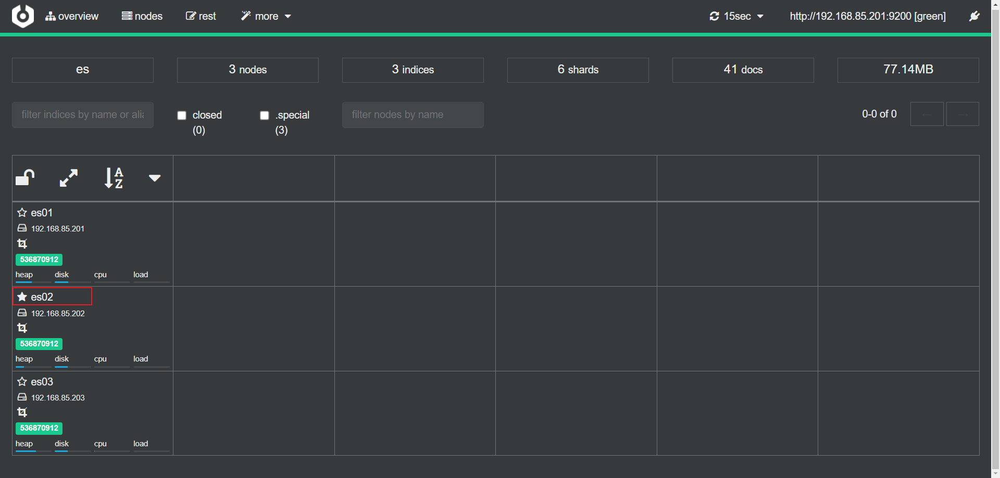

# ElasticSearch
## 简介

Elasticsearch（中文译为“弹性搜索”）是一个开源的**分布式搜索引擎**，它用于全文检索、结构化搜索和分析。它是Elastic公司的一个产品，基于Apache Lucene搜索库构建而成。Elasticsearch提供了一个RESTful API，使其易于集成到各种应用程序中。

该搜索引擎被广泛用于构建实时搜索和分析引擎，适用于各种用例，包括网站搜索、日志和事件数据分析、企业应用程序搜索等。Elasticsearch能够处理大量数据，并在分布式环境中进行水平扩展，使其适用于大规模数据存储和检索。

除了搜索功能外，Elasticsearch还具备**聚合、过滤、排序**等强大的分析能力。它通常与Logstash（用于数据收集和日志处理）以及Kibana（用于数据可视化和管理）一起使用，构成ELK堆栈，用于全面的日志和事件数据处理。

## 倒排索引


## 安装(单节点)

```shell
# 创建docker网络,使elasticsearch和kibana在同一网段
docker network create es-net

# 拉取es镜像,es最后一个7.x版本
docker pull elsaticsearch:7.17.16

# 启动es容器
# -e "ES_JAVA_OPTS=-Xms512m -Xmx512m"设置内存大小
# -e "discovery.type=single-node"设置单机版
# 将数据和插件路径挂载出来
# 设置加入之前创建的网络es-net 暴露9200 9300端口
docker run -d \
	--name elasticsearch \
    -e "ES_JAVA_OPTS=-Xms512m -Xmx512m" \
    -e "discovery.type=single-node" \
    -v es-data:/usr/share/elasticsearch/data \
    -v es-plugins:/usr/share/elasticsearch/plugins \
    --privileged \
    --network es-net \
    -p 9200:9200 \
    -p 9300:9300 \
elasticsearch:7.17.16
```

启动后访问: http://localhost:9200 可以看到以下信息

```json
{
    "name": "758d042e95ca",
    "cluster_name": "docker-cluster",
    "cluster_uuid": "yPh8v3ySTcCk8lOrTT1aIA",
    "version": {
        "number": "7.17.16",
        "build_flavor": "default",
        "build_type": "docker",
        "build_hash": "2b23fa076334f8d4651aeebe458a955a2ae23218",
        "build_date": "2023-12-08T10:06:54.672540567Z",
        "build_snapshot": false,
        "lucene_version": "8.11.1",
        "minimum_wire_compatibility_version": "6.8.0",
        "minimum_index_compatibility_version": "6.0.0-beta1"
        },
    "tagline": "You Know, for Search"
}
```

## 分词器
- 中文分词器 ik [https://github.com/medcl/elasticsearch-analysis-ik](https://github.com/medcl/elasticsearch-analysis-ik)
- 拼音分词器 pinyin
[https://github.com/medcl/elasticsearch-analysis-pinyin](https://github.com/medcl/elasticsearch-analysis-pinyin)

>  docker inspect elasticsearch 


将分词器解压到es-plugins的挂载出来的目录中即可

## kibana

```shell
docker pull kibana:7.17.16

docker run -d \
	--name mykibana \
    -p 5601:5601 \
    --network es-net \
    -e "ELASTICSEARCH_HOSTS=http://elasticsearch:9200" \
kibana:7.17.16
```

安装后,访问 http://localhost:5601

>  在Dev tools中执行默认的语句,可以得到es详细信息

```json
GET _search
{
  "query": {
    "match_all": {}
  }
}

{
  "took" : 6,
  "timed_out" : false,
  "_shards" : {
    "total" : 7,
    "successful" : 7,
    "skipped" : 0,
    "failed" : 0
  },
  "hits" : {
    "total" : {
      "value" : 86,
      "relation" : "eq"
    },
    "max_score" : 1.0,
    "hits" : [
      {
        "_index" : ".kibana_7.17.16_001",
        "_type" : "_doc",
        "_id" : "canvas-workpad-template:workpad-template-061d7868-2b4e-4dc8-8bf7-3772b52926e5",
          ..........................
```

> 执行 GET /

```json
GET /

{
  "name" : "758d042e95ca",
  "cluster_name" : "docker-cluster",
  "cluster_uuid" : "yPh8v3ySTcCk8lOrTT1aIA",
  "version" : {
    "number" : "7.17.16",
    "build_flavor" : "default",
    "build_type" : "docker",
    "build_hash" : "2b23fa076334f8d4651aeebe458a955a2ae23218",
    "build_date" : "2023-12-08T10:06:54.672540567Z",
    "build_snapshot" : false,
    "lucene_version" : "8.11.1",
    "minimum_wire_compatibility_version" : "6.8.0",
    "minimum_index_compatibility_version" : "6.0.0-beta1"
  },
  "tagline" : "You Know, for Search"
}

```

## 与Mysql概念上的对比

|    es    |  mysql   |
| :------: | :------: |
|  Index   | Database |
|   DSL    |   SQL    |
| Document |   Row    |
|  Field   |  Column  |
| Mapping  |  Schema  |

mapping属性: 对索引库中文档的约束

- Type: 字段的数据类型
  - 字符串: text(可分词)  keyword(精确值,不参与分词)
  - 数值: long integer short byte double float
  - 布尔: boolean
  - 日期: date
  - 对象: object
- index: 是否创建索引,默认为true
- analyzer: 使用哪种分词器
- properties: 字段的子字段

## 索引库CRUD

> 创建索引库

```json
PUT /索引库名称
{
    "mappings":{
        "properties":{
            "字段名":{
                "type": "text",
                "analyzer": "ik_smart"
            },
            "字段名2":{
                "type":"keyword",
                "index": "false"
            },
            "字段名3":{
                "type":"object",
                "properties":{
                    "子字段":{
                        "type":"keyword"
                    }
                }
            },
            ...
        }
    }
}
```

```json
PUT /person
{
  "mappings": {
    "properties": {
      "name":{
        "type": "text",
        "analyzer": "ik_smart"
      },
      "age":{
        "type": "integer",
        "index": false
      }
    }
  }
}

响应:
{
  "acknowledged" : true,
  "shards_acknowledged" : true,
  "index" : "person"
}
```

> 查询索引库
>
> GET /索引库名

```json
GET /person
```

> 删除索引库
>
> DELETE /索引库名

```
DELETE /zbq

{
  "acknowledged" : true
}
```

> 修改: 索引库和mapping一旦创建不可修改!!!
>
> 但是可以新增新的字段

```json
PUT /person/_mapping
{
  "properties": {
    "weight": {
      "type": "double",
      "index": false
    }
  }
}
```

## 文档CRUD

> 新增文档 DSL

```json
POST /索引库名/_doc/文档id
{
    "字段1":"value1",
    "字段2":"value2",
    ...
}
```

```shell
POST /person/_doc/1
{
  "name":"alex",
  "age":12,
  "weight":48.20
}
```

> 查询文档
>
> GET /索引库名/_doc/文档id

```
GET /person/_doc/1
```

> 删除文档
>
> DELETE /索引库名/_doc/文档id

```json
DELETE /person/_doc/1
```

> 修改文档:
>
> 分为两种: 全量修改和局部修改

> 全量修改, 删除原先文档再新增

```
POST /person/_doc/2
{
  "name":"albert",
  "age":12,
  "weight":48.20
}

```

> 局部修改: 只修改指定字段

```
POST /person/_update/1
{
  "doc": {
    "age":23
  }
}
```

## DSL查询

基本语法:

```json
GET /索引库名/_search
{
	"query":{
        "查询类型":{
            "查询条件":"条件值"
        }
    }
}
```

分类: 

- 查询所有  match_all

```json
GET /indexName/_search
{
	"query":{
        "match_all":{}
    }	
}
```

- 全文检索(full text)

```json
GET /indexName/_search
{
    "query":{
        "match":{
            "字段名": "值"
        }
    }
}
```

```json
GET /indexName/_search
{
    "query":{
        "multi_match":{
            "query":"值",
            "fields":["字段1","字段2",...]
        }
    }
}
```

- 精确查询: keyword 数值 日期等等类型查询

  - term: 精确查询

  ```json
  GET /indexName/_search
  {
      "query":{
          "term":{
              "字段名":{
                  "value":"取值"
              }
          }
      }
  }
  ```

  - range: 范围

  ```json
  GET /indexName/_search
  {
      "query":{
          "range":{
              "字段名":{
                  "gte":10,
                  "lte":20
              }
          }
      }
  }
  ```

- 地理查询

  - geo_bounding_box: 某个矩形范围内的文档

  ```json
  GET /indexName/_search
  {
      "query":{
          "geo_bounding_box":{
              "字段名":{
                  "top_left":{
                      "lat":值1,
                      "lon":值2
                  },
                  "bottom_right":{
                      "lat":值3,
                      "lon":值4
                  }
              }
          }
      }
  }
  ```

  - geo_distance: 查询到指定中心点距离的所有文档

  ```json
  GET /indexName/_search
  {
      "query":{
          "geo_distance":{
          	"distance":"15km",
              "字段名":"经度,纬度"
          }
      }
  }
  ```

- 复合查询

### 相关性算分

- TF (Term Frequency)

$TF = \frac{词条出现次数}{文档中词条总数}$

- TF-IDF : es5.0以前
- BM25: es5.0后

### Function Score Query自定义算分


### Boolean Query
一个或多个查询子句组合
- must 参与算分,必须匹配
- should 参与算分,选择性匹配
- must_not 不参与算分,必须不成立
- filter 不参与算分,必须匹配

```json
GET /indexName/_search
{
    "query":{
        "bool":{
            "must":[
                {
                    全文检索,精确查询,地理查询等
                }
            ],
            "must_not":[
                {
                    全文检索,精确查询,地理查询等
                }
            ],
            "should":[{}],
            "filter":[{}]
        }
    }
}
```

## 搜索结果处理

### 排序
默认按照相关度算分排序
可排序字段:

- keyword
- 数值
- 地理坐标
- 日期
**使用上述字段时,就不再做相关性打分**

```json
GET /indexName/_search
{
    "query":{
        "match_all":{}
    },
    "sort":{
        "字段1":"asc / desc",
        "字段2":"asc / desc"
    }
}
```


### 分页
默认返回10条结果\
通过from和size返回结果\
和mysql中limit a,b 相似\
from=10 size=10时,es会查询所有结果再从中截取想要的数据,单点时问题不太突出.当es集群部署时,要将所有的结果先聚合,在内存中排序后截取结果返回.数据量百万千万时非常恐怖的操作.es限制上限为10000条\
如果非要获取10000条以后的数据:
es提供了解决方案, search after

```json
GET /indexName/_search
{
    "query":{
        "match_all":{}
    },
    "sort":{
        "字段1":"asc / desc",
        "字段2":"asc / desc"
    },
    "from": 100,
    "size": 10
}
```


### 高亮
将搜索关键字突出显示

```json
GET /indexName/_search
{
    "query":{
        "match":{
            "字段":"值"
        }
    },
    "highlight":{
        "fields":{
            "字段1":{
                "pre_tags":"<em>",
                "post_tags":"</em>"
            },
            "字段2":...
        }
    }
}
```


## 数据聚合 aggregations
- **桶(Bucket)聚合**
    - TermAggregation
    - Date Histogram
- **度量(Metric)聚合**
    - Avg
    - Max
    - Min
- **管道(pipeline)聚合**: 对其他聚合结果再聚合

## 自动补全

## 数据同步
es数据来自mysql

- 同步阻塞式
- 异步, 消息队列
- 使用canal监听mysql的binlog

## 集群

个人机器情况: windows10 物理主机 配置虚拟网卡 ip为 192.168.85.200  网关 192.168.85.2

3台centos7.9.2009  配置静态ip

3台机器ip分别为: 192.168.85.201 192.168.85.202  192.168.85.203

能做到任意节点相互ping通

搭建3节点的es集群: 

将下方配置保存为elasticsearch.yml, 挂载数据卷时使用,作为es配置

192.168.85.201: 

```yml
cluster.name: es
# 当前该节点的名称，每个节点不能重复es-node-1，es-node-2，es-node-3
node.name: es01
# # 当前该节点是不是有资格竞选主节点
node.master: true
# # 当前该节点是否存储数据
node.data: true
# # 设置为公开访问
network.host: 0.0.0.0
# # 设置其它节点和该节点交互的本机器的ip地址，三台各自为
network.publish_host: 192.168.85.201
# # 设置映射端口
http.port: 9200
# # 内部节点之间沟通端口
transport.tcp.port: 9300
#
# # 支持跨域访问
http.cors.enabled: true

http.cors.allow-origin: "*"
#
# # 配置集群的主机地址
discovery.seed_hosts: ["192.168.85.201","192.168.85.202","192.168.85.203"]
# # 初始主节点，使用一组初始的符合主条件的节点引导集群
cluster.initial_master_nodes: ["es01","es02","es03"]
# # 节点等待响应的时间，默认值是30秒,增加这个值，从一定程度上会减少误判导致脑裂
discovery.zen.ping_timeout: 30s
# # 配置集群最少主节点数目，通常为 (可成为主节点的主机数目 / 2) + 1
discovery.zen.minimum_master_nodes: 2
# # 禁用交换内存，提升效率
bootstrap.memory_lock: false
```

然后使用docker启动容器

```shell
docker run --name=es01 -p 9200:9200 -p 9300:9300 \
-e ES_JAVA_OPTS="-Xms512m -Xmx512m" \
-v /root/es/elasticsearch.yml:/usr/share/elasticsearch/config/elasticsearch.yml \
-v es01-data:/usr/share/elasticsearch/data \
-v es01-plugins:/usr/share/elasticsearch/plugins \
--restart=always \
-d elasticsearch:7.17.16
```

第二台: 192.168.85.202

```yml
cluster.name: es
# 当前该节点的名称，每个节点不能重复es-node-1，es-node-2，es-node-3
node.name: es02
# # # 当前该节点是不是有资格竞选主节点
node.master: true
# # # 当前该节点是否存储数据
node.data: true
# # # 设置为公开访问

network.host: 0.0.0.0
# # # 设置其它节点和该节点交互的本机器的ip地址，三台各自为
network.publish_host: 192.168.85.202
# # # 设置映射端口
http.port: 9200
# # # 内部节点之间沟通端口
transport.tcp.port: 9300
# #
# # # 支持跨域访问
http.cors.enabled: true
#


http.cors.allow-origin: "*"
# #
# # # 配置集群的主机地址
discovery.seed_hosts: ["192.168.85.201","192.168.85.202","192.168.85.203"]
# # # 初始主节点，使用一组初始的符合主条件的节点引导集群
cluster.initial_master_nodes: ["es01","es02","es03"]
# # # 节点等待响应的时间，默认值是30秒,增加这个值，从一定程度上会减少误判导致脑裂
discovery.zen.ping_timeout: 30s
# # # 配置集群最少主节点数目，通常为 (可成为主节点的主机数目 / 2) + 1
discovery.zen.minimum_master_nodes: 2
# # # 禁用交换内存，提升效率
bootstrap.memory_lock: false

```

```shell
docker run --name=es02 -p 9200:9200 -p 9300:9300 \
-e ES_JAVA_OPTS="-Xms512m -Xmx512m" \
-v /root/es/elasticsearch.yml:/usr/share/elasticsearch/config/elasticsearch.yml \
-v es02-data:/usr/share/elasticsearch/data \
-v es02-plugins:/usr/share/elasticsearch/plugins \
--restart=always \
-d elasticsearch:7.17.16
```

第三台: 192.168.85.203

```yml
cluster.name: es
# 当前该节点的名称，每个节点不能重复es-node-1，es-node-2，es-node-3
node.name: es03
# # # 当前该节点是不是有资格竞选主节点
node.master: true
# # # 当前该节点是否存储数据
node.data: true
# # # 设置为公开访问

network.host: 0.0.0.0
# # # 设置其它节点和该节点交互的本机器的ip地址，三台各自为
network.publish_host: 192.168.85.203
# # # 设置映射端口
http.port: 9200
# # # 内部节点之间沟通端口
transport.tcp.port: 9300
# #
# # # 支持跨域访问
http.cors.enabled: true
#


http.cors.allow-origin: "*"
# #
# # # 配置集群的主机地址
discovery.seed_hosts: ["192.168.85.201","192.168.85.202","192.168.85.203"]
# # # 初始主节点，使用一组初始的符合主条件的节点引导集群
cluster.initial_master_nodes: ["es01","es02","es03"]
# # # 节点等待响应的时间，默认值是30秒,增加这个值，从一定程度上会减少误判导致脑裂
discovery.zen.ping_timeout: 30s
# # # 配置集群最少主节点数目，通常为 (可成为主节点的主机数目 / 2) + 1
discovery.zen.minimum_master_nodes: 2
# # # 禁用交换内存，提升效率
bootstrap.memory_lock: false
```

```
docker run --name=es03 -p 9200:9200 -p 9300:9300 \
-e ES_JAVA_OPTS="-Xms512m -Xmx512m" \
-v /root/es/elasticsearch.yml:/usr/share/elasticsearch/config/elasticsearch.yml \
-v es03-data:/usr/share/elasticsearch/data \
-v es03-plugins:/usr/share/elasticsearch/plugins \
--restart=always \
-d elasticsearch:7.17.16
```

安装 cerebro https://github.com/lmenezes/cerebro/releases/tag/v0.9.4 

启动bin目录下 cerebro.bat

登陆界面连接任意一台即可:

成功界面:



可以看到3个节点工作正常, es02为master节点

使用nginx配置反向代理

在nginx.conf中添加:

```properties
upstream   es-cluster {
        server 192.168.85.201:9200;
        server 192.168.85.202:9200;
        server 192.168.85.203:9200;
    }

    server {
        listen 8000;
        server_name localhost;

        location / {
            proxy_pass http://es-cluster;
        }
    
    }
```

访问 http://localhost:8000 即可