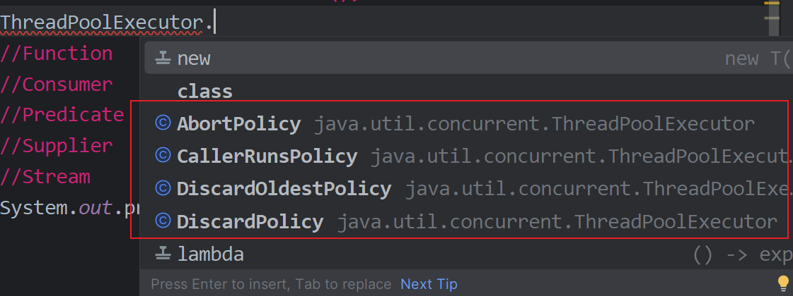
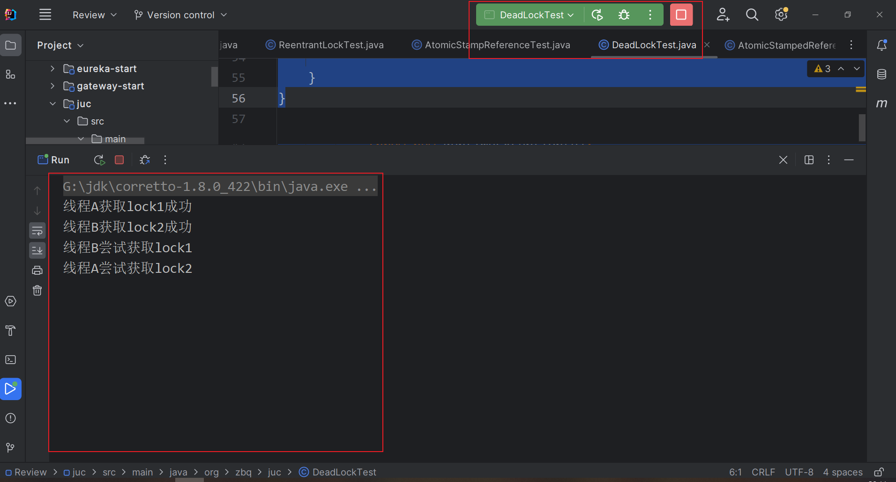
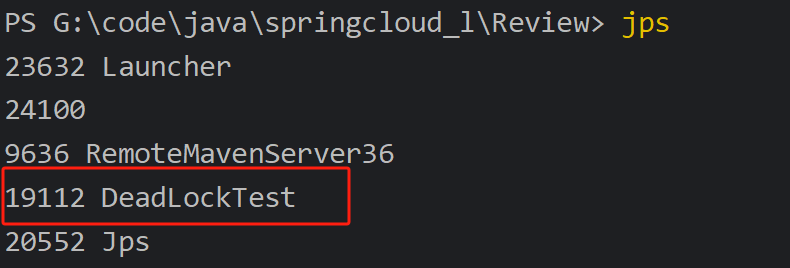
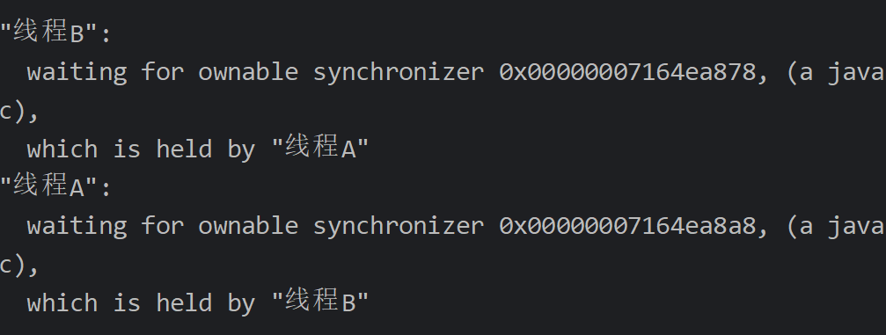
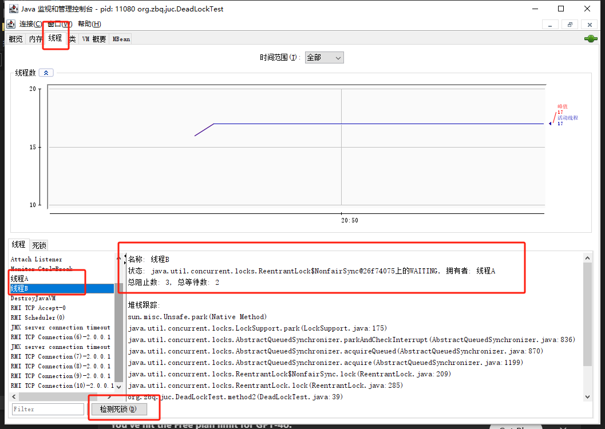
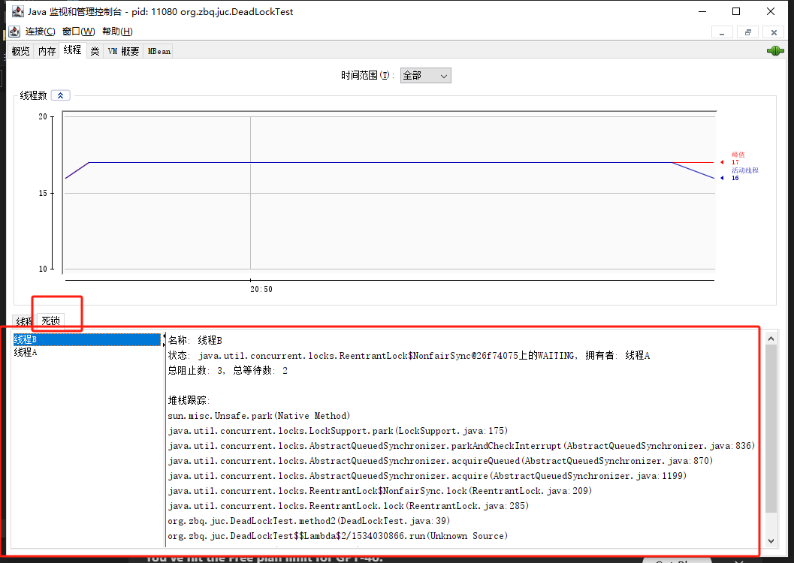

# JUC 

java.util.concurrent包

## 线程状态 6种

```java
public enum State {
        //还未开启
        NEW,
        //正在运行
        RUNNABLE,
		//阻塞,等待资源释放
        BLOCKED,
		//等待
		//Object.wait()  Thread.join() 
        WAITING,
		//有时间的等待 
		//Thread.sleep()  Object.wait()  Thread.join() 
        TIMED_WAITING,
        //终结  任务执行完
        TERMINATED;
    }
```

## 线程开启

```java
public synchronized void start() {
        /**
         * A zero status value corresponds to state "NEW".
         * 判断状态
         */
        if (threadStatus != 0)
            throw new IllegalThreadStateException();

        /* Notify the group that this thread is about to be started
         * so that it can be added to the group's list of threads
         * and the group's unstarted count can be decremented. */
    	//加入线程组
        group.add(this);

        boolean started = false;
        try {
            //调用start0()
            start0();
            started = true;
        } finally {
            try {
                if (!started) {
                    group.threadStartFailed(this);
                }
            } catch (Throwable ignore) {
                /* do nothing. If start0 threw a Throwable then
                  it will be passed up the call stack */
            }
        }
    }
	
	//start0为本地方法 java无法操作硬件 去调用底层的c/c++代码
    private native void start0();
```

## sleep和wait

- Thread.sleep()  Object.wait()
- sleep抱着锁睡   wait会释放锁
- sleep可以在任何地方调用  wait只能在同步代码块中
- sleep需要捕获InterruptedException  wait不需要捕获异常

## Lock锁

不加锁会出现什么情况 (卖票举例,启动3个线程去卖票)

```java
public class SaleTicket {
    public static void main(String[] args) {
        Ticket ticket=new Ticket();
        new Thread(()->{
            for (int i = 0; i < 50; i++) {
                ticket.sale();
                try {
                    Thread.sleep(30);
                } catch (InterruptedException e) {
                    throw new RuntimeException(e);
                }
            }
        },"A").start();
        new Thread(()->{
            for (int i = 0; i < 50; i++) {
                ticket.sale();
                try {
                    Thread.sleep(30);
                } catch (InterruptedException e) {
                    throw new RuntimeException(e);
                }
            }
        },"B").start();
        new Thread(()->{
            for (int i = 0; i < 50; i++) {
                ticket.sale();
                try {
                    Thread.sleep(30);
                } catch (InterruptedException e) {
                    throw new RuntimeException(e);
                }
            }
        },"C").start();
    }
}

class Ticket{
    private int number = 50;
    private String name ="故宫门票";

    public Ticket() {
    }

    public Ticket(int number, String name) {
        this.number = number;
        this.name = name;
    }

    public void sale(){
        if(number>0) {
            number--;
            System.out.println("线程"+Thread.currentThread().getName()+"卖出第"+(50-number)+"张票");
        }
    }
}
```

```
线程A卖出第1张票
线程B卖出第2张票
线程C卖出第3张票
线程C卖出第4张票
线程A卖出第5张票
线程B卖出第4张票
线程B卖出第6张票
线程C卖出第6张票
线程A卖出第6张票
线程A卖出第9张票
线程C卖出第9张票
线程B卖出第9张票
...
```

线程C和B都卖了第4张票...  

尝试解决方式: sale()方法添加synchronized关键字

```java
public synchronized void sale(){
        if(number>0) {
            number--;
            System.out.println("线程"+Thread.currentThread().getName()+"卖出第"+(50-number)+"张票");
        }
    }
```

```
线程A卖出第1张票
线程B卖出第2张票
线程C卖出第3张票
线程A卖出第4张票
线程B卖出第5张票
线程C卖出第6张票
线程A卖出第7张票
线程B卖出第8张票
线程C卖出第9张票
线程B卖出第10张票
线程A卖出第11张票
线程C卖出第12张票
线程C卖出第13张票
...
```

现在变得整整齐齐

synchronized

- 本质是管理对象的监视器锁,确保同一时刻只有一个线程可以执行synchronized修饰的方法或代码块
- 一个线程进入synchronized方法或代码块,获取监视器锁,执行完毕或者遇到异常,锁会自动释放
- 其他线程尝试进入时, 未拿到锁会被阻塞

尝试使用JUC下的Lock

```java
public interface Lock {
    void lock();
    void lockInterruptibly() throws InterruptedException;
    boolean tryLock();
    boolean tryLock(long time, TimeUnit unit) throws InterruptedException;
    void unlock();
    Condition newCondition();
}

已知的实现类
ReentrantLock, ReentrantReadWriteLock.ReadLock, ReentrantReadWriteLock.WriteLock
```

文档中给出的使用示例 (三部曲)

```java
 Lock l = ...; //new一个锁
 l.lock(); //加锁
 try {
   // 业务代码
 } finally {
   l.unlock(); //解锁
 }
```

修改代码为:

```java
public class SaleTicketLock {
    public static void main(String[] args) {
        Ticket2 ticket = new Ticket2();
        new Thread(() -> {
            for (int i = 0; i < 50; i++) {
                ticket.sale();
                try {
                    Thread.sleep(30);
                } catch (InterruptedException e) {
                    throw new RuntimeException(e);
                }
            }
        }, "A").start();
        new Thread(() -> {
            for (int i = 0; i < 50; i++) {
                ticket.sale();
                try {
                    Thread.sleep(30);
                } catch (InterruptedException e) {
                    throw new RuntimeException(e);
                }
            }
        }, "B").start();
        new Thread(() -> {
            for (int i = 0; i < 50; i++) {
                ticket.sale();
                try {
                    Thread.sleep(30);
                } catch (InterruptedException e) {
                    throw new RuntimeException(e);
                }
            }
        }, "C").start();
    }
}


    class Ticket2{
        private int number = 50;
        private String name ="故宫门票";
        Lock l=new ReentrantLock();
        public Ticket2() {
        }
        public void sale(){
            l.lock();
            try{
                if(number>0) {
                    number--;
                    System.out.println("线程"+Thread.currentThread().getName()+"卖出第"+(50-number)+"张票");
                }
            }catch (Exception e){
                e.printStackTrace();
            }finally {
                l.unlock();
            }
        }

    }

```

```
线程A卖出第1张票
线程B卖出第2张票
线程C卖出第3张票
线程C卖出第4张票
线程B卖出第5张票
线程A卖出第6张票
线程A卖出第7张票
线程B卖出第8张票
线程C卖出第9张票
线程C卖出第10张票
线程B卖出第11张票
线程A卖出第12张票
线程C卖出第13张票
线程A卖出第14张票
线程B卖出第15张票
```

ReentrantLock

```java
   
    public ReentrantLock() {
        sync = new NonfairSync();  //默认创建非公平锁
    }

    public ReentrantLock(boolean fair) {
        sync = fair ? new FairSync() : new NonfairSync(); //传递参数,为true则为公平锁
    }
```

公平锁与非公平锁

- 公平锁按照线程请求的顺序来获取锁, 即放入一个队列,先来先服务 FIFO,性能较低
- 非公平锁,允许线程竞争时抢占锁,适合性能要求高的场景

synchronized和Lock区别

- synchronized内置关键字  Lock是类
- synchronized无法判断锁的状态   Lock可以判断
- synchronized自动释放锁 Lock手动释放锁
- synchronized 线程1(拿到锁,阻塞) 线程2(死死的等)  Lock不一定会等
- synchronized 可重入锁,不可中断,非公平   Lock可重入,可以判断锁,可以设置是否公平
- synchronized锁少量的同步代码  Lock锁大量

## 生产者和消费者问题  

```java
public class ProducerConsumer {
    public static void main(String[] args) {
        Data data=new Data();
        new Thread(()->{
            for (int i = 0; i < 10; i++) {
                try {
                    data.increment();
                    TimeUnit.MICROSECONDS.sleep(20);
                } catch (InterruptedException e) {
                    throw new RuntimeException(e);
                }
            }
        },"A").start();
        new Thread(()->{
            for (int i = 0; i < 10; i++) {
                try {
                    data.decrement();
                    TimeUnit.MICROSECONDS.sleep(20);
                } catch (InterruptedException e) {
                    throw new RuntimeException(e);
                }
            }
        },"B").start();
    }
}

class Data{
    private int data=0;

    public synchronized void increment() throws InterruptedException {
        if(data!=0){
            this.wait();
        }
        data++;
        this.notifyAll();
        System.out.println(Thread.currentThread().getName()+"=>"+data);
    }

    public synchronized void decrement() throws InterruptedException {
        if(data!=1){
            this.wait();
        }
        data--;
        this.notifyAll();
        System.out.println(Thread.currentThread().getName()+"=>"+data);
    }
}

```

```
A=>1
B=>0
A=>1
B=>0
A=>1
B=>0
A=>1
B=>0
A=>1
B=>0
A=>1
B=>0
A=>1
B=>0
A=>1
B=>0
A=>1
B=>0
A=>1
B=>0
```

两个线程这样做没有问题, 但如果有多个线程 (2个生产者 2个消费者)

```java
public class ProducerConsumer {
    public static void main(String[] args) {
        Data data=new Data();
        new Thread(()->{
            for (int i = 0; i < 10; i++) {
                try {
                    data.increment();
                    TimeUnit.MICROSECONDS.sleep(20);
                } catch (InterruptedException e) {
                    throw new RuntimeException(e);
                }
            }
        },"A").start();
        new Thread(()->{
            for (int i = 0; i < 10; i++) {
                try {
                    data.decrement();
                    TimeUnit.MICROSECONDS.sleep(20);
                } catch (InterruptedException e) {
                    throw new RuntimeException(e);
                }
            }
        },"B").start();
        new Thread(()->{
            for (int i = 0; i < 10; i++) {
                try {
                    data.increment();
                    TimeUnit.MICROSECONDS.sleep(20);
                } catch (InterruptedException e) {
                    throw new RuntimeException(e);
                }
            }
        },"C").start();
        new Thread(()->{
            for (int i = 0; i < 10; i++) {
                try {
                    data.decrement();
                    TimeUnit.MICROSECONDS.sleep(20);
                } catch (InterruptedException e) {
                    throw new RuntimeException(e);
                }
            }
        },"D").start();
    }
}
```

```
A=>1
B=>0
C=>1
D=>0
C=>1
B=>0
D=>-1
A=>0
A=>1
D=>0
B=>-1
```

会出现 -1 的情况, 出现了**虚假唤醒**

通过修改为while

```java
class Data{
    private int data=0;

    public synchronized void increment() throws InterruptedException {
        while(data!=0){
            this.wait();
        }
        data++;
        this.notifyAll();
        System.out.println(Thread.currentThread().getName()+"=>"+data);
    }

    public synchronized void decrement() throws InterruptedException {
        while(data!=1){
            this.wait();
        }
        data--;
        this.notifyAll();
        System.out.println(Thread.currentThread().getName()+"=>"+data);
    }
}
```

```
A=>1
B=>0
C=>1
D=>0
A=>1
B=>0
C=>1
D=>0
C=>1
B=>0
A=>1
D=>0
C=>1
B=>0
A=>1
D=>0
A=>1
D=>0
C=>1
B=>0
A=>1
D=>0
C=>1
B=>0
A=>1
D=>0
C=>1
B=>0
A=>1
D=>0
C=>1
B=>0
A=>1
D=>0
C=>1
B=>0
C=>1
B=>0
A=>1
D=>0
```

JUC版   wait --> await()  notify--->signal()

```java
//从文档中得到   java.util.concurrent.locks.Condition
class BoundedBuffer {
   final Lock lock = new ReentrantLock();
   final Condition notFull  = lock.newCondition(); 
   final Condition notEmpty = lock.newCondition(); 

   final Object[] items = new Object[100];
   int putptr, takeptr, count;

   public void put(Object x) throws InterruptedException {
     lock.lock();
     try {
       while (count == items.length)
         notFull.await();  //attention!
       items[putptr] = x;
       if (++putptr == items.length) putptr = 0;
       ++count;
       notEmpty.signal();// //attention!
     } finally {
       lock.unlock();
     }
   }

   public Object take() throws InterruptedException {
     lock.lock();
     try {
       while (count == 0)
         notEmpty.await();
       Object x = items[takeptr];
       if (++takeptr == items.length) takeptr = 0;
       --count;
       notFull.signal();
       return x;
     } finally {
       lock.unlock();
     }
   }
 }
 
```

```java
public class ProduceConsumerLock {
    public static void main(String[] args) {
        Data2 data=new Data2();
        new Thread(()->{
            for (int i = 0; i < 10; i++) {
                try {
                    data.increment();
                    TimeUnit.MICROSECONDS.sleep(20);
                } catch (InterruptedException e) {
                    throw new RuntimeException(e);
                }
            }
        },"A").start();
        new Thread(()->{
            for (int i = 0; i < 10; i++) {
                try {
                    data.decrement();
                    TimeUnit.MICROSECONDS.sleep(20);
                } catch (InterruptedException e) {
                    throw new RuntimeException(e);
                }
            }
        },"B").start();
        new Thread(()->{
            for (int i = 0; i < 10; i++) {
                try {
                    data.increment();
                    TimeUnit.MICROSECONDS.sleep(20);
                } catch (InterruptedException e) {
                    throw new RuntimeException(e);
                }
            }
        },"C").start();
        new Thread(()->{
            for (int i = 0; i < 10; i++) {
                try {
                    data.decrement();
                    TimeUnit.MICROSECONDS.sleep(20);
                } catch (InterruptedException e) {
                    throw new RuntimeException(e);
                }
            }
        },"D").start();
    }

}

class Data2{
    private int data=0;
    Lock lock=new ReentrantLock();
    Condition condition = lock.newCondition();

    public  void increment() throws InterruptedException {
        lock.lock();

        try {
            while(data!=0){
                condition.await();
            }
            data++;
            condition.signalAll();
            System.out.println(Thread.currentThread().getName()+"=>"+data);
        } catch (InterruptedException e) {
            throw new RuntimeException(e);
        }finally {
            lock.unlock();
        }

    }

    public  void decrement() throws InterruptedException {
        lock.lock();

        try {
            while (data != 1) {
                condition.await();
            }
            data--;
            condition.signalAll();
            System.out.println(Thread.currentThread().getName() + "=>" + data);
        } catch (InterruptedException e) {
            throw new RuntimeException(e);
        } finally {
            lock.unlock();
        }
    }
}

```

```
A=>1
B=>0
C=>1
D=>0
A=>1
D=>0
C=>1
B=>0 
A=>1
D=>0
C=>1
B=>0
A=>1
D=>0
C=>1
B=>0
C=>1
B=>0
A=>1
D=>0
C=>1
B=>0
A=>1
D=>0
C=>1
D=>0
A=>1
B=>0
A=>1
D=>0
C=>1
B=>0
A=>1
D=>0
C=>1
B=>0
A=>1
B=>0
C=>1
D=>0
```

## 什么是锁 (8锁问题 )

什么是锁, 锁的是什么 

- synchronized 锁的是调用者(即new出来的对象), 普通方法不受影响
- 如果有static修饰,则锁的是类的Class模板
- 调用者(实例对象)和类Class 是两把锁

## 集合类不安全

- List 

```java
public class ListTest {
    public static void main(String[] args) {
        List<String> list=new ArrayList<>();
        for (int i = 0; i < 10; i++) {
            new Thread(()->{
                list.add(UUID.randomUUID().toString());
                System.out.println(list);
            },String.valueOf(i)).start();
        }
    }
}
```

```java
Exception in thread "2" Exception in thread "7" Exception in thread "0" Exception in thread "4" Exception in thread "3" Exception in thread "1" java.util.ConcurrentModificationException
```

```java
//原因  源码如图
//ArrayList 1.2 出现
 public boolean add(E e) {
        ensureCapacityInternal(size + 1);  // Increments modCount!!
        elementData[size++] = e;
        return true;
}
```

解决方案:

```java
//方案1 换成vector 线程安全 
//vector的add方法  有synchronized关键字
 public synchronized boolean add(E e) {
        modCount++;
        ensureCapacityHelper(elementCount + 1);
        elementData[elementCount++] = e;
        return true;
}
```

```java
//方案2
//Collections.synchronizedList
List<String> list= Collections.synchronizedList(new ArrayList<>());
```


```java
//方案3  JUC包
//CopyOnWrite
List<String> list = new CopyOnWriteArrayList<>();
```


- Set

```java
public class SetTest {
    public static void main(String[] args) {
        Set<String> set=new HashSet<>();
        for (int i = 0; i < 30; i++) {
            new Thread(()->{
                set.add(UUID.randomUUID().toString());
                System.out.println(set);
            },String.valueOf(i)).start();
        }
```

```
Exception in thread "22" Exception in thread "7" Exception in thread "0" Exception in thread "15" Exception in thread "6" Exception in thread "10" Exception in thread "11" Exception in thread "5" Exception in thread "23" java.util.ConcurrentModificationException
```

解决方案:

```java
// 1工具类
Set<String> set= Collections.synchronizedSet(new HashSet<>());
```

```java
//2. juc
Set<String> set = new CopyOnWriteArraySet<>();
```

- map

 ```java
public class MapTest {
    public static void main(String[] args) {
        Map<Integer,String> map=new HashMap<>();
        for (int i = 0; i < 30; i++) {
            int finalI = i;
            new Thread(()->{
                map.put(finalI, UUID.randomUUID().toString());
                System.out.println(map);
            },String.valueOf(i)).start();
        }
    }
}

 ```


解决方案

```java
Map<Integer,String> map= Collections.synchronizedMap(new HashMap<>());

Map<Integer,String> map= new ConcurrentHashMap<>();
```

## Callable

## CountDownLatch CyclicBArrier Semaphore

CountDownLatch 减法计数器

- countDownLatch.countDown()  数量-1

- countDownLatch.await() 等待计数器归0,才会被唤醒,向下执行

CyclicBarrier  可以理解为加法计数器, 构造方法可以传入一个Runnable,"加"到设定的数量后执行

Semaphore 信号量 : 竞争资源的数量

## 读写锁 ReadWriteLock

```java
public interface ReadWriteLock {
    Lock readLock();

    Lock writeLock();
}
```

读可以多个线程读,写只能一个线程去写 

**但是**,读写是互斥的,即**在读的时候不能写入, 写的时候不能读取**

```java
public class ReadWriteLockTest {
    public static void main(String[] args) {
        MyCache cache=new MyCache();
        for (int i = 0; i < 5; i++) {
            final int num=i;
            new Thread(()->{
                cache.put(num+" ",num+" ");
            }).start();
        }

        for (int i = 0; i < 5; i++) {
            final int num=i;
            new Thread(()->{
                cache.get(num+" ");
            }).start();
        }
    }
}

class MyCache{
    private Map<String,Object> cache = new HashMap<>();
    private ReadWriteLock lock = new ReentrantReadWriteLock();
    public void put(String key,Object value){
        lock.writeLock().lock();

        try {
            System.out.println("准备写入"+key);
            cache.put(key,value);
            System.out.println(key+"写入成功");
        } catch (Exception e) {
            throw new RuntimeException(e);
        }finally {
            lock.writeLock().unlock();
        }

    }

    public Object get(String key){
        lock.readLock().lock();
        try {
            System.out.println("准备读取"+key);
            Object o = cache.get(key);
            if(o==null) System.out.println("读取为null");
            System.out.println(key+"读取完成");
            return o;
        } catch (Exception e) {
            throw new RuntimeException(e);
        } finally {
            lock.readLock().unlock();
        }
    }
}
```

```
准备写入0 
0 写入成功
准备写入4 
4 写入成功
准备写入3 
3 写入成功
准备写入2 
2 写入成功
准备写入1 
1 写入成功
准备读取0 
0 读取完成
准备读取1 
准备读取2 
准备读取3 
3 读取完成
准备读取4 
4 读取完成
1 读取完成
2 读取完成
```

## 阻塞队列

典型场景为生产者消费者, 生产者发的消息送到队列中, 消费者从队列头部去拿. 如果当前队列为空,消费者就不能拿,只能阻塞等待. 如果当前队列满了,生产者就得阻塞,直到队列有空位

ArrayBlockingQueue  LinkedBlockingQueue

| 方式     | 抛出异常 | 有返回值,不抛异常 | 阻塞等待 | 超时等待  |
| -------- | -------- | ----------------- | -------- | --------- |
| 添加     | add      | offer             | put      | offer(,,) |
| 删除     | remove   | poll              | take     | poll(,)   |
| 获得队首 | element  | peek              | -        |           |

同步队列 SynchronousQueue : 容量为1 的阻塞队列

## 线程池

池化思想: 线程池 数据库连接池 字符串常量池

频繁的创建销毁非常消耗系统资源,所以提前准备好一些,即用即拿,用完归还

- 降低资源消耗
- 提高效应速度
- 便于统一管理

Executors工具类 (3个方法)

```java
Executors.newSingleThreadExecutor(); //创建单一线程的池子
Executors.newFixedThreadPool();//创建固定大小的池
Executors.newCachedThreadPool();//可伸缩的池子
```


ThreadPoolExecutor 7大参数

```java
 public ThreadPoolExecutor(int corePoolSize, //核心线程数
                              int maximumPoolSize, //最大线程数
                              long keepAliveTime, //等待时间,时间到了就销毁
                              TimeUnit unit,//时间单位
                              BlockingQueue<Runnable> workQueue,//阻塞队列
                              ThreadFactory threadFactory,//线程工厂
                              RejectedExecutionHandler handler//拒绝策略
                          ) {
        if (corePoolSize < 0 ||
            maximumPoolSize <= 0 ||
            maximumPoolSize < corePoolSize ||
            keepAliveTime < 0)
            throw new IllegalArgumentException();
        if (workQueue == null || threadFactory == null || handler == null)
            throw new NullPointerException();
        this.acc = System.getSecurityManager() == null ?
                null :
                AccessController.getContext();
        this.corePoolSize = corePoolSize;
        this.maximumPoolSize = maximumPoolSize;
        this.workQueue = workQueue;
        this.keepAliveTime = unit.toNanos(keepAliveTime);
        this.threadFactory = threadFactory;
        this.handler = handler;
    }
```

4种策略



```java
AbortPolicy : 抛出异常
CallerRunsPolicy: 返回给调用者去执行 ,Main线程
DiscardPolicy: 不抛异常,不执行
DiscardOldestPolicy: 尝试竞争
```

## 函数式接口

```java
@FunctionalInterface
public interface Function<T, R> {

    /**
     * Applies this function to the given argument.
     *
     * @param t the function argument
     * @return the function result
     */
    R apply(T t);
}

@FunctionalInterface
public interface Predicate<T> {

    /**
     * Evaluates this predicate on the given argument.
     *
     * @param t the input argument
     * @return {@code true} if the input argument matches the predicate,
     * otherwise {@code false}
     */
    boolean test(T t);
}

@FunctionalInterface
public interface Supplier<T> {

    /**
     * Gets a result.
     *
     * @return a result
     */
    T get();
}


@FunctionalInterface
public interface Consumer<T> {

    /**
     * Performs this operation on the given argument.
     *
     * @param t the input argument
     */
    void accept(T t);
}
```

## ForkJoin

分支合并, 并发执行  MapReduce

特点: 工作窃取  (双端队列)

Stream并行流

## 异步回调

CompletableFuture

## JMM

java内存模型

- 线程解锁前,必须把共享变量立刻刷回主存
- 线程加锁前,必须读取主存中的最新值到自己的工作内存
- 加锁和解锁是同一把锁

## Volatile

jvm提供的轻量级的同步机制

- 保证可见性
- 不保证原子性
  - 不用Lock和synchronized解决: 使用Atomic原子类
- 禁止指令重排

## CAS

 compareAndSet  CAS  比较并交换 

如果是期望的值,就更新

```java
public final int getAndAddInt(Object o, long offset, int delta) {
    int v;
    do {
        v = getIntVolatile(o, offset);
    } while (!compareAndSwapInt(o, offset, v, v + delta));
    return v;
}
```

缺点:

- 自旋等待 CAS操作失败时会不断尝试重试,这种操作在高并发下可能增加CPU开销
- 一次性只能保证一个共享变量的原子性
- **ABA问题**即一个变量的值被改动后再改回原值，普通CAS无法检测到这一情况，而通过增加标记字段，可以检测到该变量的变化次数

## 原子引用 (乐观锁)

```java
AtomicStampedReference

public boolean compareAndSet(V   expectedReference,  //期望的引用
                                 V   newReference,   //要修改的引用
                                 int expectedStamp,  //期望的时间戳
                                 int newStamp        //新的时间戳
                            ) {
        Pair<V> current = pair;
        return
            expectedReference == current.reference &&
            expectedStamp == current.stamp &&
            ((newReference == current.reference &&
              newStamp == current.stamp) ||
             casPair(current, Pair.of(newReference, newStamp)));
    }
```

```java

public class AtomicStampReferenceTest {

    public static void main(String[] args) {
        AtomicStampedReference<Long> atomicStampedReference=new AtomicStampedReference<>(1L,1);
        new Thread(()->{
            int stamp = atomicStampedReference.getStamp();
            System.out.println(Thread.currentThread().getName()+"当前时间戳为"+stamp);

            boolean b = atomicStampedReference.compareAndSet(1L, 2L, atomicStampedReference.getStamp(), atomicStampedReference.getStamp() + 1);
            if(b){
                System.out.println(Thread.currentThread().getName()+"CAS成功");
                System.out.println("当前引用为"+atomicStampedReference.getReference());
            }else{
                System.out.println(Thread.currentThread().getName()+"CAS失败");
                System.out.println("当前引用为"+atomicStampedReference.getReference());
            }

            boolean c = atomicStampedReference.compareAndSet(2L, 1L, atomicStampedReference.getStamp(), atomicStampedReference.getStamp() + 1);
            if(c){
                System.out.println(Thread.currentThread().getName()+"CAS成功");
                System.out.println("当前引用为"+atomicStampedReference.getReference());
            }else{
                System.out.println(Thread.currentThread().getName()+"CAS失败");
            }
        },"线程A-->").start();
        new Thread(()->{
            int stamp = atomicStampedReference.getStamp();
            System.out.println(Thread.currentThread().getName()+"初始时间戳为"+stamp);
            try {
                TimeUnit.SECONDS.sleep(3);
                boolean b = atomicStampedReference.compareAndSet(1L, 2L, stamp, stamp + 1);
                if(b){
                    System.out.println(Thread.currentThread().getName()+"CAS成功");
                    System.out.println("当前引用为"+atomicStampedReference.getReference());
                }else{
                    System.out.println(Thread.currentThread().getName()+"CAS失败");

                }

                System.out.println(Thread.currentThread().getName()+"执行CAS时间戳"+atomicStampedReference.getStamp());

            } catch (InterruptedException e) {
                throw new RuntimeException(e);
            }
        },"线程B-->").start();
    }
}
```

```java
线程A-->当前时间戳为1
线程A-->CAS成功
线程B-->初始时间戳为1  //线程b刚进来获取当前时间戳为1
当前引用为2
线程A-->CAS成功
当前引用为1
线程B-->CAS失败   //线程B在执行CAS时,当前时间戳为3,执行失败
线程B-->执行CAS时间戳3  
```


## 各种锁

1.公平锁 非公平锁

**公平锁**的特点是按照线程请求的顺序来分配锁，先请求锁的线程会先获得锁，避免出现“饥饿”现象。公平锁适合**追求响应顺序性**的场景，但会增加一些性能开销。

- **实现原理**：使用队列来维护所有等待的线程，新线程尝试获取锁时，如果锁被占用，则加入队列。释放锁时，锁会优先唤醒队列中等待时间最长的线程。

**非公平锁**的特点是**线程不按照顺序获取锁**，而是新请求的线程可以直接尝试获取锁。相较于公平锁，非公平锁性能更高，适合**高吞吐量需求**的场景。但这种策略可能导致某些线程长期得不到锁，出现“饥饿”现象。

```java
public ReentrantLock() {
    sync = new NonfairSync();  //默认创建非公平锁
}

public ReentrantLock(boolean fair) {
    sync = fair ? new FairSync() : new NonfairSync(); //传递参数,为true则为公平锁
}
```

2.可重入锁

**可重入锁（Reentrant Lock）**，也称为递归锁，是一种允许同一线程多次获取同一个锁的锁机制。它的关键特点是，当一个线程获得锁后，再次请求同一锁时无需阻塞，而是直接获取并增加锁的计数（即重入次数）。当线程退出同步块时，重入计数会减少，直到计数为 0 时锁才真正释放。

```java
public class ReentrantLockTest {
    private Lock lock=new ReentrantLock();

    public void method1(){
        lock.lock();
        try{
            System.out.println(Thread.currentThread().getName()+"执行任务");
            System.out.println("执行方法1");
            method2();
            System.out.println(Thread.currentThread().getName()+"完成任务");
        }finally {
            lock.unlock();
        }
    }

    public void method2(){
        lock.lock();
        try{
            System.out.println("执行方法2");
        }finally {
            lock.unlock();
        }
    }

    public static void main(String[] args) {
        ReentrantLockTest reentrantLockTest=new ReentrantLockTest();
        new Thread(()->{

            reentrantLockTest.method1();

        },"A").start();

        new Thread(()->{
            reentrantLockTest.method1();
        },"B").start();
    }
}

```

```
A执行任务
执行方法1
执行方法2
A完成任务
B执行任务
执行方法1
执行方法2
B完成任务
```


3.自旋锁 SpinLock

```java
public class SpinLock {
    private AtomicBoolean lockFlag=new AtomicBoolean(false);

    public void lock(){
        while(!lockFlag.compareAndSet(false,true)){

        }
    }

    public void unlock(){
        lockFlag.set(false);
    }

    public static void main(String[] args) {
        SpinLock spinLock=new SpinLock();
        for (int i = 0; i < 10; i++) {
            new Thread(()->{
                spinLock.lock();
                try{
                    System.out.println(Thread.currentThread().getName()+"申请锁成功");
                    System.out.println("执行临界区操作");
                } finally {
                    spinLock.unlock();
                    System.out.println(Thread.currentThread().getName()+"释放锁成功");
                }
            },"Thread"+i).start();
        }
    }
}

```

```
Thread0申请锁成功
执行临界区操作
Thread0释放锁成功
Thread6申请锁成功
执行临界区操作
Thread6释放锁成功
Thread5申请锁成功
执行临界区操作
Thread5释放锁成功
Thread8申请锁成功
执行临界区操作
Thread8释放锁成功
Thread9申请锁成功
执行临界区操作
Thread9释放锁成功
Thread2申请锁成功
执行临界区操作
Thread2释放锁成功
Thread3申请锁成功
执行临界区操作
Thread3释放锁成功
Thread7申请锁成功
执行临界区操作
Thread7释放锁成功
Thread1申请锁成功
执行临界区操作
Thread1释放锁成功
Thread4申请锁成功
执行临界区操作
Thread4释放锁成功
```

优点:

- 减少线程切换: 短期锁竞争情况下,自旋锁避免了线程挂起和恢复的开销
- 性能提升, (多核CPU和执行临界区时间短的情况下)自旋锁性能优于阻塞锁

缺点

- CPU占用  对CPU密集型任务影响大
- 适用性有限, 不适于长时间等待

4.死锁

四个必要条件

- 互斥: 资源一次只能被一个线程占用
- 持有并等待: 一个线程在持有资源的同时,还在等待其他资源
- 不可抢占: 资源不能被强制释放,只能线程主动释放
- 循环等待: 存在资源等待的环形链

```java
public class DeadLockTest {
    private Lock lock1=new ReentrantLock();
    private Lock lock2=new ReentrantLock();

    public void method1(){
        lock1.lock();
        try{
            System.out.println(Thread.currentThread().getName() + "获取lock1成功");
            TimeUnit.SECONDS.sleep(1); //睡眠模拟临界区操作
            System.out.println(Thread.currentThread().getName() + "尝试获取lock2");
            lock2.lock();
            System.out.println(Thread.currentThread().getName() + "获取lock2成功");
            TimeUnit.SECONDS.sleep(1);
        } catch (InterruptedException e) {
            throw new RuntimeException(e);
        }finally {
            lock2.unlock();
            lock1.unlock();
        }

    }

    public void method2(){
        lock2.lock();
        try{
            System.out.println(Thread.currentThread().getName() + "获取lock2成功");
            TimeUnit.SECONDS.sleep(1); //睡眠模拟临界区操作
            System.out.println(Thread.currentThread().getName() + "尝试获取lock1");
            lock1.lock();
            System.out.println(Thread.currentThread().getName() + "获取lock1成功");
            TimeUnit.SECONDS.sleep(1);
        } catch (InterruptedException e) {
            throw new RuntimeException(e);
        }finally {
            lock1.unlock();
            lock2.unlock();
        }
    }

    public static void main(String[] args) {
        DeadLockTest deadLockTest=new DeadLockTest();
        new Thread(deadLockTest::method1,"线程A").start();
        new Thread(deadLockTest::method2,"线程B").start();

    }
}
```



死锁如何排查:

1. jps命令查看



2. jstack  19112




3. jconsole 可以打开GUI程序,监控应用程序的内存 线程 类加载信息



