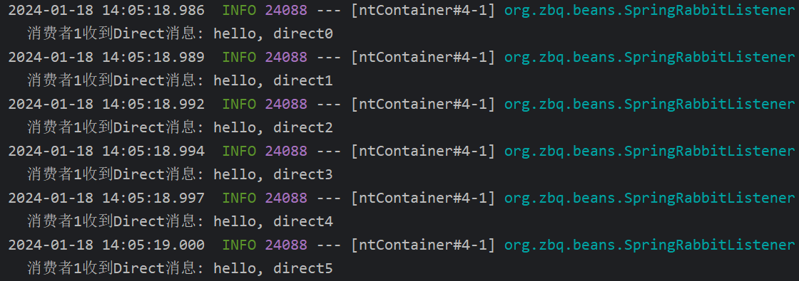

# MQ

## 同步调用和异步调用

同步调用优点:

时效性强,立即得到结果

缺点:

- 耦合度高  新业务新需求到来时,需要修改代码
- 性能和吞吐能力下降  调用服务的响应时间为所有服务的时间之和
- 资源浪费  调用链中的服务在等待时不会释放请求占用的资源
- 级联失败 一个服务执行失败会导致调用链后续所有服务失败

异步调用优点:

- 服务解耦  便于扩展
- 性能提高 吞吐量提高
- 不会级联失败
- 流量削峰

## RabbitMQ

### 基础概念

- channel: 操作MQ工具
- exchange: 交换机, 将消息路由到队列中
- queue: 保存消息的队列
- virtual host: 虚拟主机, 相当于namespace,隔离的环境,对queue和exchange的逻辑分组

### 模型

基于 Spring Amqp

引入依赖

```xml
<dependency>
    <groupId>org.springframework.boot</groupId>
    <artifactId>spring-boot-starter-amqp</artifactId>
</dependency>
```


#### 简单队列 (Hello-World)


消息发送者和接收者都需要以下配置:

```yaml
spring:
  rabbitmq:
    port: 5672
    host: localhost
    virtual-host: /
    username: guest
    password: guest
```

发送消息:

```java
@SpringBootTest
@RunWith(SpringRunner.class)
public class SpringAmqpTest {

    @Autowired
    private RabbitTemplate rabbitTemplate;

    @Test
    public void helloWorldModel(){
        String queueName="zbq.queue1";
        String message="hello, spring amqp";
        rabbitTemplate.convertAndSend(queueName,message);
    }
}
```

消息接受:

```java
@Component
@Slf4j
public class SpringRabbitListener {
    @RabbitListener(queues = "zbq.queue1")
    public void listenSimpleQueue(String msg){
        log.info("收到消息: "+msg);
    }
}
```


#### 工作队列 (Work Queue)


发送者:

```java
@Test
    public void workQueueModel(){
        String queueName="zbq.work.queue";
        String msg="hello, amqp ";
        for(int i=0;i<1000;i++){
            rabbitTemplate.convertAndSend(queueName,msg+i);
        }
    }
```

接收者:

```java
@RabbitListener(queues = "zbq.work.queue")
public void listenWorkQueue1(String msg) throws InterruptedException {
    log.info("消费者1号接收到消息: "+msg);
    Thread.sleep(20);
}

@RabbitListener(queues = "zbq.work.queue")
public void listenWorkQueue2(String msg) throws InterruptedException {
    log.info("消费者2号接收到消息: "+msg);
    Thread.sleep(100);
}
```


#### Pub/Sub (Fanout  exchange)


Fanout交换将将消息发送到每一个绑定到它的队列中

1. 声明一个FanoutExchange,声明2个队列, 绑定队列到FanoutExchange上

```java
@Configuration
public class FanoutConfig {
    @Bean
    public FanoutExchange fanoutExchange(){
        return new FanoutExchange("zbq.fanout");
    }

    @Bean
    public Queue fanoutQueue1(){
        return new Queue("zbq.fanout.queue1");
    }

    @Bean
    public Binding bindingQueue1(Queue fanoutQueue1,FanoutExchange fanoutExchange){
        return BindingBuilder.bind(fanoutQueue1).to(fanoutExchange);
    }

    @Bean
    public Queue fanoutQueue2(){
        return new Queue("zbq.fanout.queue2");
    }

    @Bean
    public Binding bindingQueue2(Queue fanoutQueue2,FanoutExchange fanoutExchange){
        return BindingBuilder.bind(fanoutQueue2).to(fanoutExchange);
    }
}
```

2.消费者监听这两个队列

```java
@RabbitListener(queues = "zbq.fanout.queue1")
public void listenFanoutQueue1(String msg){
    log.info("消费者1收到Fanout消息: "+msg);
}

@RabbitListener(queues = "zbq.fanout.queue2")
public void listenFanoutQueue2(String msg){
    log.info("消费者2收到Fanout消息: "+msg);
}
```

3.发消息到fanoutexchange

```java
@Test
public void fanoutModel(){
    String exchangeName="zbq.fanout";
    String msg="hello, fanout ";
    for(int i=0;i<10;i++){
        rabbitTemplate.convertAndSend(exchangeName,"",msg+i);
    }
}
```

查看消费者输出信息


#### Direct Exchange

Direct交换机会将消息按照路由规则发送到指定的队列


1.声明交换机, 队列,并绑定,添加routingkey

```java
@RabbitListener(bindings = @QueueBinding(
    value = @Queue(name = "zbq.direct.queue1"),
    exchange = @Exchange(name="zbq.direct",type = ExchangeTypes.DIRECT),
    key = {"girlfriend","family"}
))
public void listenDirectQueue1(String msg){
    log.info("消费者1收到Direct消息: "+msg);
}

@RabbitListener(bindings = @QueueBinding(
    value = @Queue(name = "zbq.direct.queue2"),
    exchange = @Exchange(name="zbq.direct",type = ExchangeTypes.DIRECT),
    key = {"friend","family"}
))
public void listenDirectQueue2(String msg){
    log.info("消费者2收到Direct消息: "+msg);
}
```

2.发送消息

```java
@Test
public void directModel(){
    String exchangeName="zbq.direct";
    String msg="晚上回去吃饭 ";
    for (int i = 0; i < 10; i++) {
        rabbitTemplate.convertAndSend(exchangeName,"family",msg+i);
    }
}

@Test
public void directModel2(){
    String exchangeName="zbq.direct";
    String msg="hello, direct";
    for (int i = 0; i < 10; i++) {
        rabbitTemplate.convertAndSend(exchangeName,"girlfriend",msg+i);
    }
}
```




#### Topic Exchange

话题交换机的routingkey 必须是多个单词的列表,并以`.`分隔

可以使用通配符`#`和`*`

`#`:代表0个或者多个单词

`*`:代表1个单词


1.定义

```java
@RabbitListener(bindings = @QueueBinding(
    value = @Queue(name = "zbq.topic.queue1"),
    exchange = @Exchange(name="zbq.topic",type = ExchangeTypes.TOPIC),
    key = "China.#"
))
public void listenTopicQueue1(String msg){
    log.info("消费者1收到Topic消息: "+msg);
}

@RabbitListener(bindings = @QueueBinding(
    value = @Queue(name = "zbq.topic.queue2"),
    exchange = @Exchange(name="zbq.topic",type = ExchangeTypes.TOPIC),
    key = "#.weather"
))
public void listenTopicQueue2(String msg){
    log.info("消费者2收到Topic消息: "+msg);
}
```

2.发消息

```java
@Test
public void topicModel(){
    String exchangeName="zbq.topic";
    String msg="首都北京,今日气温10摄氏度";
    rabbitTemplate.convertAndSend(exchangeName,"China.weather",msg);
}
```


### 序列化方式

```java
@Test
public void test(){
    Map<String,Object> map=new HashMap<>();
    map.put("hair","long");
    map.put("eyes","big");
    rabbitTemplate.convertAndSend("zbq.queue1",map);
}
```

发送对象类型过去, 查看序列化后的值


RabbitMQ默认使用JDK自带序列化

引入以下依赖修改序列化方法:

```xml
<dependency>
    <groupId>com.fasterxml.jackson.core</groupId>
    <artifactId>jackson-databind</artifactId>
</dependency>
```

注入Bean

```java
@Bean
public MessageConverter customMC(){
    return new Jackson2JsonMessageConverter();
}
```


## 进阶

 消息可靠性: 一个消息发送后至少被消费一次

- 发送者可靠性

  - 生产者重连  (连接server失败)

  ```yml
      connection-timeout: 1
      template:
        retry:
          enabled: true
  ```

  

  - 生产者确认

  返回ACK

- MQ可靠性

  - 宕机后消息丢失 (rabbitmq默认将消息保存在内存中)
    - 解决: 数据持久化 (交换机持久化  队列持久化  消息持久化delivery_mode=2) 
  - 内存空间有限, 消费者故障或处理太慢,会导致消息积压,引发mq阻塞
    - 3.6.0开始使用Lazy Queue
      - 收到消息直接写入磁盘而非内存(内存中只保留2048条)
      - 消费者要消费时从磁盘读取到内存
      - 支持百万条消息存储

- 消费者可靠性

  - 消费者确认 (消费者消费完后向mq发送回执)

    - ack: 成功处理 (mq从队列中删除)
    - nack: 处理失败 (mq需要再次投递该消息)
    - reject: 处理失败且拒绝(mq删除)

  - 失败处理策略

    - 利用spring的retry机制,先在本地重试,而不是无限制的requeue到mq
      - 重试次数耗尽,消息依然失败后有三种手段:
        - 重试耗尽 直接reject
        - 重试耗尽 返回nack
        - 重试耗尽, 将失败消息投递到指定的交换机

  - 业务幂等  (一个消息被消费多次 重复消费)

    - 同一个业务, 执行一次或多次对业务状态的影响是一致的

    - 本身就是幂等: 查询和删除  非幂等:  用户下单,扣减库存  用户退款,恢复余额

    - 解决方案:

      - 唯一 id,给每条消息设置唯一id, 后端存到数据库, 收到消息时先去数据库查是否存在, 存在业务入侵

      ```
      Jackson2JsonMessageConvert().setCreateMessgaeIds(true)
      ```

      - 使用业务逻辑进行判断..例如:再支付后修改订单状态为已支付,应该在修改前先查询订单状态,判断是否未支付.只有未支付订单才需要修改