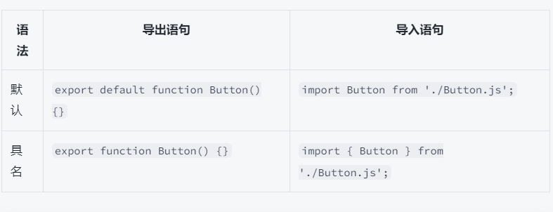
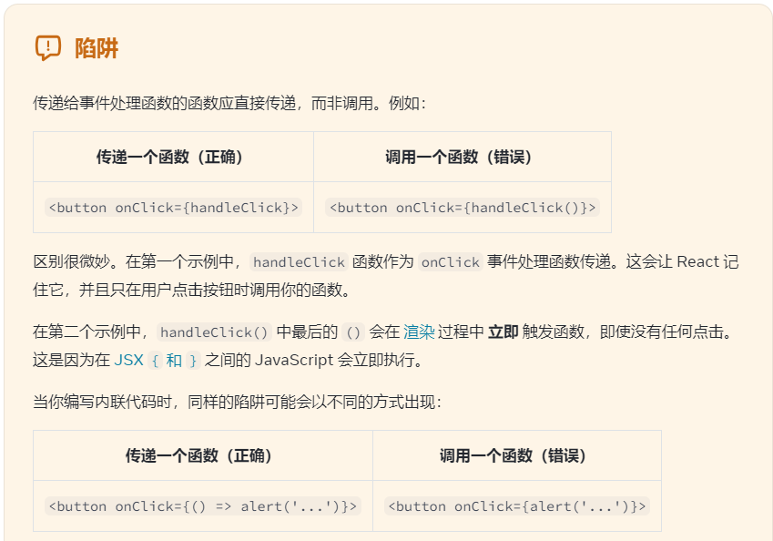
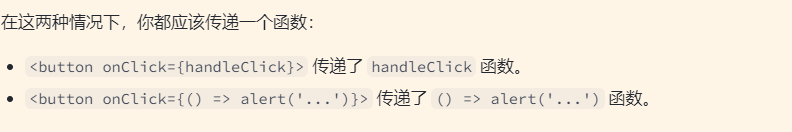
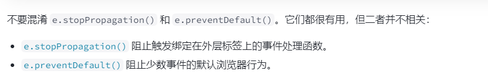
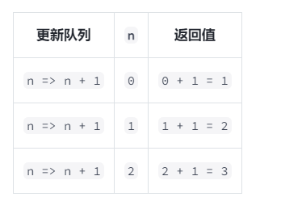
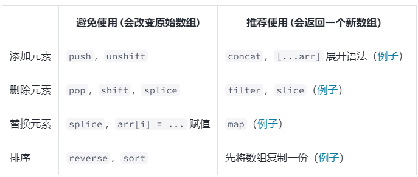

@[toc]
[以下内容均来自官方文档https://zh-hans.react.dev/learn](https://zh-hans.react.dev/learn)

## React组件:
React 允许你将标签、CSS 和 JavaScript 组合成自定义“组件”，即 **应用程序中可复用的 UI 元素<br />**React 组件是常规的 JavaScript 函数，但 **组件的名称必须以大写字母开头**，否则它们将无法运行！
```javascript
export default function Profile() {
  return (
    
  )
}

```
返回语句可以全写在一行上，如下面组件中所示：
```javascript
return ;
```
但是，如果你的标签和 return 关键字不在同一行，则必须把它包裹在一对括号中，如下所示：
```javascript
return (

  <div>

    

  </div>

);
```
没有括号包裹的话，任何在 return 下一行的代码都 [将被忽略](https://stackoverflow.com/questions/2846283/what-are-the-rules-for-javascripts-automatic-semicolon-insertion-asi)！

组件可以渲染其他组件，但是 **请不要嵌套他们的定义**：
```javascript
export default function Gallery() {

  // 🔴 永远不要在组件中定义组件

  function Profile() {

    // ...

  }

  // ...

}
```
当子组件需要使用父组件的数据时，你需要 [通过 props 的形式进行传递](https://zh-hans.react.dev/learn/passing-props-to-a-component)，而不是嵌套定义。

<a name="M9onM"></a>
#### 万物皆组件 
组件导入与导出

默认导出 export default 一个文件只能有一个<br />默认导入如下代码块所示<br />引入过程中，你可能会遇到一些文件并未添加 .js 文件后缀，如下所示：
```javascript
import Gallery from './Gallery';
```
无论是 './Gallery.js' 还是 './Gallery'，在 React 里都能正常使用，只是前者更符合 [原生 ES 模块](https://developer.mozilla.org/docs/Web/JavaScript/Guide/Modules)。

**同一文件中，有且仅有一个默认导出，但可以有多个具名导出！**<br />首先，用具名导出的方式，将 Profile 组件从 Gallery.js**导出**（不使用 default 关键字）：
```javascript
export function Profile() {

  // ...

}
```
接着，用具名导入的方式，从 Gallery.js 文件中 **导入**Profile 组件（用大括号）:
```javascript
import { Profile } from './Gallery.js';
```
最后，在 App 组件里 **渲染**<Profile />：
```javascript
export default function App() {

  return <Profile />;

}
```
<br />使用JSX书写标签语言

<a name="YhGNw"></a>

## JSX: 将标签引入 JavaScript
[JSX and React 是相互独立的](https://reactjs.org/blog/2020/09/22/introducing-the-new-jsx-transform.html#whats-a-jsx-transform) 东西。但它们经常一起使用，但你 **可以** 单独使用它们中的任意一个，JSX 是一种语法扩展，而 React 则是一个 JavaScript 的库

<a name="l5yim"></a>
### JSX 规则 
<a name="x3Ex5"></a>
### 1. 只能返回一个根元素 
如果想要在一个组件中包含多个元素，**需要用一个父标签把它们包裹起来**。
```javascript
<div>
  <h1>海蒂·拉玛的待办事项</h1>
  
  <ul>
    ...
  </ul>
</div>
```
如果你不想在标签中增加一个额外的 <div>，可以用 <> 和 </> 元素来代替
<a name="h6PhL"></a>
### 2. 标签必须闭合 
JSX 要求标签必须正确闭合。像  这样的自闭合标签必须书写成 ，而像 <li>oranges 这样只有开始标签的元素必须带有闭合标签，需要改为 <li>oranges</li>。
<a name="BJjLB"></a>
### 3. 使用驼峰式命名法给 ~~所有~~ 大部分属性命名！ 
<br /> JSX 最终会被转化为 JavaScript，而 JSX 中的属性也会变成 JavaScript 对象中的键值对。在你自己的组件中，经常会遇到需要用变量的方式读取这些属性的时候。但 JavaScript 对变量的命名有限制。例如，变量名称不能包含 - 符号或者像 class 这样的保留字。<br />由于 class 是一个保留字，所以在 React 中需要用 className 来代替
<a name="a2hUO"></a>
### 高级提示：使用 JSX 转化器 
将现有的 HTML 中的所有属性转化 JSX 的格式是很繁琐的。我们建议使用 [转化器](https://transform.tools/html-to-jsx) 将 HTML 和 SVG 标签转化为 JSX。这种转化器在实践中非常有用。但我们依然有必要去了解这种转化过程中发生了什么，这样你就可以编写自己的 JSX 了。

<a name="eceLH"></a>
## 在 JSX 中通过大括号使用 JavaScript
<a name="Vzc0e"></a>
### 使用引号传递字符串 
当你想把一个字符串属性传递给 JSX 时，把它放到单引号或双引号中：
```javascript
export default function Avatar() {
  return (
    
  );
}
```
但是如果你想要动态地指定 src 或 alt 的值呢？你可以 **用 { 和 } 替代 " 和 " 以使用 JavaScript 变量**
```javascript
export default function Avatar() {
  const avatar = 'https://i.imgur.com/7vQD0fPs.jpg';
  const description = 'Gregorio Y. Zara';
  return (
    
  );
}
```
<a name="JPxnt"></a>
### 使用大括号：一扇进入 JavaScript 世界的窗户
<a name="YqMY6"></a>
### 可以在哪使用大括号 
在 JSX 中，只能在以下两种场景中使用大括号：

1. 用作 JSX 标签内的**文本**：<h1>{name}'s To Do List</h1> 是有效的，但是 <{tag}>Gregorio Y. Zara's To Do List</{tag}> 无效。
2. 用作紧跟在 = 符号后的 **属性**：src={avatar} 会读取 avatar 变量，但是 src="{avatar}" 只会传一个字符串 {avatar}。
<a name="eRMT3"></a>
### 使用 “双大括号”：JSX 中的 CSS 和 对象
你甚至可以在 JSX 中传递对象。对象也用大括号表示，例如 { name: "Hedy Lamarr", inventions: 5 }。因此，为了能在 JSX 中传递，你必须用另一对额外的大括号包裹对象：person={{ name: "Hedy Lamarr", inventions: 5 }}。
```javascript
// 注意style用了两层大括号
export default function TodoList() {
  return (
    <ul style={{
      backgroundColor: 'black',
      color: 'pink'
    }}>
      <li>Improve the videophone</li>
      <li>Prepare aeronautics lectures</li>
      <li>Work on the alcohol-fuelled engine</li>
    </ul>
  );
}
```
内联 style 属性 使用驼峰命名法编写。例如，HTML

```
<ul style="background-color: black"></ul>
```


 在你的组件里应该写成 <ul style={{ backgroundColor: 'black' }}>。

```javascript

const baseUrl = 'https://i.imgur.com/';
const person = {
  name: 'Gregorio Y. Zara',
  imageId: '7vQD0fP',
  imageSize: 's',
  theme: {
    backgroundColor: 'black',
    color: 'pink'
  }
};

export default function TodoList() {
  return (
    <div style={person.theme}>
      <h1>{person.name}'s Todos</h1>
      
      <ul>
        <li>Improve the videophone</li>
        <li>Prepare aeronautics lectures</li>
        <li>Work on the alcohol-fuelled engine</li>
      </ul>
    </div>
  );
}

```
<a name="pzYfZ"></a>

## 将 Props 传递给组件
React 组件使用 _props_ 来互相通信。每个父组件都可以提供 props 给它的子组件，从而将一些信息传递给它。Props 可能会让你想起 HTML 属性，但你可以通过它们传递任何 JavaScript 值，包括对象、数组和函数
<a name="Ridjz"></a>
### 熟悉的 props 
Props 是你传递给 JSX 标签的信息。例如，className、src、alt、width 和 height 便是一些可以传递给  的 props
<a name="ijiok"></a>
### 向组件传递 props
你可以分两步给 Avatar 一些 props。
<a name="Ptij7"></a>
### 步骤 1: 将 props 传递给子组件 
首先，将一些 props 传递给 Avatar。例如，让我们传递两个 props：person（一个对象）和 size（一个数字）
```javascript
export default function Profile() {
  return (
    <Avatar
      person={{ name: 'Lin Lanying', imageId: '1bX5QH6' }}
      size={100}
    />
  );
}
```
<a name="Z61oY"></a>
### 步骤 2: 在子组件中读取 props 
你可以通过在 function Avatar 之后直接列出它们的名字 person, size 来读取这些 props。这些 props 在 ({ 和 }) 之间，并由逗号分隔。这样，你可以在 Avatar 的代码中使用它们，就像使用变量一样。
```javascript
function Avatar({ person, size }) {

  // 在这里 person 和 size 是可访问的
	return (
    
  );
}
```
Props 使你独立思考父组件和子组件。 例如，你可以改变 Profile 中的 person 或 size props，而无需考虑 Avatar 如何使用它们。 同样，你可以改变 Avatar 使用这些 props 的方式，不必考虑 Profile

你可以将 props 想象成可以调整的“旋钮”。它们的作用与函数的参数相同 —— 事实上，props **正是** 组件的唯一参数！ React 组件函数接受一个参数，一个 props 对象：
```javascript
function Avatar(props) {

  let person = props.person;

  let size = props.size;

  // ...

}
```
在声明 props 时， **不要忘记 ( 和 ) 之间的一对花括号 { 和 }** ：
```javascript
function Avatar({ person, size }) {

  // ...

}
```
这种语法被称为 [“解构”](https://developer.mozilla.org/docs/Web/JavaScript/Reference/Operators/Destructuring_assignment#Unpacking_fields_from_objects_passed_as_a_function_parameter)，等价于于从函数参数中读取属性：
```javascript
function Avatar(props) {

  let person = props.person;

  let size = props.size;

  // ...

}
```
<a name="gPDXh"></a>
### 给 prop 指定一个默认值 
如果你想在没有指定值的情况下给 prop 一个默认值，你可以通过在参数后面写 = 和默认值来进行解构：
```javascript
function Avatar({ person, size = 100 }) {

  // ...

}
```
现在， 如果 <Avatar person={...} /> 渲染时没有 size prop， size 将被赋值为 100。<br />默认值仅在缺少 size prop 或 size={undefined} 时生效。 但是如果你传递了 size={null} 或 size={0}，默认值将 **不** 被使用。
<a name="XWPES"></a>
### 使用 JSX 展开语法传递 props 
有时候，传递 props 会变得非常重复：
```javascript
function Profile({ person, size, isSepia, thickBorder }) {

  return (

    <div className="card">

      <Avatar

        person={person}

        size={size}

        isSepia={isSepia}

        thickBorder={thickBorder}

      />

    </div>

  );

}
```
所以使用更简洁的“展开”语法是有意义的：
```javascript
function Profile(props) {

  return (

    <div className="card">

      <Avatar {...props} />

    </div>

  );

}
```
<a name="GQWaw"></a>
### Props 如何随时间变化
**一个组件可能会随着时间的推移收到不同的 props**<br />然而，props 是 [**不可变的**](https://en.wikipedia.org/wiki/Immutable_object)（一个计算机科学术语，意思是“不可改变”）。当一个组件需要改变它的 props（例如，响应用户交互或新数据）时，它不得不“请求”它的父组件传递 **不同的 props** —— 一个新对象！它的旧 props 将被丢弃，最终 JavaScript 引擎将回收它们占用的内存。<br />React文档例题抽取组件
```javascript
import { getImageUrl } from './utils.js';

export function Person({name,Img,Profession,Awards,Discovered}){
  return(
    <section className="profile">
      <h2>{name}</h2>
      
      <ul>
        <li>
          <b>Profession: </b> 
          {Profession}
        </li>
        <li>
          <b>Awards: {Awards.num} </b> 
          {Awards.total}
        </li>
        <li>
          <b>Discovered: </b>
          {Discovered}
        </li>
      </ul>
    </section>
  )

}

export default function Gallery() {
  return (
    <div>
      <h1>Notable Scientists</h1>
      <Person 
        name="Maria Skłodowska-Curie"
        Img={{ id: 'szV5sdG', size: 70 }}
        Profession="physicist and chemist"
        Awards={{ num: 4, total: '(Nobel Prize in Physics, Nobel Prize in Chemistry, Davy Medal, Matteucci Medal)' }}
        Discovered="polonium (chemical element)"
        />
      <Person
        name="Katsuko Saruhashi"
        Img={{ id: 'YfeOqp2', size: 70 }}
        Profession="geochemist"
        Awards={{ num: 2, total: '(Miyake Prize for geochemistry, Tanaka Prize)' }}
        Discovered="a method for measuring carbon dioxide in seawater"
        />
      <section className="profile">
        <h2>Maria Skłodowska-Curie</h2>
        
        <ul>
          <li>
            <b>Profession: </b> 
            physicist and chemist
          </li>
          <li>
            <b>Awards: 4 </b> 
            (Nobel Prize in Physics, Nobel Prize in Chemistry, Davy Medal, Matteucci Medal)
          </li>
          <li>
            <b>Discovered: </b>
            polonium (chemical element)
          </li>
        </ul>
      </section>
      <section className="profile">
        <h2>Katsuko Saruhashi</h2>
        
        <ul>
          <li>
            <b>Profession: </b> 
            geochemist
          </li>
          <li>
            <b>Awards: 2 </b> 
            (Miyake Prize for geochemistry, Tanaka Prize)
          </li>
          <li>
            <b>Discovered: </b>
            a method for measuring carbon dioxide in seawater
          </li>
        </ul>
      </section>
    </div>
  );
}

```
```javascript
export function Card({children}){
  return(
    <>
      <div className="card">
        <div className="card-content">
          {children}
        </div>
      </div>
    </>
  )
}
export default function Profile() {
  return (
      <div>
        <Card>
          <h1>Photo</h1>
        
        </Card>
        <Card>
        <h1>About</h1>
        <p>Aklilu Lemma was a distinguished Ethiopian scientist who discovered a natural treatment to schistosomiasis.</p>
  
        </Card>
      <div className="card">
        <div className="card-content">
          <h1>Photo</h1>
          
        </div>
      </div>
      <div className="card">
        <div className="card-content">
          <h1>About</h1>
          <p>Aklilu Lemma was a distinguished Ethiopian scientist who discovered a natural treatment to schistosomiasis.</p>
        </div>
      </div>
    </div>
  );
}
```

<a name="JxNMf"></a>
## 条件渲染
通常你的组件会需要根据不同的情况显示不同的内容。在 React 中，你可以通过使用 JavaScript 的 if 语句、&& 和 ? : 运算符来选择性地渲染 JSX
<a name="bk8Jc"></a>
### 条件返回 JSX
```javascript
function Item({ name, isPacked }) {
  if (isPacked) {
    return <li className="item">{name} ✔</li>;
  }
  return <li className="item">{name}</li>;
}

export default function PackingList() {
  return (
    <section>
      <h1>Sally Ride 的行李清单</h1>
      <ul>
        <Item 
          isPacked={true} 
          name="宇航服" 
        />
        <Item 
          isPacked={true} 
          name="带金箔的头盔" 
        />
        <Item 
          isPacked={false} 
          name="Tam 的照片" 
        />
      </ul>
    </section>
  );
}

```
<a name="X5KGT"></a>
### 选择性地返回 null
```javascript
function Item({ name, isPacked }) {
  if (isPacked) {
    return null;
  }
  return <li className="item">{name}</li>;
}

export default function PackingList() {
  return (
    <section>
      <h1>Sally Ride 的行李清单</h1>
      <ul>
        <Item 
          isPacked={true} 
          name="宇航服" 
        />
        <Item 
          isPacked={true} 
          name="带金箔的头盔" 
        />
        <Item 
          isPacked={false} 
          name="Tam 的照片" 
        />
      </ul>
    </section>
  );
}
```
<a name="aF9um"></a>
### 三目运算符（? :）
```javascript
return (
  <li className="item">
    {isPacked ? name + ' ✔' : name}
  </li>
);
```
<a name="XoGbD"></a>
### 与运算符（&&） 
你会遇到的另一个常见的快捷表达式是 [JavaScript 逻辑与（&&）运算符](https://developer.mozilla.org/zh-CN/docs/Web/JavaScript/Reference/Operators/Logical_AND#:~:text=The%20logical%20AND%20(%20%26%26%20)%20operator,it%20returns%20a%20Boolean%20value.)。在 React 组件里，通常用在当条件成立时，你想渲染一些 JSX，**或者不做任何渲染**。使用 &&，你也可以实现仅当 isPacked 为 true 时，渲染勾选符号
```javascript
return (
  <li className="item">
    {name} {isPacked && '✔'}
  </li>
);
```
**切勿将数字放在 && 左侧.**<br />JavaScript 会自动将左侧的值转换成布尔类型以判断条件成立与否。然而，如果左侧是 0，整个表达式将变成左侧的值（0），React 此时则会渲染 0 而不是不进行渲染。<br />例如，一个常见的错误是 messageCount && <p>New messages</p>。其原本是想当 messageCount 为 0 的时候不进行渲染，但实际上却渲染了 0。<br />为了更正，可以将左侧的值改成布尔类型：messageCount > 0 && <p>New messages</p>。
<a name="DdlPS"></a>
### 选择性地将 JSX 赋值给变量
这种方式是最冗长的，但也是最灵活的
```javascript
function Item({ name, isPacked }) {
  let itemContent = name;
  if (isPacked) {
    itemContent = name + " ✔";
  }
  return (
    <li className="item">
      {itemContent}
    </li>
  );
}

export default function PackingList() {
  return (
    <section>
      <h1>Sally Ride 的行李清单</h1>
      <ul>
        <Item 
          isPacked={true} 
          name="宇航服" 
        />
        <Item 
          isPacked={true} 
          name="带金箔的头盔" 
        />
        <Item 
          isPacked={false} 
          name="Tam 的照片" 
        />
      </ul>
    </section>
  );
}

```
练习2
```javascript
function Item({ name, importance }) {
  return (
    <li className="item">
      {name} {importance!=0 && <i>(重要性: {importance})</i>}
    </li>
  );
}

export default function PackingList() {
  return (
    <section>
      <h1>Sally Ride 的行李清单</h1>
      <ul>
        <Item 
          importance={9} 
          name="宇航服" 
        />
        <Item 
          importance={0} 
          name="带金箔的头盔" 
        />
        <Item 
          importance={6} 
          name="Tam 的照片" 
        />
      </ul>
    </section>
  );
}

```
练习3
```javascript
function Drink({ name }) {
  let a,b,c
  if(name === 'tea'){
    a= 'leaf'
    b='15–70 mg/cup'
    c='4,000+ years'
  }else{
    a= 'bean'
    b='80–185 mg/cup'
    c='1,000+ years'
  }
  return (
    <section>
      <h1>{name}</h1>
      <dl>
        <dt>Part of plant</dt>
        <dd>{a}</dd>
        <dt>Caffeine content</dt>
        <dd>{b}</dd>
        <dt>Age</dt>
        <dd>{c}</dd>
      </dl>
    </section>
  );
}

export default function DrinkList() {
  return (
    <div>
      <Drink name="tea" />
      <Drink name="coffee" />
    </div>
  );
}
```
<a name="ebb96"></a>
## 渲染列表
<a name="An9iT"></a>
### 从数组中渲染数据
这里我们有一个列表。
```javascript
<ul>

  <li>凯瑟琳·约翰逊: 数学家</li>

  <li>马里奥·莫利纳: 化学家</li>

  <li>穆罕默德·阿卜杜勒·萨拉姆: 物理学家</li>

  <li>珀西·莱温·朱利亚: 化学家</li>

  <li>苏布拉马尼扬·钱德拉塞卡: 天体物理学家</li>

</ul>
```
这里给出一个由数组生成一系列列表项的简单示例：

1. 首先，把数据 **存储** 到数组中：
```javascript
const people = [

  '凯瑟琳·约翰逊: 数学家',

  '马里奥·莫利纳: 化学家',

  '穆罕默德·阿卜杜勒·萨拉姆: 物理学家',

  '珀西·莱温·朱利亚: 化学家',

  '苏布拉马尼扬·钱德拉塞卡: 天体物理学家',
];


2. **遍历** people 这个数组中的每一项，并获得一个新的 JSX 节点数组 listItems：

​```javascript
const listItems = people.map(person => <li>{person}</li>);
```

3. 把 listItems 用 <ul> 包裹起来，然后 **返回** 它：
```javascript
return <ul>{listItems}</ul>;
```
你只想显示 profession 值是 化学家 的人

1. 首先，**创建** 一个用来存化学家们的新数组 chemists，这里用到 filter() 方法过滤 people 数组来得到所有的化学家，过滤的条件应该是 person.profession === '化学家'：
```javascript
const chemists = people.filter(person =>

  person.profession === '化学家'

                              );
```

2. 接下来 **用 map 方法遍历** chemists 数组:
```javascript
const listItems = chemists.map(person =>

  <li>

    

    <p>

      <b>{person.name}:</b>

      {' ' + person.profession + ' '}

      因{person.accomplishment}而闻名世界

    </p>

  </li>

                              );
```

3. 最后，**返回** listItems：
```
return <ul>{listItems}</ul>;
```
<a name="nxiBk"></a>
### 用 key 保持列表项的顺序 
如果把上面任何一个沙盒示例在新标签页打开，你就会发现控制台有这样一个报错：<br />Warning: Each child in a list should have a unique “key” prop.<br />这是因为你必须给数组中的每一项都指定一个 key——它可以是字符串或数字的形式，只要能唯一标识出各个数组项就行：
```javascript
<li key={person.id}>...</li>
```
用作 key 的值应该在数据中提前就准备好，而不是在运行时才随手生成
```javascript
export const people = [
  {
    id: 0, // 在 JSX 中作为 key 使用
    name: '凯瑟琳·约翰逊',
    profession: '数学家',
    accomplishment: '太空飞行相关数值的核算',
    imageId: 'MK3eW3A',
  },
  {
    id: 1, // 在 JSX 中作为 key 使用
    name: '马里奥·莫利纳',
    profession: '化学家',
    accomplishment: '北极臭氧空洞的发现',
    imageId: 'mynHUSa',
  },
  {
    id: 2, // 在 JSX 中作为 key 使用
    name: '穆罕默德·阿卜杜勒·萨拉姆',
    profession: '物理学家',
    accomplishment: '关于基本粒子间弱相互作用和电磁相互作用的统一理论',
    imageId: 'bE7W1ji',
  },
  {
    id: 3, // 在 JSX 中作为 key 使用
    name: '珀西·莱温·朱利亚',
    profession: '化学家',
    accomplishment: '开创性的可的松药物、类固醇和避孕药',
    imageId: 'IOjWm71',
  },
  {
    id: 4, // 在 JSX 中作为 key 使用
    name: '苏布拉马尼扬·钱德拉塞卡',
    profession: '天体物理学家',
    accomplishment: '白矮星质量计算',
    imageId: 'lrWQx8l',
  },];
  
    import { people } from './data.js';
    import { getImageUrl } from './utils.js';

    export default function List() {
      const listItems = people.map(person =>
        <li key={person.id}>
          
          <p>
            <b>{person.name}</b>
              {' ' + person.profession + ' '}
              因{person.accomplishment}而闻名世界
          </p>
        </li>
      );
      return <ul>{listItems}</ul>;
    }
```


如果你想让每个列表项都输出多个 DOM 节点而非一个的话，该怎么做呢？<br />Fragment 语法的简写形式 <> </> 无法接受 key 值，所以你只能要么把生成的节点用一个 <div> 标签包裹起来，要么使用长一点但更明确的 <Fragment> 写法：
```javascript
import { Fragment } from 'react';


// ...


const listItems = people.map(person =>

  <Fragment key={person.id}>

    <h1>{person.name}</h1>

    <p>{person.bio}</p>

  </Fragment>

);
```
<a name="sEnBA"></a>
### 如何设定 key 值 
不同来源的数据往往对应不同的 key 值获取方式：

- **来自数据库的数据：** 如果你的数据是从数据库中获取的，那你可以直接使用数据表中的主键，因为它们天然具有唯一性。
- **本地产生数据：** 如果你数据的产生和保存都在本地（例如笔记软件里的笔记），那么你可以使用一个自增计数器或者一个类似 [uuid](https://www.npmjs.com/package/uuid) 的库来生成 key。

练习1
```javascript
import { people } from './data.js';
import { getImageUrl } from './utils.js';

export default function List() {
  const chemists = people.filter(
    person => person.profession === '化学家'
  )

  const others = people.filter(
    person => person.profession != '化学家'
  )

  const Items1 = chemists.map(
    person =>
      <li key={person.id}>
      
      <p>
        <b>{person.name}:</b>
        {' ' + person.profession + ' '}
        因{person.accomplishment}而闻名世界
      </p>
    </li>
  )

  const Items2 = others.map(
    person =>
      <li key={person.id}>
      
      <p>
        <b>{person.name}:</b>
        {' ' + person.profession + ' '}
        因{person.accomplishment}而闻名世界
      </p>
    </li>
  )
  const listItems = people.map(person =>
    <li key={person.id}>
      
      <p>
        <b>{person.name}:</b>
        {' ' + person.profession + ' '}
        因{person.accomplishment}而闻名世界
      </p>
    </li>
  );
  return (
    <>
    <article>
      <h1>化学家</h1>
      <ul>{Items1}</ul>
    </article>
    <article>
      <h1>其他</h1>
      <ul>{Items2}</ul>
    </article>
      </>
  );
}


//使用reduce进行优化
import { people } from './data.js';
import { getImageUrl } from './utils.js';

export default function List() {
  const { chemists, others } = people.reduce(
    (result, person) => {
      if (person.profession === '化学家') {
        result.chemists.push(person);
      } else {
        result.others.push(person);
      }
      return result;
    },
    { chemists: [], others: [] }
  );

  const renderItems = (people) => {
    return people.map(person => (
      <li key={person.id}>
        
        <p>
          <b>{person.name}:</b>
          {' ' + person.profession + ' '}
          因{person.accomplishment}而闻名世界
        </p>
      </li>
    ));
  };

  return (
    <>
      <article>
        <h1>化学家</h1>
        <ul>{renderItems(chemists)}</ul>
      </article>
      <article>
        <h1>其他</h1>
        <ul>{renderItems(others)}</ul>
      </article>
    </>
  );
}
```
练习2
```javascript
import { recipes } from './data.js';

export default function RecipeList() {
  return (
    <div>
      <h1>菜谱</h1>
      {
        recipes.map(recipe=>(
          <div key={recipe.id}>
          <h2>{recipe.name}</h2>
            <ul>
            {recipe.ingredients.map((ingredient,index)=>(
              <li key={index}>{ingredient}</li>
            ))}
            </ul>
          </div>
        ))
      }
    </div>
  );
}

export const recipes = [
  {
    id: 'greek-salad',
    name: '希腊沙拉',
    ingredients: ['西红柿', '黄瓜', '洋葱', '油橄榄', '羊奶酪'],
  },
  {
    id: 'hawaiian-pizza',
    name: '夏威夷披萨',
    ingredients: ['披萨饼皮', '披萨酱', '马苏里拉奶酪', '火腿', '菠萝'],
  },
  {
    id: 'hummus',
    name: '鹰嘴豆泥',
    ingredients: ['鹰嘴豆', '橄榄油', '蒜瓣', '柠檬', '芝麻酱'],
  },
];

```
当你使用 **()** 包裹 JSX 时，它会被视为一个表达式，而当你使用 **{}** 时，它将被视为一个代码块。如果你决定使用 **{}** 替换 **()**，你需要在代码块内显式地使用 **return** 关键字返回 JSX<br />练习3
```javascript
import { recipes } from './data.js';
export function Recipe({id,name,ingredients}){
  return(
    <>
    <h2>{name}</h2>
    <ul>
    {
    ingredients.map((ingredient,index)=>
      <li key={index}>{ingredient}</li>
                   )
    }
    </ul>
      </>
  )
}
export default function RecipeList() {
  return (
    <div>
      <h1>菜谱</h1>
      {recipes.map(recipe =>
        <Recipe key={recipe.id} {...recipe}/>
      )}
    </div>
  );
}
export const recipes = [
  {
    id: 'greek-salad',
    name: '希腊沙拉',
    ingredients: ['西红柿', '黄瓜', '洋葱', '油橄榄', '羊奶酪'],
  },
  {
    id: 'hawaiian-pizza',
    name: '夏威夷披萨',
    ingredients: ['披萨饼皮', '披萨酱', '马苏里拉奶酪', '火腿', '菠萝'],
  },
  {
    id: 'hummus',
    name: '鹰嘴豆泥',
    ingredients: ['鹰嘴豆', '橄榄油', '蒜瓣', '柠檬', '芝麻酱'],
  },
];

```
练习4
```javascript
import React from 'react'
const poem = {
  lines: [
    'I write, erase, rewrite',
    'Erase again, and then',
    'A poppy blooms.'
  ]
};

export default function Poem() {
  return (
    <article>
      {poem.lines.map((line, index) =>(
      <React.Fragment key={index}>
        <p>
          {line}
        </p>
        {index !== poem.lines.length-1 && <hr/>}
         </React.Fragment>
      ))}
    </article>
  );
}
```
<a name="uZYxA"></a>
## 保持组件纯粹
部分 JavaScript 函数是 **纯粹** 的，这类函数通常被称为纯函数。纯函数仅执行计算操作，不做其他操作
<a name="QnukQ"></a>
### 纯函数：组件作为公式 
在计算机科学中（尤其是函数式编程的世界中），[纯函数](https://wikipedia.org/wiki/Pure_function) 通常具有如下特征：

- **只负责自己的任务**。它不会更改在该函数调用前就已存在的对象或变量。
- **输入相同，则输出相同**。给定相同的输入，纯函数应总是返回相同的结果
<a name="YBKGT"></a>
### 副作用：（不符合）预期的后果 
React 的渲染过程必须自始至终是纯粹的。组件应该只 **返回** 它们的 JSX，而不 **改变** 在渲染前，就已存在的任何对象或变量 — 这将会使它们变得不纯粹！
```javascript
let guest = 0;
function Cup() {
  // Bad: changing a preexisting variable!
  guest = guest + 1;
  return <h2>Tea cup for guest #{guest}</h2>;
}
export default function TeaSet() {
  return (
    <>
      <Cup />
      <Cup />
      <Cup />
    </>
  );
}


Tea cup for guest #2<br />Tea cup for guest #4<br />Tea cup for guest #6
<a name="PDbEH"></a>


#### 使用严格模式检测不纯的计算 
React 提供了 “严格模式”，在严格模式下开发时，它将会调用每个组件函数两次。**通过重复调用组件函数，严格模式有助于找到违反这些规则的组件**<br />严格模式在生产环境下不生效，因此它不会降低应用程序的速度。如需引入严格模式，你可以用 <React.StrictMode> 包裹根组件。一些框架会默认这样做

<a name="c0GG2"></a>
### 哪些地方 **可能** 引发副作用 
函数式编程在很大程度上依赖于纯函数，但 **某些事物** 在特定情况下不得不发生改变。这是编程的要义！这些变动包括更新屏幕、启动动画、更改数据等，它们被称为 **副作用**。它们是 **“额外”** 发生的事情，与渲染过程无关<br />如果你用尽一切办法，仍无法为副作用找到合适的事件处理程序，你还可以调用组件中的 [useEffect](https://zh-hans.react.dev/reference/react/useEffect) 方法将其附加到返回的 JSX 中。这会告诉 React 在渲染结束后执行它

练习1
```javascript
import React,{useState,useEffect} from 'react'
export default function Clock({ time }) {

  const [isNight,setIsNight] = useState(false)

  useEffect(()=>{
    const hours = time.getHours()
    setIsNight(hours>=0 && hours <=6)
  },[time])
  return (
    <h1 id="time" className={isNight? 'night' : 'day'}>
      {time.toLocaleTimeString()}
    </h1>
  );
}

```
练习2
```javascript
import Panel from './Panel.js';
import { getImageUrl } from './utils.js';
import {useState} from 'react'


export default function Profile({ person }) {
  const [ currentPerson,setCurrentPerson] = useState(person)
  return (
    <Panel>
      <Header c={currentPerson}/>
      <Avatar c={currentPerson}/>
    </Panel>
  )
}

function Header({c}) {
  return <h1>{c.name}</h1>;
}

function Avatar({c}) {
  return (
    
  );
}


import Profile from './Profile.js';

export default function App() {
  return (
    <>
      <Profile person={{
        imageId: 'lrWQx8l',
        name: 'Subrahmanyan Chandrasekhar',
      }} />
      <Profile person={{
        imageId: 'MK3eW3A',
        name: 'Creola Katherine Johnson',
      }} />
    </>
  )
}
```
练习3
```javascript
export default function StoryTray({ stories }) {
  const newStories = [...stories,{
    id: 'create',
    label: 'Create Story'
  }]
  return (
    <ul>
      {newStories.map(story => (
        <li key={story.id}>
          {story.label}
        </li>
      ))}
    </ul>
  );
}
```
<a name="swEwG"></a>
## 将 UI 视为树

- 树是表示实体之间关系的常见方式，它们经常用于建模 UI。
- 渲染树表示单次渲染中 React 组件之间的嵌套关系。
- 使用条件渲染，渲染树可能会在不同的渲染过程中发生变化。使用不同的属性值，组件可能会渲染不同的子组件。
- 渲染树有助于识别顶级组件和叶子组件。顶级组件会影响其下所有组件的渲染性能，而叶子组件通常会频繁重新渲染。识别它们有助于理解和调试渲染性能问题。
- 依赖树表示 React 应用程序中的模块依赖关系。
- 构建工具使用依赖树来捆绑必要的代码以部署应用程序。
- 依赖树有助于调试大型捆绑包带来的渲染速度过慢的问题，以及发现哪些捆绑代码可以被优化
<a name="BZmPQ"></a>
## 添加交互
<a name="RATkQ"></a>
### 响应事件 
React 允许你向 JSX 中添加事件处理程序。事件处理程序是你自己的函数，它将在用户交互时被触发，如点击、悬停、焦点在表单输入框上等等。<br />< button> 等内置组件只支持内置浏览器事件，如 onClick。但是，你也可以创建你自己的组件，并给它们的事件处理程序 props 指定你喜欢的任何特定于应用的名称
<a name="Krstj"></a>
### 添加事件处理函数
按照如下三个步骤，即可让它在用户点击时显示消息：

1. 在 Button 组件 **内部** 声明一个名为 handleClick 的函数。
2. 实现函数内部的逻辑（使用 alert 来显示消息）。
3. 添加 onClick={handleClick} 到 < button> JSX 中。
```javascript
export default function Button() {
  function handleClick() {
    alert('你点击了我！');
  }

  return (
    <button onClick={handleClick}>
      点我
    </button>
  );
}
```
事件处理函数有如下特点:

- 通常在你的组件 **内部** 定义。
- 名称以 handle 开头，后跟事件名
- 称按照惯例，通常将事件处理程序命名为 handle，后接事件名。你会经常看到 onClick={handleClick}，onMouseEnter={handleMouseEnter} 等。

或者，你也可以在 JSX 中定义一个内联的事件处理函数：
```javascript
<button onClick={function handleClick() {

  alert('你点击了我！');

}}>
```
或者，直接使用更为简洁箭头函数：
```javascript
<button onClick={() => {

  alert('你点击了我！');

}}>
```



<a name="FSdTr"></a>
### 在事件处理函数中读取 props 
由于事件处理函数声明于组件内部，因此它们可以直接访问组件的 props。
```javascript
function AlertButton({ message, children }) {
  return (
    <button onClick={() => alert(message)}>
      {children}
    </button>
  );
}

export default function Toolbar() {
  return (
    <div>
      <AlertButton message="正在播放！">
        播放电影
      </AlertButton>
      <AlertButton message="正在上传！">
        上传图片
      </AlertButton>
    </div>
  );
}

```
<a name="h57kP"></a>
### 将事件处理函数作为 props 传递
```javascript
function Button({ onClick, children }) {
  return (
    <button onClick={onClick}>
      {children}
    </button>
  );
}

function PlayButton({ movieName }) {
  function handlePlayClick() {
    alert(`正在播放 ${movieName}！`);
  }

  return (
    <Button onClick={handlePlayClick}>
      播放 "{movieName}"
    </Button>
  );
}

function UploadButton() {
  return (
    <Button onClick={() => alert('正在上传！')}>
      上传图片
    </Button>
  );
}

export default function Toolbar() {
  return (
    <div>
      <PlayButton movieName="魔女宅急便" />
      <UploadButton />
    </div>
  );
}

```
<a name="mbQRc"></a>
### 事件传播 
事件处理函数还将捕获任何来自子组件的事件。通常，我们会说事件会沿着树向上“冒泡”或“传播”：它从事件发生的地方开始，然后沿着树向上传播。
```javascript
export default function Toolbar() {
  return (
    <div className="Toolbar" onClick={() => {
      alert('你点击了 toolbar ！');
    }}>
      <button onClick={() => alert('正在播放！')}>
        播放电影
      </button>
      <button onClick={() => alert('正在上传！')}>
        上传图片
      </button>
    </div>
  );
}
```
如果你点击任一按钮，它自身的 onClick 将首先执行，然后父级 <div> 的 onClick 会接着执行。因此会出现两条消息。如果你点击 toolbar 本身，将只有父级 <div> 的 onClick 会执行
<a name="HImiZ"></a>
### 阻止传播 
这个事件对象还允许你阻止传播。如果你想阻止一个事件到达父组件，你需要像下面 Button 组件那样调用 e.stopPropagation()
```javascript
function Button({ onClick, children }) {
  return (
    <button onClick={e => {
      e.stopPropagation();
      onClick();
    }}>
      {children}
    </button>
  );
}

export default function Toolbar() {
  return (
    <div className="Toolbar" onClick={() => {
      alert('你点击了 toolbar ！');
    }}>
      <Button onClick={() => alert('正在播放！')}>
        播放电影
      </Button>
      <Button onClick={() => alert('正在上传！')}>
        上传图片
      </Button>
    </div>
  );
}

```
<a name="EJjSX"></a>
### 阻止默认行为 
某些浏览器事件具有与事件相关联的默认行为。例如，点击 <form> 表单内部的按钮会触发表单提交事件，默认情况下将重新加载整个页面
```javascript
export default function Signup() {
  return (
    <form onSubmit={e => {
      e.preventDefault();
      alert('提交表单！');
    }}>
      <input />
      <button>发送</button>
    </form>
  );
}
```
<br />练习2
```javascript
export default function ColorSwitch({
  onChangeColor
}) {
  return (
    <button onClick={e => {
      e.stopPropagation();
      onChangeColor();
    }}>
      改变颜色
    </button>
  );
}
```
<a name="ZXItM"></a>
## 组件的记忆 **state**
<a name="Vlpgs"></a>
### 当普通的变量无法满足时 
```javascript
import { sculptureList } from './data.js';

export default function Gallery() {
  let index = 0;

  function handleClick() {
    index = index + 1;
  }

  let sculpture = sculptureList[index];
  return (
    <>
      <button onClick={handleClick}>
        Next
      </button>
      <h2>
        <i>{sculpture.name} </i> 
        by {sculpture.artist}
      </h2>
      <h3>  
        ({index + 1} of {sculptureList.length})
      </h3>
      
      <p>
        {sculpture.description}
      </p>
    </>
  );
}
```
<br /> handleClick() 事件处理函数正在更新局部变量 index。但存在两个原因使得变化不可见：

1. **局部变量无法在多次渲染中持久保存。** 当 React 再次渲染这个组件时，它会从头开始渲染——不会考虑之前对局部变量的任何更改。
2. **更改局部变量不会触发渲染。** React 没有意识到它需要使用新数据再次渲染组件。

要使用新数据更新组件，需要做两件事：

1. **保留** 渲染之间的数据。
2. **触发** React 使用新数据渲染组件（重新渲染）。

[useState](https://zh-hans.react.dev/reference/react/useState) Hook 提供了这两个功能：

1. **State 变量** 用于保存渲染间的数据。
2. **State setter 函数** 更新变量并触发 React 再次渲染组件
<a name="xekNc"></a>
### 添加一个 state 变量 
要添加 state 变量，先从文件顶部的 React 中导入 useState：
```
import { useState } from 'react';
```
然后，替换这一行：
```
let index = 0;
```
将其修改为
```
const [index, setIndex] = useState(0);
```
<a name="K3XN2"></a>
### 遇见你的第一个 Hook 
在 React 中，useState 以及任何其他以“use”开头的函数都被称为 **Hook**。<br />Hook 是特殊的函数，只在 React [渲染](https://zh-hans.react.dev/learn/render-and-commit#step-1-trigger-a-render)时有效（我们将在下一节详细介绍）。它们能让你 “hook” 到不同的 React 特性中去<br />**Hooks ——以 use 开头的函数——只能在组件或**[自定义 Hook](https://zh-hans.react.dev/learn/reusing-logic-with-custom-hooks)** 的最顶层调用。** 你不能在条件语句、循环语句或其他嵌套函数内调用 Hook。Hook 是函数，但将它们视为关于组件需求的无条件声明会很有帮助。在组件顶部 “use” React 特性，类似于在文件顶部“导入”模块
<a name="wNv3i"></a>
### 剖析 useState
useState 的唯一参数是 state 变量的**初始值**。在这个例子中，index 的初始值被useState(0)设置为 0。<br />每次你的组件渲染时，useState 都会给你一个包含两个值的数组：

1. **state 变量** (index) 会保存上次渲染的值。
2. **state setter 函数** (setIndex) 可以更新 state 变量并触发 React 重新渲染组件

以下是实际发生的情况：
```
const [index, setIndex] = useState(0);
```

1. **组件进行第一次渲染。** 因为你将 0 作为 index 的初始值传递给 useState，它将返回 [0, setIndex]。 React 记住 0 是最新的 state 值。
2. **你更新了 state**。当用户点击按钮时，它会调用 setIndex(index + 1)。 index 是 0，所以它是 setIndex(1)。这告诉 React 现在记住 index 是 1 并触发下一次渲染。
3. **组件进行第二次渲染**。React 仍然看到 useState(0)，但是因为 React _记住_ 了你将 index 设置为了 1，它将返回 [1, setIndex]。
4. 以此类推！
<a name="lx0zX"></a>
### 赋予一个组件多个 state 变量 
你可以在一个组件中拥有任意多种类型的 state 变量
<a name="cMwjM"></a>
### State 是隔离且私有的 
State 是屏幕上组件实例内部的状态。换句话说，**如果你渲染同一个组件两次，每个副本都会有完全隔离的 state**！改变其中一个不会影响另一个。<br />练习1
```javascript
import { useState } from 'react';
import { sculptureList } from './data.js';
export default function Gallery() {
  const [index, setIndex] = useState(0);
  const [showMore, setShowMore] = useState(false);

  function handleNextClick() {
    if(index>= sculptureList.length-1){
      setIndex(0)
    }else{
      setIndex(index + 1);
    }
    
  }

  function handleMoreClick() {
    setShowMore(!showMore);
  }

  function handlePreviousClick(){
    if(index===0){
      setIndex(sculptureList.length-1)
    }else{
      setIndex(index-1)
    }
  }
  let sculpture = sculptureList[index];
  return (
    <>
      <button onClick={handlePreviousClick}>
      Previous
      </button>
      <button onClick={handleNextClick}>
        Next
      </button>
      <h2>
        <i>{sculpture.name} </i> 
        by {sculpture.artist}
      </h2>
      <h3>  
        ({index + 1} of {sculptureList.length})
      </h3>
      <button onClick={handleMoreClick}>
        {showMore ? 'Hide' : 'Show'} details
      </button>
      {showMore && <p>{sculpture.description}</p>}
      
    </>
  );
}


练习2

```javascript
import {useState} from 'react'
export default function Form() {
  //let firstName = '';
  //let lastName = '';
  const [firstName,setFirstName]= useState('')
  const [lastName,setLastName] = useState('')

  function handleFirstNameChange(e) {
   setFirstName(e.target.value);
  }

  function handleLastNameChange(e) {
    setLastName(e.target.value) ;
  }

  function handleReset() {
    setFirstName('');
    setLastName('') ;
  }

  return (
    <form onSubmit={e => e.preventDefault()}>
      <input
        placeholder="First name"
        value={firstName}
        onChange={handleFirstNameChange}
      />
      <input
        placeholder="Last name"
        value={lastName}
        onChange={handleLastNameChange}
      />
      <h1>Hi, {firstName} {lastName}</h1>
      <button onClick={handleReset}>Reset</button>
    </form>
  );
}

```
练习3
```javascript
import { useState } from 'react';

export default function FeedbackForm() {
  const [isSent, setIsSent] = useState(false);
  const [message, setMessage] = useState('');
  if (isSent) {
    return <h1>Thank you!</h1>;
  } else {
    // eslint-disable-next-line
    return (
      <form onSubmit={e => {
        e.preventDefault();
        alert(`Sending: "${message}"`);
        setIsSent(true);
      }}>
        <textarea
          placeholder="Message"
          value={message}
          onChange={e => setMessage(e.target.value)}
        />
        <br />
        <button type="submit">Send</button>
      </form>
    );
  }
}

```
<a name="tRV0L"></a>
## 渲染和提交
<a name="deLmN"></a>
### 步骤 1: 触发一次渲染 
有两种原因会导致组件的渲染:

1. 组件的 **初次渲染。**
2. 组件（或者其祖先之一）的 **状态发生了改变。**
<a name="Zc6wa"></a>
### 状态更新时重新渲染 
一旦组件被初次渲染，你就可以通过使用 [**set 函数**](https://zh-hans.react.dev/reference/react/useState#setstate) 更新其状态来触发之后的渲染。更新组件的状态会自动将一次渲染送入队列。（你可以把这种情况想象成餐厅客人在第一次下单之后又点了茶、点心和各种东西，具体取决于他们的胃口。）
<a name="NWHTg"></a>
### 步骤 2: React 渲染你的组件 
在你触发渲染后，React 会调用你的组件来确定要在屏幕上显示的内容。**“渲染中” 即 React 在调用你的组件。**

- **在进行初次渲染时,** React 会调用根组件。
- **对于后续的渲染,** React 会调用内部状态更新触发了渲染的函数组件
```javascript
import Gallery from './Gallery.js';
import { createRoot } from 'react-dom/client';
const root = createRoot(document.getElementById('root'))
root.render(<Gallery />);
export default function Gallery() {
  return (
    <section>
      <h1>鼓舞人心的雕塑</h1>
      <Image />
      <Image />
      <Image />
    </section>
  );
}
function Image() {
  return (
    
  );
}


渲染必须始终是一次 [纯计算](https://zh-hans.react.dev/learn/keeping-components-pure):

- **输入相同，输出相同。** 给定相同的输入，组件应始终返回相同的 JSX。（当有人点了西红柿沙拉时，他们不应该收到洋葱沙拉！）
- **只做它自己的事情。** 它不应更改任何存在于渲染之前的对象或变量。（一个订单不应更改其他任何人的订单。）
<a name="uMPn9"></a>
### 步骤 3: React 把更改提交到 DOM 上 
在渲染（调用）你的组件之后，React 将会修改 DOM。
<a name="k2tqF"></a>
### 尾声：浏览器绘制 
在渲染完成并且 React 更新 DOM 之后，浏览器就会重新绘制屏幕。尽管这个过程被称为“浏览器渲染”（“browser rendering”），但我们还是将它称为“绘制”（“painting”），以避免在这些文档的其余部分中出现混淆

<a name="YQBx1"></a>
## state 如同一张快照
也许 state 变量看起来和一般的可读写的 JavaScript 变量类似。但 state 在其表现出的特性上更像是一张快照。设置它不会更改你已有的 state 变量，但会触发重新渲染
<a name="ithvr"></a>
### 设置 state 会触发渲染 
在这个例子中，当你按下 “send” 时，setIsSent(true) 会通知 React 重新渲染 UI：
```javascript
import { useState } from 'react';

export default function Form() {
  const [isSent, setIsSent] = useState(false);
  const [message, setMessage] = useState('Hi!');
  if (isSent) {
    return <h1>Your message is on its way!</h1>
  }
  return (
    <form onSubmit={(e) => {
      e.preventDefault();
      setIsSent(true);
      sendMessage(message);
    }}>
      <textarea
        placeholder="Message"
        value={message}
        onChange={e => setMessage(e.target.value)}
      />
      <button type="submit">Send</button>
    </form>
  );
}

function sendMessage(message) {
  // ...
}

```
当你单击按钮时会发生以下情况：

1. 执行 onSubmit 事件处理函数。
2. setIsSent(true) 将 isSent 设置为 true 并排列一个新的渲染。
3. React 根据新的 isSent 值重新渲染组件

当 React 重新渲染一个组件时：

1. React 会再次调用你的函数
2. 函数会返回新的 JSX 快照
3. React 会更新界面以匹配返回的快照

点击+3按钮只会+1
```javascript
import { useState } from 'react';

export default function Counter() {
  const [number, setNumber] = useState(0);

  return (
    <>
      <h1>{number}</h1>
      <button onClick={() => {
        setNumber(number + 1);
        setNumber(number + 1);
        setNumber(number + 1);
      }}>+3</button>
    </>
  )
}

```
以下是这个按钮的点击事件处理函数通知 React 要做的事情：

1. setNumber(number + 1)：number 是 0 所以 setNumber(0 + 1)。
   - React 准备在下一次渲染时将 number 更改为 1。
2. setNumber(number + 1)：number 是0 所以 setNumber(0 + 1)。
   - React 准备在下一次渲染时将 number 更改为 1。
3. setNumber(number + 1)：number 是0 所以 setNumber(0 + 1)。
   - React 准备在下一次渲染时将 number 更改为 1。

尽管你调用了三次 setNumber(number + 1)，但在 **这次渲染的** 事件处理函数中 number 会一直是 0，所以你会三次将 state 设置成 1。这就是为什么在你的事件处理函数执行完以后，React 重新渲染的组件中的 number 等于 1 而不是 3<br />每一次渲染的 state 值都是固定的<br />理解 : 快照
<a name="I5vnv"></a>
### 把一系列 state 更新加入队列
<a name="DFAbO"></a>
### React 会对 state 更新进行批处理
```javascript
<button onClick={() => {
        setNumber(number + 1);
        setNumber(number + 1);
        setNumber(number + 1);
      }}>+3</button>
```
这可能会让你想起餐厅里帮你点菜的服务员。服务员不会在你说第一道菜的时候就跑到厨房！相反，他们会让你把菜点完，让你修改菜品，甚至会帮桌上的其他人点菜
<a name="S7JnI"></a>
### 在下次渲染前多次更新同一个 state 
你可以像 setNumber(n => n + 1) 这样传入一个根据队列中的前一个 state 计算下一个 state 的 **函数**
```javascript
<button onClick={() => {
        setNumber(n => n + 1);
        setNumber(n => n + 1);
        setNumber(n => n + 1);
      }}>+3</button>
```
当你在下次渲染期间调用 useState 时，React 会遍历队列。之前的 number state 的值是 0，所以这就是 React 作为参数 n 传递给第一个更新函数的值<br />事件处理函数执行完成后，React 将触发重新渲染。在重新渲染期间，React 将处理队列。更新函数会在渲染期间执行，因此 **更新函数必须是 **[纯函数](https://zh-hans.react.dev/learn/keeping-components-pure) 并且只 **返回** 结果。不要尝试从它们内部设置 state 或者执行其他副作用。在严格模式下，React 会执行每个更新函数两次（但是丢弃第二个结果）以便帮助你发现错误<br />练习1
```javascript
import { useState } from 'react';

export default function RequestTracker() {
  const [pending, setPending] = useState(0);
  const [completed, setCompleted] = useState(0);

  async function handleClick() {
    setPending(pending=>pending + 1);
    await delay(3000);
    setPending(pending=>pending - 1);
    setCompleted(completed=>completed + 1);
  }

  return (
    <>
      <h3>
        等待：{pending}
      </h3>
      <h3>
        完成：{completed}
      </h3>
      <button onClick={handleClick}>
        购买
      </button>
    </>
  );
}

function delay(ms) {
  return new Promise(resolve => {
    setTimeout(resolve, ms);
  });
}

```
练习2
```javascript
export function getFinalState(baseState, queue) {
  let finalState = baseState;
  queue.forEach((e,index)=>{
    if (typeof e === 'number'){
      finalState = e;
    }else{
      finalState = e(finalState)
    }
  })

  return finalState;
}

```
<a name="pxsnk"></a>
## 更新 state 中的对象
state 中可以保存任意类型的 JavaScript 值，包括对象。但是，你不应该直接修改存放在 React state 中的对象。相反，当你想要更新一个对象时，你需要创建一个新的对象（或者将其拷贝一份），然后将 state 更新为此对象<br />state x 从 0 变为 5，但是数字 0 本身并没有发生改变。在 JavaScript 中，无法对内置的原始值，如数字、字符串和布尔值，进行任何更改。<br />现在考虑 state 中存放对象的情况：
```jsx
const [position, setPosition] = useState({ x: 0, y: 0 });
```
从技术上来讲，可以改变对象自身的内容。**当你这样做时，就制造了一个 mutation**：
```jsx
position.x = 5;
```
然而，虽然严格来说 React state 中存放的对象是可变的，但你应该像处理数字、布尔值、字符串一样将它们视为不可变的。因此你应该替换它们的值，而不是对它们进行修改
<a name="Tn3l0"></a>
### 将 state 视为只读的 
换句话说，你应该 **把所有存放在 state 中的 JavaScript 对象都视为只读的**。
```jsx
onPointerMove={e => {
  position.x = e.clientX;
  position.y = e.clientY;
}}
```
```jsx
onPointerMove={e => {
  setPosition({
    x: e.clientX,
    y: e.clientY
  });
}}
```
<a name="qBWGq"></a>
#### 局部 mutation 是可以接受的 
<br /> 像这样的代码是有问题的，因为它改变了 state 中现有的对象：
```jsx
position.x = e.clientX;

position.y = e.clientY;
```
但是像这样的代码就 **没有任何问题**，因为你改变的是你刚刚创建的一个新的对象：
```javascript
const nextPosition = {};

nextPosition.x = e.clientX;

nextPosition.y = e.clientY;

setPosition(nextPosition);
```
事实上，它完全等同于下面这种写法：
```javascript
setPosition({

  x: e.clientX,

  y: e.clientY

});
```
<a name="u3kTN"></a>
### 使用展开语法复制对象
```javascript
import { useState } from 'react';

export default function Form() {
  const [person, setPerson] = useState({
    firstName: 'Barbara',
    lastName: 'Hepworth',
    email: 'bhepworth@sculpture.com'
  });

  function handleFirstNameChange(e) {
    setPerson({
      ...person,
      firstName: e.target.value
    });
  }

  function handleLastNameChange(e) {
    setPerson({
      ...person,
      lastName: e.target.value
    });
  }

  function handleEmailChange(e) {
    setPerson({
      ...person,
      email: e.target.value
    });
  }

  return (
    <>
      <label>
        First name:
        <input
          value={person.firstName}
          onChange={handleFirstNameChange}
        />
      </label>
      <label>
        Last name:
        <input
          value={person.lastName}
          onChange={handleLastNameChange}
        />
      </label>
      <label>
        Email:
        <input
          value={person.email}
          onChange={handleEmailChange}
        />
      </label>
      <p>
        {person.firstName}{' '}
        {person.lastName}{' '}
        ({person.email})
      </p>
    </>
  );
}

```
**把当前的数据复制到新对象中**，因为你只改变了其中一个字段：
```javascript
setPerson({

  firstName: e.target.value, // 从 input 中获取新的 first name

  lastName: person.lastName,

  email: person.email

});
```
你可以使用 ...[对象展开](https://developer.mozilla.org/zh-CN/docs/Web/JavaScript/Reference/Operators/Spread_syntax#spread_in_object_literals) 语法，这样你就不需要单独复制每个属性。
```javascript
setPerson({

  ...person, // 复制上一个 person 中的所有字段

  firstName: e.target.value // 但是覆盖 firstName 字段 

});
```
<a name="VyL7Q"></a>
#### 使用一个事件处理函数来更新多个字段
你也可以在对象的定义中使用 [ 和 ] 括号来实现属性的动态命名。下面是同一个例子，但它使用了一个事件处理函数而不是三个
```javascript
import { useState } from 'react';

export default function Form() {
  const [person, setPerson] = useState({
    firstName: 'Barbara',
    lastName: 'Hepworth',
    email: 'bhepworth@sculpture.com'
  });

  function handleChange(e) {
    setPerson({
      ...person,
      [e.target.name]: e.target.value
    });
  }

  return (
    <>
      <label>
        First name:
        <input
          name="firstName"
          value={person.firstName}
          onChange={handleChange}
        />
      </label>
      <label>
        Last name:
        <input
          name="lastName"
          value={person.lastName}
          onChange={handleChange}
        />
      </label>
      <label>
        Email:
        <input
          name="email"
          value={person.email}
          onChange={handleChange}
        />
      </label>
      <p>
        {person.firstName}{' '}
        {person.lastName}{' '}
        ({person.email})
      </p>
    </>
  );
}

```
<a name="KSdkf"></a>
### 更新一个嵌套对象 
考虑下面这种结构的嵌套对象：
```javascript
const [person, setPerson] = useState({

  name: 'Niki de Saint Phalle',

  artwork: {

    title: 'Blue Nana',

    city: 'Hamburg',

    image: 'https://i.imgur.com/Sd1AgUOm.jpg',

  }

});
```
为了修改 city 的值，你首先需要创建一个新的 artwork 对象（其中预先填充了上一个 artwork 对象中的数据），然后创建一个新的 person 对象，并使得其中的 artwork 属性指向新创建的 artwork 对象：
```javascript
const nextArtwork = { ...person.artwork, city: 'New Delhi' };

const nextPerson = { ...person, artwork: nextArtwork };

setPerson(nextPerson);
```
或者，写成一个函数调用：
```javascript
setPerson({

  ...person, // 复制其它字段的数据 

  artwork: { // 替换 artwork 字段 

    ...person.artwork, // 复制之前 person.artwork 中的数据

    city: 'New Delhi' // 但是将 city 的值替换为 New Delhi！

  }

});
```
<a name="GpYZb"></a>
#### 对象并非是真正嵌套的
下面这个对象从代码上来看是“嵌套”的：
```javascript
let obj = {

  name: 'Niki de Saint Phalle',

  artwork: {

    title: 'Blue Nana',

    city: 'Hamburg',

    image: 'https://i.imgur.com/Sd1AgUOm.jpg',

  }

};
```
然而，当我们思考对象的特性时，“嵌套”并不是一个非常准确的方式。当这段代码运行的时候，不存在“嵌套”的对象。你实际上看到的是两个不同的对象：
```javascript
let obj1 = {

  title: 'Blue Nana',

  city: 'Hamburg',

  image: 'https://i.imgur.com/Sd1AgUOm.jpg',

};


let obj2 = {

  name: 'Niki de Saint Phalle',

  artwork: obj1

};
```
对象 obj1 并不处于 obj2 的“内部”。例如，下面的代码中，obj3 中的属性也可以指向 obj1：
```javascript
let obj1 = {

  title: 'Blue Nana',

  city: 'Hamburg',

  image: 'https://i.imgur.com/Sd1AgUOm.jpg',

};


let obj2 = {

  name: 'Niki de Saint Phalle',

  artwork: obj1

};


let obj3 = {

  name: 'Copycat',

  artwork: obj1

};
```
如果你直接修改 obj3.artwork.city，就会同时影响 obj2.artwork.city 和 obj1.city。这是因为 obj3.artwork、obj2.artwork 和 obj1 都指向同一个对象。当你用“嵌套”的方式看待对象时，很难看出这一点。相反，它们是相互独立的对象，只不过是用属性“指向”彼此而已
<a name="plO7s"></a>
### 使用 Immer 编写简洁的更新逻辑通过使用 Immer，你写出的代码看起来就像是你“打破了规则”而直接修改了对象：
```javascript
updatePerson(draft => {

  draft.artwork.city = 'Lagos';

});
```
<br /> 尝试使用 Immer:

1. 运行 npm install use-immer 添加 Immer 依赖
2. 用 import { useImmer } from 'use-immer' 替换掉 import { useState } from 'react'

下面我们把上面的例子用 Immer 实现一下
```javascript
import { useImmer } from 'use-immer';

export default function Form() {
  const [person, updatePerson] = useImmer({
    name: 'Niki de Saint Phalle',
    artwork: {
      title: 'Blue Nana',
      city: 'Hamburg',
      image: 'https://i.imgur.com/Sd1AgUOm.jpg',
    }
  });

  function handleNameChange(e) {
    updatePerson(draft => {
      draft.name = e.target.value;
    });
  }

  function handleTitleChange(e) {
    updatePerson(draft => {
      draft.artwork.title = e.target.value;
    });
  }

  function handleCityChange(e) {
    updatePerson(draft => {
      draft.artwork.city = e.target.value;
    });
  }

  function handleImageChange(e) {
    updatePerson(draft => {
      draft.artwork.image = e.target.value;
    });
  }

  return (
    <>
      <label>
        Name:
        <input
          value={person.name}
          onChange={handleNameChange}
        />
      </label>
      <label>
        Title:
        <input
          value={person.artwork.title}
          onChange={handleTitleChange}
        />
      </label>
      <label>
        City:
        <input
          value={person.artwork.city}
          onChange={handleCityChange}
        />
      </label>
      <label>
        Image:
        <input
          value={person.artwork.image}
          onChange={handleImageChange}
        />
      </label>
      <p>
        <i>{person.artwork.title}</i>
        {' by '}
        {person.name}
        <br />
        (located in {person.artwork.city})
      </p>
      
    </>
  );
}

```
练习1
```javascript
import { useState } from 'react';

export default function Scoreboard() {
  const [player, setPlayer] = useState({
    firstName: 'Ranjani',
    lastName: 'Shettar',
    score: 10,
  });

  function handlePlusClick() {
    //player.score++;
    setPlayer({
      ...player,
      score: player.score+1
    })
  }

  function handleFirstNameChange(e) {
    setPlayer({
      ...player,
      firstName: e.target.value,
    });
  }

  function handleLastNameChange(e) {
    setPlayer({
      ...player,
      lastName: e.target.value
    });
  }

  return (
    <>
      <label>
        Score: <b>{player.score}</b>
        {' '}
        <button onClick={handlePlusClick}>
          +1
        </button>
      </label>
      <label>
        First name:
        <input
          value={player.firstName}
          onChange={handleFirstNameChange}
        />
      </label>
      <label>
        Last name:
        <input
          value={player.lastName}
          onChange={handleLastNameChange}
        />
      </label>
    </>
  );
}

```
练习2
```javascript
import { useState } from 'react';
import Background from './Background.js';
import Box from './Box.js';

const initialPosition = {
  x: 0,
  y: 0
};

export default function Canvas() {
  const [shape, setShape] = useState({
    color: 'orange',
    position: initialPosition
  });

  function handleMove(dx, dy) {
    //shape.position.x += dx;
    //shape.position.y += dy;
    let newPos = {
      x: shape.position.x+dx,
      y: shape.position.y+dy
    }
    setShape({
      ...shape,
      position: newPos
    })
  }

  function handleColorChange(e) {
    setShape({
      ...shape,
      color: e.target.value
    });
  }

  return (
    <>
      <select
        value={shape.color}
        onChange={handleColorChange}
      >
        <option value="orange">orange</option>
        <option value="lightpink">lightpink</option>
        <option value="aliceblue">aliceblue</option>
      </select>
      <Background
        position={initialPosition}
      />
      <Box
        color={shape.color}
        position={shape.position}
        onMove={handleMove}
      >
        Drag me!
      </Box>
    </>
  );
}

```
练习3
```javascript
import { useState } from 'react';
import { useImmer } from 'use-immer';
import Background from './Background.js';
import Box from './Box.js';

const initialPosition = {
  x: 0,
  y: 0
};

export default function Canvas() {
  const [shape, updateShape] = useImmer({
    color: 'orange',
    position: initialPosition
  });

  function handleMove(dx, dy) {
    //shape.position.x += dx;
    //shape.position.y += dy;
    updateShape(draft=>{
      draft.position = {
        x: shape.position.x + dx,
        y: shape.position.y + dy
      }
    })
  }

  function handleColorChange(e) {
    /*setShape({
      ...shape,
      color: e.target.value
    });*/
    updateShape(draft=>{
      draft.color = e.target.value
    })
  }

  return (
    <>
      <select
        value={shape.color}
        onChange={handleColorChange}
      >
        <option value="orange">orange</option>
        <option value="lightpink">lightpink</option>
        <option value="aliceblue">aliceblue</option>
      </select>
      <Background
        position={initialPosition}
      />
      <Box
        color={shape.color}
        position={shape.position}
        onMove={handleMove}
      >
        Drag me!
      </Box>
    </>
  );
}

```
<a name="rfu2T"></a>
## 更新 state 中的数组
数组是另外一种可以存储在 state 中的 JavaScript 对象，它虽然是可变的，但是却应该被视为不可变。同对象一样，当你想要更新存储于 state 中的数组时，你需要创建一个新的数组（或者创建一份已有数组的拷贝值），并使用新数组设置 state
<a name="wHaTC"></a>
### 在没有 mutation 的前提下更新数组 
在 JavaScript 中，数组只是另一种对象。[同对象一样](https://zh-hans.react.dev/learn/updating-objects-in-state)，**你需要将 React state 中的数组视为只读的**。这意味着你不应该使用类似于 arr[0] = 'bird' 这样的方式来重新分配数组中的元素，也不应该使用会直接修改原始数组的方法，例如 push() 和 pop()。<br />相反，每次要更新一个数组时，你需要把一个**新**的数组传入 state 的 setting 方法中。为此，你可以通过使用像 filter() 和 map() 这样不会直接修改原始值的方法，从原始数组生成一个新的数组<br />你需要避免使用左列的方法，而首选右列的方法：<br />
<a name="u88BU"></a>
### 向数组中添加元素  头部和尾部
push() 会直接修改原始数组，而你不希望这样
```javascript
import { useState } from 'react';

let nextId = 0;

export default function List() {
  const [name, setName] = useState('');
  const [artists, setArtists] = useState([]);

  return (
    <>
      <h1>振奋人心的雕塑家们：</h1>
      <input
        value={name}
        onChange={e => setName(e.target.value)}
      />
      <button onClick={() => {
        artists.push({
          id: nextId++,
          name: name,
        });
      }}>添加</button>
      <ul>
        {artists.map(artist => (
          <li key={artist.id}>{artist.name}</li>
        ))}
      </ul>
    </>
  );
}

```
你应该创建一个 **新** 数组，其包含了原始数组的所有元素 **以及** 一个在末尾的新元素。这可以通过很多种方法实现，最简单的一种就是使用 ...[数组展开](https://zh-hans.react.dev/a-javascript-refresher#array-spread) 语法
```javascript
setArtists( // 替换 state
  [ // 是通过传入一个新数组实现的
    ...artists, // 新数组包含原数组的所有元素
    { id: nextId++, name: name } // 并在末尾添加了一个新的元素
  ]
);
```
数组展开运算符还允许你把新添加的元素放在原始的 ...artists 之前：
```javascript
setArtists([

  { id: nextId++, name: name },

  ...artists // 将原数组中的元素放在末尾

]);
```
<a name="omlDw"></a>
### 从数组中删除元素 
从数组中删除一个元素最简单的方法就是将它**过滤出去**。换句话说，你需要生成一个不包含该元素的新数组。这可以通过 filter 方法实现
```javascript
setArtists(
  artists.filter(a => a.id !== artist.id)
);
```
这里，artists.filter(s => s.id !== artist.id) 表示“创建一个新的数组，该数组由那些 ID 与 artists.id 不同的 artists 组成”。换句话说，每个 artist 的“删除”按钮会把 _那一个_ artist 从原始数组中过滤掉，并使用过滤后的数组再次进行渲染。注意，filter 并不会改变原始数组
<a name="PDa11"></a>
### 转换数组 
如果你想改变数组中的某些或全部元素，你可以用 map() 创建一个**新**数组
```javascript
function handleClick() {
    const nextShapes = shapes.map(shape => {
      if (shape.type === 'square') {
        // 不作改变
        return shape;
      } else {
        // 返回一个新的圆形，位置在下方 50px 处
        return {
          ...shape,
          y: shape.y + 50,
        };
      }
    });
    // 使用新的数组进行重渲染
    setShapes(nextShapes);
  }
```
<a name="EgkKU"></a>
### 替换数组中的元素 
想要替换数组中一个或多个元素是非常常见的。类似 arr[0] = 'bird' 这样的赋值语句会直接修改原始数组，所以在这种情况下，你也应该使用 map
```javascript
function handleIncrementClick(index) {
    const nextCounters = counters.map((c, i) => {
      if (i === index) {
        // 递增被点击的计数器数值
        return c + 1;
      } else {
        // 其余部分不发生变化
        return c;
      }
    });
    setCounters(nextCounters);
  }
```
<a name="DIR7p"></a>
### 向数组中插入元素 
有时，你也许想向数组特定位置插入一个元素，这个位置既不在数组开头，也不在末尾。为此，你可以将数组展开运算符 ... 和 slice() 方法一起使用
<a name="pcwmQ"></a>
#### Slice()方法详解
`slice()` 方法是 JavaScript 数组的一个方法，它用于从数组中提取出一部分元素，生成一个新的数组，而不修改原始数组。`slice()` 方法接收两个参数，表示截取的开始和结束位置。截取范围是左闭右开区间，即包括开始位置对应的元素，但不包括结束位置对应的元素。

```javascript
const fruits = ['apple', 'banana', 'orange', 'grape', 'kiwi'];

// 从索引 1（包括）开始截取到索引 3（不包括）的元素
const slicedFruits = fruits.slice(1, 3);

console.log(slicedFruits); // 输出: ['banana', 'orange']
console.log(fruits); // 输出: ['apple', 'banana', 'orange', 'grape', 'kiwi']
```

在上述例子中，`slice(1, 3)` 截取了索引 1（包括）到索引 3（不包括）之间的元素，生成了一个新的数组 `['banana', 'orange']`。原始数组 `fruits` 并没有被修改。

`slice()` 方法的常见用法和注意事项：

1.  **截取整个数组：** 如果没有传递任何参数给 `slice()`，它将返回数组的浅拷贝，相当于复制整个数组。 
```javascript
const copyOfFruits = fruits.slice();
```


2.  **负数索引：** `slice()` 方法支持负数索引，表示从数组末尾开始计算的位置。 
```javascript
const lastTwoFruits = fruits.slice(-2);
```


3.  **不传结束位置：** 如果只传递一个参数，表示从这个位置开始一直截取到数组末尾。 
```javascript
const afterIndex2 = fruits.slice(2);
```


4.  **不修改原数组：** `slice()` 方法不会修改原始数组，而是返回一个新的数组。 
5.  **适用于类数组对象：** `slice()` 方法也可以用于类数组对象，比如 DOM 元素集合。 
```javascript
const elements = document.getElementsByTagName('div');
const divArray = Array.prototype.slice.call(elements);
```


总体而言，`slice()` 是一个非常方便的数组方法，可用于创建数组的副本或截取数组的特定部分，而不影响原始数组。

```javascript
function handleClick() {
    const insertAt = 1; // 可能是任何索引
    const nextArtists = [
      // 插入点之前的元素：
      ...artists.slice(0, insertAt),
      // 新的元素：
      { id: nextId++, name: name },
      // 插入点之后的元素：
      ...artists.slice(insertAt)
    ];
    setArtists(nextArtists);
    setName('');
  }

```
<a name="iHyjf"></a>
### 其他改变数组的情况
排序 或者 逆转: 先拷贝一个新的,再操作
```javascript
function handleClick() {
    const nextList = [...list];
    nextList.reverse();
    setList(nextList);
  }
```
然而，**即使你拷贝了数组，你还是不能直接修改其内部的元素**。这是因为数组的拷贝是浅拷贝——新的数组中依然保留了与原始数组相同的元素
<a name="tqicP"></a>
### 更新数组内部的对象
**当你更新一个嵌套的 state 时，你需要从想要更新的地方创建拷贝值，一直这样，直到顶层**
<a name="j7YpJ"></a>
### 使用 Immer 编写简洁的更新逻辑
```javascript
import { useState } from 'react';
import { useImmer } from 'use-immer';

let nextId = 3;
const initialList = [
  { id: 0, title: 'Big Bellies', seen: false },
  { id: 1, title: 'Lunar Landscape', seen: false },
  { id: 2, title: 'Terracotta Army', seen: true },
];

export default function BucketList() {
  const [myList, updateMyList] = useImmer(
    initialList
  );
  const [yourList, updateYourList] = useImmer(
    initialList
  );

  function handleToggleMyList(id, nextSeen) {
    updateMyList(draft => {
      const artwork = draft.find(a =>
        a.id === id
      );
      artwork.seen = nextSeen;
    });
  }

  function handleToggleYourList(artworkId, nextSeen) {
    updateYourList(draft => {
      const artwork = draft.find(a =>
        a.id === artworkId
      );
      artwork.seen = nextSeen;
    });
  }

  return (
    <>
      <h1>艺术愿望清单</h1>
      <h2>我想看的艺术清单：</h2>
      <ItemList
        artworks={myList}
        onToggle={handleToggleMyList} />
      <h2>你想看的艺术清单：</h2>
      <ItemList
        artworks={yourList}
        onToggle={handleToggleYourList} />
    </>
  );
}

function ItemList({ artworks, onToggle }) {
  return (
    <ul>
      {artworks.map(artwork => (
        <li key={artwork.id}>
          <label>
            <input
              type="checkbox"
              checked={artwork.seen}
              onChange={e => {
                onToggle(
                  artwork.id,
                  e.target.checked
                );
              }}
            />
            {artwork.title}
          </label>
        </li>
      ))}
    </ul>
  );
}

```
这是因为你并不是在直接修改原始的 state，而是在修改 Immer 提供的一个特殊的 draft 对象。同理，你也可以为 draft 的内容使用 push() 和 pop() 这些会直接修改原值的方法。<br />在幕后，Immer 总是会根据你对 draft 的修改来从头开始构建下一个 state。这使得你的事件处理程序非常的简洁，同时也不会直接修改 state<br />练习1
```javascript
import { useState } from 'react';

const initialProducts = [{
  id: 0,
  name: 'Baklava',
  count: 1,
}, {
  id: 1,
  name: 'Cheese',
  count: 5,
}, {
  id: 2,
  name: 'Spaghetti',
  count: 2,
}];

export default function ShoppingCart() {
  const [
    products,
    setProducts
  ] = useState(initialProducts)

  function handleIncreaseClick(productId) {
      const newPro = products.map((c,i)=>{
        if(i === productId){
          c.count++
        }
        return c
      })
      setProducts(newPro)
  }

  return (
    <ul>
      {products.map(product => (
        <li key={product.id}>
          {product.name}
          {' '}
          (<b>{product.count}</b>)
          <button onClick={() => {
            handleIncreaseClick(product.id);
          }}>
            +
          </button>
        </li>
      ))}
    </ul>
  );
}

```
练习2
```javascript
import { useState } from 'react';

const initialProducts = [{
  id: 0,
  name: 'Baklava',
  count: 1,
}, {
  id: 1,
  name: 'Cheese',
  count: 5,
}, {
  id: 2,
  name: 'Spaghetti',
  count: 2,
}];

export default function ShoppingCart() {
  const [
    products,
    setProducts
  ] = useState(initialProducts)

  function handleIncreaseClick(productId) {
    setProducts(products.map(product => {
      if (product.id === productId) {
        return {
          ...product,
          count: product.count + 1
        };
      } else {
        return product;
      }
    }))
  }

  function handleDecreaseClick(productId){
    let newPro = products.map((e,i)=>{
      if(e.id === productId){
        e.count--
      }
      return e
    }).filter(e=>{
      if(e.count!==0){return e}
    })
    setProducts(newPro)
    
    
  }
  
  return (
    <ul>
      {products.map(product => (
        <li key={product.id}>
          {product.name}
          {' '}
          (<b>{product.count}</b>)
          <button onClick={() => {
            handleIncreaseClick(product.id);
          }}>
            +
          </button>
          <button onClick={()=>{
            handleDecreaseClick(product.id)
          }}>
            –
          </button>
        </li>
      ))}
    </ul>
  );
}

```
map和filter使用<br />在 JavaScript 中，`map()` 函数的回调函数中的 `return` 语句通常用于创建一个新的数组，而且 `map()` 期望每个回调都返回一个值。如果没有显式使用 `return`，则该回调默认返回 `undefined`。

在你的例子中，使用 `map()` 函数更新数组的元素时，确保在回调函数中使用 `return` 语句将修改后的元素返回。这是因为 `map()` 会创建一个新数组，该数组的每个元素都是通过回调函数处理原始数组的对应元素得到的。

```javascript
function handleIncreaseClick(productId) {
  const newPro = products.map((product, index) => {
    if (index === productId) {
      product.count++;
    }
    return product; // 确保使用 return 返回修改后的元素
  });
  setProducts(newPro);
}
```

在这个例子中，通过 `map()` 创建了一个新的数组 `newPro`，其中被点击的产品的 `count` 属性被增加。`return product;` 确保了每个元素都被正确返回，从而构成了新的数组。


`filter` 函数的回调函数通常期望返回一个布尔值，用于确定数组中的元素是否应该被保留（为 `true`）还是被过滤掉（为 `false`）。因此，通常来说，在 `filter` 函数中使用 `return` 语句是很常见的。

```javascript
const newArray = array.filter(item => {
  // 返回 true 表示保留该元素
  // 返回 false 表示过滤掉该元素
  return someCondition;
});
```

然而，在 JavaScript 中，如果回调函数只有一行且是一个表达式，你可以省略 `return` 语句。该表达式的结果将被隐式视为回调函数的返回值。

```javascript
const newArray = array.filter(item => someCondition);
```

在这个简短的情况下，`someCondition` 的结果将被视为该元素是否被保留的条件。

总的来说，是否使用 `return` 取决于你的代码风格和个人偏好，但在大多数情况下，为了代码的清晰和可读性，最好在 `filter` 函数中使用 `return` 语句。<br />练习3
```javascript
import { useState } from 'react';
import AddTodo from './AddTodo.js';
import TaskList from './TaskList.js';

let nextId = 3;
const initialTodos = [
  { id: 0, title: 'Buy milk', done: true },
  { id: 1, title: 'Eat tacos', done: false },
  { id: 2, title: 'Brew tea', done: false },
];

export default function TaskApp() {
  const [todos, setTodos] = useState(
    initialTodos
  );

  function handleAddTodo(title) {
    /*todos.push({
      id: nextId++,
      title: title,
      done: false
    });*/
    if(title !== ''){
      setTodos(
      [
        ...todos,
        {
      id: nextId++,
      title: title,
      done: false
    }
      ]
    )
    }else{
      alert('输入框不能为空')
    }
  }

  function handleChangeTodo(nextTodo) {
    /*const todo = todos.find(t =>
      t.id === nextTodo.id
    );
    todo.title = nextTodo.title;
    todo.done = nextTodo.done;*/
    setTodos(todos.map(e=>{
      if(e.id === nextTodo.id){
        e.title = nextTodo.title;
        e.done = nextTodo.done;
      }
      return e
    }))
  }

  function handleDeleteTodo(todoId) {
    /*const index = todos.findIndex(t =>
      t.id === todoId
    );
    todos.splice(index, 1);*/
    setTodos(todos.filter(e=>{
      return e.id !== todoId
    }))
  }

  return (
    <>
      <AddTodo
        onAddTodo={handleAddTodo}
      />
      <TaskList
        todos={todos}
        onChangeTodo={handleChangeTodo}
        onDeleteTodo={handleDeleteTodo}
      />
    </>
  );
}

```
练习4
```javascript
import { useState } from 'react';
import { useImmer } from 'use-immer';
import AddTodo from './AddTodo.js';
import TaskList from './TaskList.js';

let nextId = 3;
const initialTodos = [
  { id: 0, title: 'Buy milk', done: true },
  { id: 1, title: 'Eat tacos', done: false },
  { id: 2, title: 'Brew tea', done: false },
];

export default function TaskApp() {
  const [todos, updateTodos] = useImmer(
    initialTodos
  );

  function handleAddTodo(title) {
    /*todos.push({
      id: nextId++,
      title: title,
      done: false
    });*/
    if(title !== ''){
      updateTodos(draft=>{
      draft.push({
      id: nextId++,
      title: title,
      done: false
    })
    })
    }else{
      alert('输入不能为空')
    }
    
  }

  function handleChangeTodo(nextTodo) {
    /*const todo = todos.find(t =>
      t.id === nextTodo.id
    );
    todo.title = nextTodo.title;
    todo.done = nextTodo.done;*/
    updateTodos(draft=>{
      const todo = draft.find(t =>
      t.id === nextTodo.id
    );
    todo.title = nextTodo.title;
    todo.done = nextTodo.done;
    })
  }

  function handleDeleteTodo(todoId) {
    /*const index = todos.findIndex(t =>
      t.id === todoId
    );
    todos.splice(index, 1);*/
    updateTodos(draft=>{
      const index = draft.findIndex(t =>
      t.id === todoId
    );
    draft.splice(index, 1);
    })
  }

  return (
    <>
      <AddTodo
        onAddTodo={handleAddTodo}
      />
      <TaskList
        todos={todos}
        onChangeTodo={handleChangeTodo}
        onDeleteTodo={handleDeleteTodo}
      />
    </>
  );
}

```