@[toc]
[]以下内容来自官方文档 https://zh-hans.react.dev/learn](https://zh-hans.react.dev/learn)
<a name="Wyeg7"></a>

# 用 State 响应输入
React 控制 UI 的方式是声明式的。你不必直接控制 UI 的各个部分，只需要声明组件可以处于的不同状态，并根据用户的输入在它们之间切换
<a name="iBvt9"></a>
## 声明式地考虑 UI 
你已经从上面的例子看到如何去实现一个表单了，为了更好地理解如何在 React 中思考，接下来你将会学到如何用 React 重新实现这个 UI：

1. **定位**你的组件中不同的视图状态
2. **确定**是什么触发了这些 state 的改变
3. **表示**内存中的 state（需要使用 useState）
4. **删除**任何不必要的 state 变量
5. **连接**事件处理函数去设置 state
<a name="LtFWf"></a>
### 步骤 1：定位组件中不同的视图状态 
在计算机科学中，你或许听过可处于多种“状态”之一的 [“状态机”](https://en.wikipedia.org/wiki/Finite-state_machine)<br />首先，你需要去可视化 UI 界面中用户可能看到的所有不同的“状态”：

- **无数据**：表单有一个不可用状态的“提交”按钮。
- **输入中**：表单有一个可用状态的“提交”按钮。
- **提交中**：表单完全处于不可用状态，加载动画出现。
- **成功时**：显示“成功”的消息而非表单。
- **错误时**：与输入状态类似，但会多错误的消息。
<a name="lboSF"></a>
### 步骤 2：确定是什么触发了这些状态的改变
你可以触发 state 的更新来响应两种输入：

- **人为**输入。比如点击按钮、在表单中输入内容，或导航到链接。
- **计算机**输入。比如网络请求得到反馈、定时器被触发，或加载一张图片

你需要改变 state 以响应几个不同的输入：

- **改变输入框中的文本时**（人为）应该根据输入框的内容是否是**空值**，从而决定将表单的状态从空值状态切换到**输入中**或切换回原状态。
- **点击提交按钮时**（人为）应该将表单的状态切换到**提交中**的状态。
- **网络请求成功后**（计算机）应该将表单的状态切换到**成功**的状态。
- **网络请求失败后**（计算机）应该将表单的状态切换到**失败**的状态，与此同时，显示错误信息
- 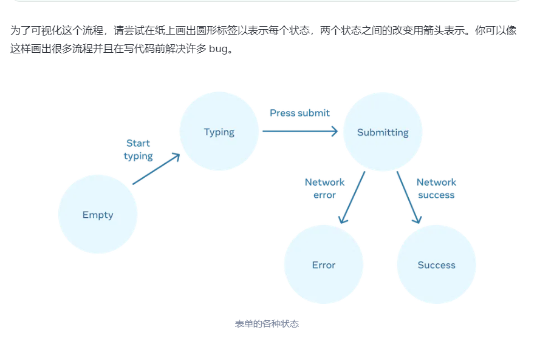
<a name="KBYL7"></a>
### 步骤 3：通过 useState 表示内存中的 state
如果你很难立即想出最好的办法，那就先从添加足够多的 state 开始，**确保**所有可能的视图状态都囊括其中：
```js
const [isEmpty, setIsEmpty] = useState(true);
const [isTyping, setIsTyping] = useState(false);
const [isSubmitting, setIsSubmitting] = useState(false);
const [isSuccess, setIsSuccess] = useState(false);
const [isError, setIsError] = useState(false);
```
你最初的想法或许不是最好的，但是没关系，重构 state 也是步骤中的一部分！
<a name="Z1Osn"></a>
### 步骤 4：删除任何不必要的 state 变量 
在清理之后，你只剩下 3 个（从原本的 7 个！）_必要_的 state 变量：
```js
const [answer, setAnswer] = useState('');
const [error, setError] = useState(null);
const [status, setStatus] = useState('typing'); // 'typing', 'submitting', or 'success'
```
<a name="BConb"></a>
### 步骤 5：连接事件处理函数以设置 state 

练习1
```js
import {useState} from 'react'
export default function Picture() {
  const [imgcss,setImgcss] = useState(false)
  function handleBgd(){
     setImgcss(false)
  }
  function handleImg(e){
    e.stopPropagation()
    setImgcss(true)
  }
  let bgdClassName = 'background'
  let imgClassName = 'picture'
  if(imgcss){
    imgClassName += ' picture--active'  //注意此处的空格
  }else{
    bgdClassName += ' background--active'  //注意此处的空格
  }
  return (
    <div className={bgdClassName} onClick={()=>setImgcss(false)}>
       {
          e.stopPropagation();
          setImgcss(true)}}
        className={imgClassName}
        alt="Rainbow houses in Kampung Pelangi, Indonesia"
        src="https://i.imgur.com/5qwVYb1.jpeg"
      />
    </div>
  );
}

```
练习2
```js
import {useState} from 'react'
export default function EditProfile() {
  const [edit,setEdit]= useState(false)
  const [firstName,setFirstName] = useState('')
  const [lastName,setLastName] = useState('')
  return (
    <form onSubmit={(e)=>{
      e.preventDefault()
      setEdit(!edit)
    }}>
      <label>
        First name:{' '}
        {edit? <input onChange={(e)=>{
          setFirstName(e.target.value)
        }} value={firstName}/>:<b>{firstName}</b>}
      </label>
      <label>
        Last name:{' '}
        {edit? <input onChange={(e)=>{
          setLastName(e.target.value)
        }} value={lastName}/>:<b>{lastName}</b>}
      </label>
      <button type="submit">
        {edit? 'save ': 'edit '} Profile
      </button>
      <p><i>Hello, {firstName} {lastName}!</i></p>
    </form>
  );
}

```
<a name="Nn4iD"></a>
# 选择 State 结构
<a name="v7QiR"></a>
## 构建 state 的原则 
当你编写一个存有 state 的组件时，你需要选择使用多少个 state 变量以及它们都是怎样的数据格式。尽管选择次优的 state 结构下也可以编写正确的程序，但有几个原则可以指导您做出更好的决策：

1. **合并关联的 state**。如果你总是同时更新两个或更多的 state 变量，请考虑将它们合并为一个单独的 state 变量。
2. **避免互相矛盾的 state**。当 state 结构中存在多个相互矛盾或“不一致”的 state 时，你就可能为此会留下隐患。应尽量避免这种情况。
3. **避免冗余的 state**。如果你能在渲染期间从组件的 props 或其现有的 state 变量中计算出一些信息，则不应将这些信息放入该组件的 state 中。
4. **避免重复的 state**。当同一数据在多个 state 变量之间或在多个嵌套对象中重复时，这会很难保持它们同步。应尽可能减少重复。
5. **避免深度嵌套的 state**。深度分层的 state 更新起来不是很方便。如果可能的话，最好以扁平化方式构建 state。
<a name="gKaIE"></a>
# 在组件间共享状态
有时候，你希望两个组件的状态始终同步更改。要实现这一点，可以将相关 state 从这两个组件上移除，并把 state 放到它们的公共父级，再通过 props 将 state 传递给这两个组件。这被称为“状态提升”，这是编写 React 代码时常做的事
<a name="FvC5q"></a>
## 举例说明一下状态提升 
在这个例子中，父组件 Accordion 渲染了 2 个独立的 Panel 组件。

- Accordion
   - Panel
   - Panel

每个 Panel 组件都有一个布尔值 isActive，用于控制其内容是否可见
```js
import { useState } from 'react';

function Panel({ title, children }) {
  const [isActive, setIsActive] = useState(false);
  return (
    <section className="panel">
      <h3>{title}</h3>
      {isActive ? (
        <p>{children}</p>
      ) : (
        <button onClick={() => setIsActive(true)}>
          显示
        </button>
      )}
    </section>
  );
}

export default function Accordion() {
  return (
    <>
      <h2>哈萨克斯坦，阿拉木图</h2>
      <Panel title="关于">
        阿拉木图人口约200万，是哈萨克斯坦最大的城市。它在 1929 年到 1997 年间都是首都。
      </Panel>
      <Panel title="词源">
        这个名字来自于 <span lang="kk-KZ">алма</span>，哈萨克语中“苹果”的意思，经常被翻译成“苹果之乡”。事实上，阿拉木图的周边地区被认为是苹果的发源地，<i lang="la">Malus sieversii</i> 被认为是现今苹果的祖先。
      </Panel>
    </>
  );
}

```
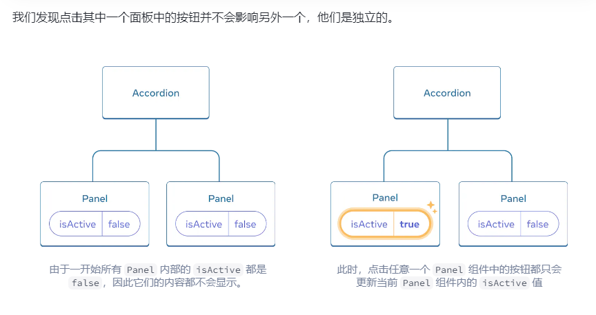**假设现在您想改变这种行为，以便在任何时候只展开一个面板**。在这种设计下，展开第 2 个面板应会折叠第 1 个面板。您该如何做到这一点呢？”<br />要协调好这两个面板，我们需要分 3 步将状态“提升”到他们的父组件中。

1. 从子组件中 **移除** state 。
2. 从父组件 **传递** 硬编码数据。
3. 为共同的父组件添加 state ，并将其与事件处理函数一起向下传递
<a name="nW3GU"></a>
### 第 1 步: 从子组件中移除状态 
你将把 Panel 组件对 isActive 的控制权交给他们的父组件。这意味着，父组件会将 isActive 作为 prop 传给子组件 Panel。我们先从 Panel 组件中 **删除下面这一行**：
```jsx
const [isActive, setIsActive] = useState(false);
```
然后，把 isActive 加入 Panel 组件的 props 中：
```js
function Panel({ title, children, isActive }) {
```
<a name="Iydu0"></a>
### 第 2 步: 从公共父组件传递硬编码数据
```js
import { useState } from 'react';
export default function Accordion() {
  return (
    <>
      <h2>哈萨克斯坦，阿拉木图</h2>
      <Panel title="关于" isActive={true}>
        阿拉木图人口约200万，是哈萨克斯坦最大的城市。它在 1929 年到 1997 年间都是首都。
      </Panel>
      <Panel title="词源" isActive={true}>
        这个名字来自于 <span lang="kk-KZ">алма</span>，哈萨克语中“苹果”的意思，经常被翻译成“苹果之乡”。事实上，阿拉木图的周边地区被认为是苹果的发源地，<i lang="la">Malus sieversii</i> 被认为是现今苹果的祖先。
      </Panel>
    </>
  );
}
function Panel({ title, children, isActive }) {
  return (
    <section className="panel">
      <h3>{title}</h3>
      {isActive ? (
        <p>{children}</p>
      ) : (
        <button onClick={() => setIsActive(true)}>
          显示
        </button>
      )}
    </section>
  );
}

<a name="Zgt56"></a>
### 第 3 步: 为公共父组件添加状态 
状态提升通常会改变原状态的数据存储类型。<br />在这个例子中，一次只能激活一个面板。这意味着 Accordion 这个父组件需要记录 **哪个** 面板是被激活的面板。我们可以用数字作为当前被激活 Panel 的索引，而不是 boolean 值：
```js
const [activeIndex, setActiveIndex] = useState(0);
```
```js
import { useState } from 'react';

export default function Accordion() {
  const [activeIndex, setActiveIndex] = useState(0);
  return (
    <>
      <h2>哈萨克斯坦，阿拉木图</h2>
      <Panel
        title="关于"
        isActive={activeIndex === 0}
        onShow={() => setActiveIndex(0)}
      >
        阿拉木图人口约200万，是哈萨克斯坦最大的城市。它在 1929 年到 1997 年间都是首都。
      </Panel>
      <Panel
        title="词源"
        isActive={activeIndex === 1}
        onShow={() => setActiveIndex(1)}
      >
        这个名字来自于 <span lang="kk-KZ">алма</span>，哈萨克语中“苹果”的意思，经常被翻译成“苹果之乡”。事实上，阿拉木图的周边地区被认为是苹果的发源地，<i lang="la">Malus sieversii</i> 被认为是现今苹果的祖先。
      </Panel>
    </>
  );
}

function Panel({
  title,
  children,
  isActive,
  onShow
}) {
  return (
    <section className="panel">
      <h3>{title}</h3>
      {isActive ? (
        <p>{children}</p>
      ) : (
        <button onClick={onShow}>
          显示
        </button>
      )}
    </section>
  );
}

```
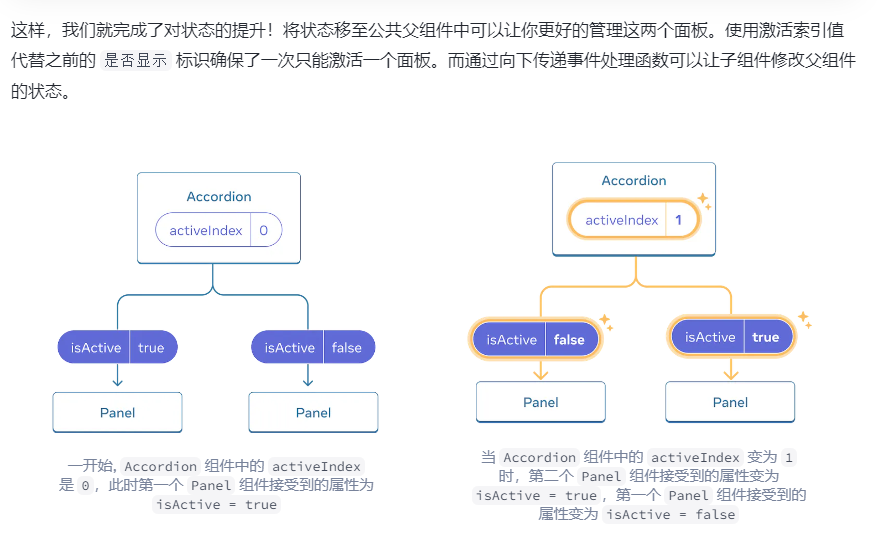
<a name="vY8xd"></a>
#### 受控组件和非受控组件 
<br /> 通常我们把包含“不受控制”状态的组件称为“非受控组件”。例如，最开始带有 isActive 状态变量的 Panel 组件就是不受控制的，因为其父组件无法控制面板的激活状态。<br />相反，当组件中的重要信息是由 props 而不是其自身状态驱动时，就可以认为该组件是“受控组件”。这就允许父组件完全指定其行为。最后带有 isActive 属性的 Panel 组件是由 Accordion 组件控制的<br />练习1
```js
import { useState } from 'react';

export default function SyncedInputs() {
  const [text,setText]= useState('')
  function handleChange(e){
    setText(e.target.value)
  }
  return (
    <>
      <Input label="第一个输入框" onChange={handleChange} text={text}/>
      <Input label="第二个输入框" onChange={handleChange} text={text}/>
    </>
  );
}

function Input({ label, onChange, text }) {
  //const [text, setText] = useState('');

  /*function handleChange(e) {
    setText(e.target.value);
  }*/

  return (
    <label>
      {label}
      {' '}
      <input
        value={text}
        onChange={onChange}
      />
    </label>
  );
}

```
练习2
```js
import { useState } from 'react';
import { foods, filterItems } from './data.js';

export default function FilterableList() {
  const [query,setQuery] = useState('')
  function handleQuery(e){
    setQuery(e.target.value)
  }
  return (
    <>
      <SearchBar text={query} onChange={handleQuery}/>
      <hr />
      <List items={foods} text={query}/>
    </>
  );
}

function SearchBar({text,onChange}) {
  /*const [query, setQuery] = useState('');

  function handleChange(e) {
    setQuery(e.target.value);
  }*/

  return (
    <label>
      搜索：{' '}
      <input
        value={text}
        onChange={onChange}
      />
    </label>
  );
}

function List({ items,text }) {
  return (
    <table>
      <tbody>
        {filterItems(items,text).map(food => (
          <tr key={food.id}>
            <td>{food.name}</td>
            <td>{food.description}</td>
          </tr>
        ))}
      </tbody>
    </table>
  );
}

```
<a name="Mmq6Q"></a>
# 对 state 进行保留和重置
<a name="SDbIs"></a>
## 状态与渲染树中的位置相关
只有当在树中相同的位置渲染相同的组件时，React 才会一直保留着组件的 state
```js
import { useState } from 'react';

export default function App() {
  const [showB, setShowB] = useState(true);
  return (
    <div>
      <Counter />
      {showB && <Counter />} 
      <label>
        <input
          type="checkbox"
          checked={showB}
          onChange={e => {
            setShowB(e.target.checked)
          }}
        />
        渲染第二个计数器
      </label>
    </div>
  );
}

function Counter() {
  const [score, setScore] = useState(0);
  const [hover, setHover] = useState(false);

  let className = 'counter';
  if (hover) {
    className += ' hover';
  }

  return (
    <div
      className={className}
      onPointerEnter={() => setHover(true)}
      onPointerLeave={() => setHover(false)}
    >
      <h1>{score}</h1>
      <button onClick={() => setScore(score + 1)}>
        加一
      </button>
    </div>
  );
}

```
注意，当你停止渲染第二个计数器的那一刻，它的 state 完全消失了。这是因为 React 在移除一个组件时，也会销毁它的 state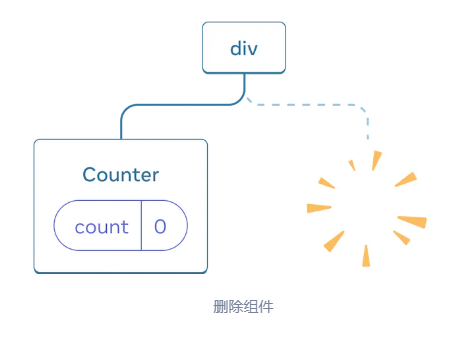<br />当你重新勾选“渲染第二个计数器”复选框时，另一个计数器及其 state 将从头开始初始化（score = 0）并被添加到 DOM 中。<br />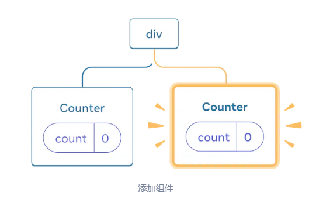
<a name="gyFmg"></a>
## 相同位置的相同组件会使得 state 被保留下来
```js
import { useState } from 'react';

export default function App() {
  const [isFancy, setIsFancy] = useState(false);
  return (
    <div>
      {isFancy ? (
        <Counter isFancy={true} /> 
      ) : (
        <Counter isFancy={false} /> 
      )}
      <label>
        <input
          type="checkbox"
          checked={isFancy}
          onChange={e => {
            setIsFancy(e.target.checked)
          }}
        />
        使用好看的样式
      </label>
    </div>
  );
}

function Counter({ isFancy }) {
  const [score, setScore] = useState(0);
  const [hover, setHover] = useState(false);

  let className = 'counter';
  if (hover) {
    className += ' hover';
  }
  if (isFancy) {
    className += ' fancy';
  }

  return (
    <div
      className={className}
      onPointerEnter={() => setHover(true)}
      onPointerLeave={() => setHover(false)}
    >
      <h1>{score}</h1>
      <button onClick={() => setScore(score + 1)}>
        加一
      </button>
    </div>
  );
}

```
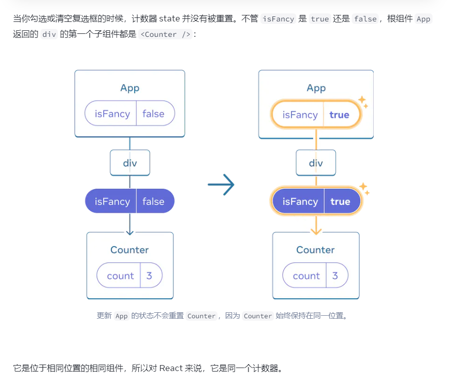
<a name="PRz13"></a>
## 相同位置的不同组件会使 state 重置
在这个例子中，勾选复选框会将 <Counter> 替换为一个 <p>
```js
import { useState } from 'react';

export default function App() {
  const [isPaused, setIsPaused] = useState(false);
  return (
    <div>
      {isPaused ? (
        <p>待会见！</p> 
      ) : (
        <Counter /> 
      )}
      <label>
        <input
          type="checkbox"
          checked={isPaused}
          onChange={e => {
            setIsPaused(e.target.checked)
          }}
        />
        休息一下
      </label>
    </div>
  );
}

function Counter() {
  const [score, setScore] = useState(0);
  const [hover, setHover] = useState(false);

  let className = 'counter';
  if (hover) {
    className += ' hover';
  }

  return (
    <div
      className={className}
      onPointerEnter={() => setHover(true)}
      onPointerLeave={() => setHover(false)}
    >
      <h1>{score}</h1>
      <button onClick={() => setScore(score + 1)}>
        加一
      </button>
    </div>
  );
}

```
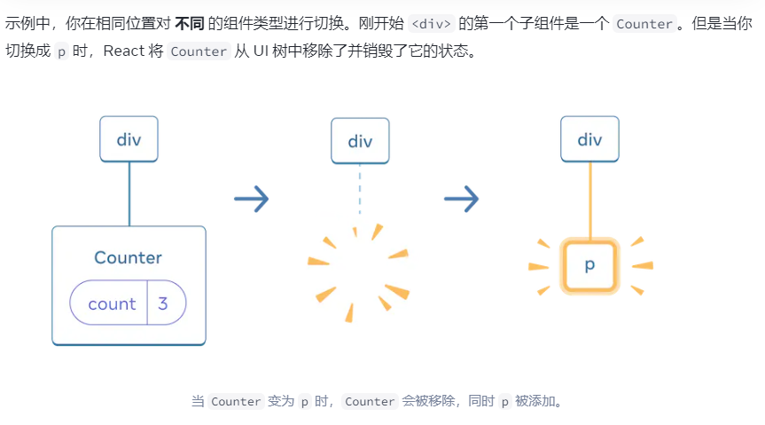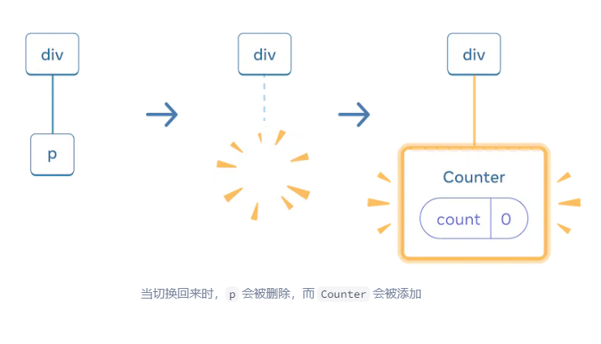并且，**当你在相同位置渲染不同的组件时，组件的整个子树都会被重置**。要验证这一点，可以增加计数器的值然后勾选复选框
```js
import { useState } from 'react';

export default function App() {
  const [isFancy, setIsFancy] = useState(false);
  return (
    <div>
      {isFancy ? (
        <div>
          <Counter isFancy={true} /> 
        </div>
      ) : (
        <section>
          <Counter isFancy={false} />
        </section>
      )}
      <label>
        <input
          type="checkbox"
          checked={isFancy}
          onChange={e => {
            setIsFancy(e.target.checked)
          }}
        />
        使用好看的样式
      </label>
    </div>
  );
}

function Counter({ isFancy }) {
  const [score, setScore] = useState(0);
  const [hover, setHover] = useState(false);

  let className = 'counter';
  if (hover) {
    className += ' hover';
  }
  if (isFancy) {
    className += ' fancy';
  }

  return (
    <div
      className={className}
      onPointerEnter={() => setHover(true)}
      onPointerLeave={() => setHover(false)}
    >
      <h1>{score}</h1>
      <button onClick={() => setScore(score + 1)}>
        加一
      </button>
    </div>
  );
}

```
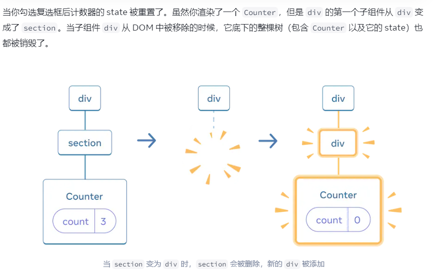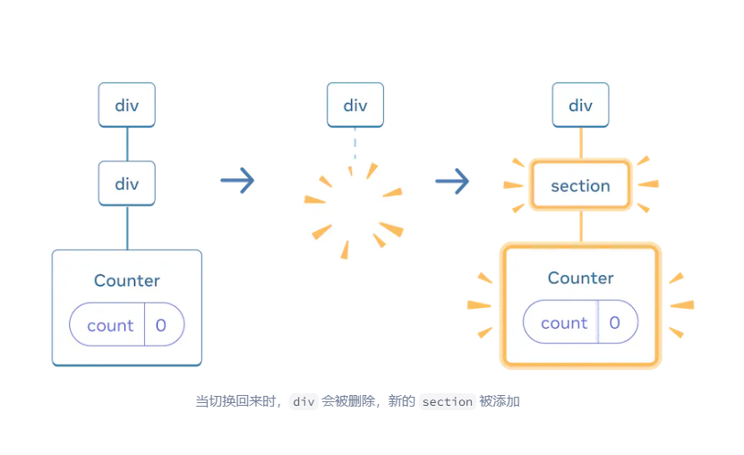
<a name="XURbL"></a>
## 在相同位置重置 state
<a name="ws2Dj"></a>
### 方法一：将组件渲染在不同的位置
```js
import { useState } from 'react';

export default function Scoreboard() {
  const [isPlayerA, setIsPlayerA] = useState(true);
  return (
    <div>
      {isPlayerA &&
        <Counter person="Taylor" />
      }
      {!isPlayerA &&
        <Counter person="Sarah" />
      }
      <button onClick={() => {
        setIsPlayerA(!isPlayerA);
      }}>
        下一位玩家！
      </button>
    </div>
  );
}

function Counter({ person }) {
  const [score, setScore] = useState(0);
  const [hover, setHover] = useState(false);

  let className = 'counter';
  if (hover) {
    className += ' hover';
  }

  return (
    <div
      className={className}
      onPointerEnter={() => setHover(true)}
      onPointerLeave={() => setHover(false)}
    >
      <h1>{person} 的分数：{score}</h1>
      <button onClick={() => setScore(score + 1)}>
        加一
      </button>
    </div>
  );
}

```
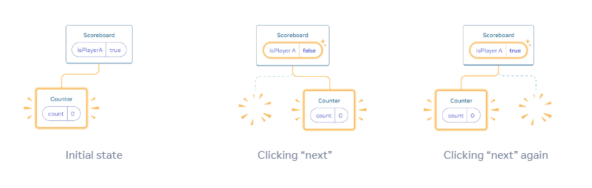
<a name="z3PhJ"></a>
### 方法二：使用 key 来重置 state
 key 不只可以用于列表！你可以使用 key 来让 React 区分任何组件。默认情况下，React 使用父组件内部的顺序（“第一个计数器”、“第二个计数器”）来区分组件。但是 key 可以让你告诉 React 这不仅仅是 **第一个** 或者 **第二个** 计数器，而且还是一个特定的计数器——例如，**Taylor 的** 计数器。这样无论它出现在树的任何位置， React 都会知道它是 **Taylor 的** 计数器！
```js
import { useState } from 'react';

export default function Scoreboard() {
  const [isPlayerA, setIsPlayerA] = useState(true);
  return (
    <div>
      {isPlayerA ? (
        <Counter key="Taylor" person="Taylor" />
      ) : (
        <Counter key="Sarah" person="Sarah" />
      )}
      <button onClick={() => {
        setIsPlayerA(!isPlayerA);
      }}>
        下一位玩家！
      </button>
    </div>
  );
}

function Counter({ person }) {
  const [score, setScore] = useState(0);
  const [hover, setHover] = useState(false);

  let className = 'counter';
  if (hover) {
    className += ' hover';
  }

  return (
    <div
      className={className}
      onPointerEnter={() => setHover(true)}
      onPointerLeave={() => setHover(false)}
    >
      <h1>{person} 的分数：{score}</h1>
      <button onClick={() => setScore(score + 1)}>
        加一
      </button>
    </div>
  );
}

```
<a name="Q3kIN"></a>
#### 为被移除的组件保留 state 
在真正的聊天应用中，你可能会想在用户再次选择前一个收件人时恢复输入 state。对于一个不可见的组件，有几种方法可以让它的 state “活下去”：

- 与其只渲染现在这一个聊天，你可以把 **所有** 聊天都渲染出来，但用 CSS 把其他聊天隐藏起来。这些聊天就不会从树中被移除了，所以它们的内部 state 会被保留下来。这种解决方法对于简单 UI 非常有效。但如果要隐藏的树形结构很大且包含了大量的 DOM 节点，那么性能就会变得很差。
- 你可以进行 [状态提升](https://zh-hans.react.dev/learn/sharing-state-between-components) 并在父组件中保存每个收件人的草稿消息。这样即使子组件被移除了也无所谓，因为保留重要信息的是父组件。这是最常见的解决方法。
- 除了 React 的 state，你也可以使用其他数据源。例如，也许你希望即使用户不小心关闭页面也可以保存一份信息草稿。要实现这一点，你可以让 Chat 组件通过读取 [localStorage](https://developer.mozilla.org/zh-CN/docs/Web/API/Window/localStorage) 对其 state 进行初始化，并把草稿保存在那里。

练习1
```js
import { useState } from 'react';

export default function App() {
  const [showHint, setShowHint] = useState(false);
  if (showHint) {
    return (
      <div>
        <p><i>提示：你最喜欢的城市？</i></p>
        <Form />
        <button onClick={() => {
          setShowHint(false);
        }}>隐藏提示</button>
      </div>
    );
  }
  return (
    <div>
      <p></p>
      <Form />
      <button onClick={() => {
        setShowHint(true);
      }}>显示提示</button>
    </div>
  );
}

function Form() {
  const [text, setText] = useState('');
  return (
    <textarea
      value={text}
      onChange={e => setText(e.target.value)}
    />
  );
}

```
练习2
```js
import { useState } from 'react';

export default function App() {
  const [reverse, setReverse] = useState(false);
  let checkbox = (
    <label>
      <input
        type="checkbox"
        checked={reverse}
        onChange={e => setReverse(e.target.checked)}
      />
      调换顺序
    </label>
  );
  if (reverse) {
    return (
      <>
        <Field label="姓氏" key='姓氏' /> 
        <Field label="名字" key='名字'/>
        {checkbox}
      </>
    );
  } else {
    return (
      <>
        <Field label="名字" key='名字'/> 
        <Field label="姓氏" key='姓氏'/>
        {checkbox}
      </>
    );    
  }
}

function Field({ label }) {
  const [text, setText] = useState('');
  return (
    <label>
      {label}：
      <input
        type="text"
        value={text}
        placeholder={label}
        onChange={e => setText(e.target.value)}
      />
    </label>
  );
}

```
练习3,4,5
<a name="dLMkG"></a>
# 迁移状态逻辑至 Reducer 中
<a name="mNS0C"></a>
## 使用 reducer 整合状态逻辑 
随着组件复杂度的增加，你将很难一眼看清所有的组件状态更新逻辑。例如，下面的 TaskApp 组件有一个数组类型的状态 tasks，并通过三个不同的事件处理程序来实现任务的添加、删除和修改
```js
import { useState } from 'react';
import AddTask from './AddTask.js';
import TaskList from './TaskList.js';
export default function TaskApp() {
const [tasks, setTasks] = useState(initialTasks);
  function handleAddTask(text) {
    setTasks([
      ...tasks,
      {
        id: nextId++,
        text: text,
        done: false,
      },
    ]);
  }
  function handleChangeTask(task) {
    setTasks(
      tasks.map((t) => {
        if (t.id === task.id) {
          return task;
        } else {
          return t;
        }
      })
    );
  }

  function handleDeleteTask(taskId) {
    setTasks(tasks.filter((t) => t.id !== taskId));
  }

  return (
    <>
      <h1>布拉格的行程安排</h1>
      <AddTask onAddTask={handleAddTask} />
      <TaskList
        tasks={tasks}
        onChangeTask={handleChangeTask}
        onDeleteTask={handleDeleteTask}
      />
    </>
  );
}

let nextId = 3;
const initialTasks = [
  {id: 0, text: '参观卡夫卡博物馆', done: true},
  {id: 1, text: '看木偶戏', done: false},
  {id: 2, text: '打卡列侬墙', done: false},
];

```
你可以通过三个步骤将 useState 迁移到 useReducer
<a name="Rs63I"></a>
### 第 1 步: 将设置状态的逻辑修改成 dispatch 的一个 action
移除所有的状态设置逻辑。只留下三个事件处理函数：

- handleAddTask(text) 在用户点击 “添加” 时被调用。
- handleChangeTask(task) 在用户切换任务或点击 “保存” 时被调用。
- handleDeleteTask(taskId) 在用户点击 “删除” 时被调用。

使用 reducers 管理状态与直接设置状态略有不同。它不是通过设置状态来告诉 React “要做什么”，而是通过事件处理程序 dispatch 一个 “action” 来指明 “用户刚刚做了什么”。（而状态更新逻辑则保存在其他地方！）因此，我们不再通过事件处理器直接 “设置 task”，而是 dispatch 一个 “添加/修改/删除任务” 的 action。这更加符合用户的思维。
```js
function handleAddTask(text) {
  dispatch({
    type: 'added',
    id: nextId++,
    text: text,
  });
}

function handleChangeTask(task) {
  dispatch({
    type: 'changed',
    task: task,
  });
}

function handleDeleteTask(taskId) {
  dispatch({
    type: 'deleted',
    id: taskId,
  });
}
```
<a name="mjWoY"></a>
### 第 2 步: 编写一个 reducer 函数 
reducer 函数就是你放置状态逻辑的地方。它接受两个参数，分别为当前 state 和 action 对象，并且返回的是更新后的 state<br />在这个例子中，要将状态设置逻辑从事件处理程序移到 reducer 函数中，你需要：

1. 声明当前状态（tasks）作为第一个参数；
2. 声明 action 对象作为第二个参数；
3. 从 reducer 返回 **下一个** 状态（React 会将旧的状态设置为这个最新的状态）
```js
function tasksReducer(tasks, action) {
  if (action.type === 'added') {
    return [
      ...tasks,
      {
        id: action.id,
        text: action.text,
        done: false,
      },
    ];
  } else if (action.type === 'changed') {
    return tasks.map((t) => {
      if (t.id === action.task.id) {
        return action.task;
      } else {
        return t;
      }
    });
  } else if (action.type === 'deleted') {
    return tasks.filter((t) => t.id !== action.id);
  } else {
    throw Error('未知 action: ' + action.type);
  }
}
```
上面的代码使用了 if/else 语句，但是在 reducers 中使用 [switch 语句](https://developer.mozilla.org/docs/Web/JavaScript/Reference/Statements/switch) 是一种惯例。两种方式结果是相同的，但 switch 语句读起来一目了然
```js
function tasksReducer(tasks, action) {
  switch (action.type) {
    case 'added': {
      return [
        ...tasks,
        {
          id: action.id,
          text: action.text,
          done: false,
        },
      ];
    }
    case 'changed': {
      return tasks.map((t) => {
        if (t.id === action.task.id) {
          return action.task;
        } else {
          return t;
        }
      });
    }
    case 'deleted': {
      return tasks.filter((t) => t.id !== action.id);
    }
    default: {
      throw Error('未知 action: ' + action.type);
    }
  }
}
```
Reduce()<br />`reduce()` 是 JavaScript 中数组的高阶函数之一，用于将数组中的元素归纳为单个值。它接受一个回调函数作为参数，这个回调函数可以进行累积操作。

<a name="f2b0b493"></a>
### 语法

```javascript
array.reduce(callback(accumulator, currentValue, currentIndex, array), initialValue);
```

-  `callback`：用于处理数组中每个元素的回调函数，包含四个参数： 
   - `accumulator`：累积器，累积计算的结果。
   - `currentValue`：当前处理的元素。
   - `currentIndex`（可选）：当前处理的元素的索引。
   - `array`（可选）：调用 `reduce` 的数组。
-  `initialValue`（可选）：作为第一次调用 `callback` 时的第一个参数 `accumulator` 的初始值。如果不提供，将使用数组的第一个元素作为初始值，且 `callback` 不会在数组的第一个元素上调用。 

<a name="1a63ac23"></a>
### 示例

```javascript
// 计算数组元素的和
const numbers = [1, 2, 3, 4, 5];
const sum = numbers.reduce((accumulator, currentValue) => accumulator + currentValue, 0);
console.log(sum); // 输出 15

// 找出数组中的最大值
const max = numbers.reduce((accumulator, currentValue) => Math.max(accumulator, currentValue));
console.log(max); // 输出 5
```

<a name="7efcb0ce"></a>
### 使用场景

- **累加或累乘**：计算数组中所有元素的和或积。
- **查找最值**：找出数组中的最大值或最小值。
- **转换数据格式**：将数组转换成其他数据结构。
- **归纳操作**：进行复杂的归纳计算。

<a name="1bbbb204"></a>
### 注意事项

- 在没有提供 `initialValue` 的情况下，`reduce` 将从数组的第二个元素开始调用回调函数。
- 如果数组为空且没有提供 `initialValue`，`reduce` 将抛出 `TypeError`。
- 回调函数在数组有元素时至少会被调用一次。
- `reduce` 不会改变原数组。

<a name="1a63ac23-1"></a>
### 示例

```javascript
// 使用 reduce 计算数组中的平均值
const numbers = [10, 20, 30, 40, 50];
const average = numbers.reduce((accumulator, currentValue, index, array) => {
  accumulator += currentValue;
  if (index === array.length - 1) {
    return accumulator / array.length;
  } else {
    return accumulator;
  }
}, 0);

console.log(average); // 输出 30
```

在这个示例中，`reduce` 被用于计算数组 `numbers` 中所有元素的平均值。

<a name="VTXlW"></a>
### 第 3 步: 在组件中使用 reducer 
你需要将 tasksReducer 导入到组件中。记得先从 React 中导入 useReducer Hook：
```js
import { useReducer } from 'react';
```
接下来，你就可以替换掉之前的 useState:
```js
const [tasks, setTasks] = useState(initialTasks);
```
只需要像下面这样使用 useReducer:
```js
const [tasks, dispatch] = useReducer(tasksReducer, initialTasks);
```
useReducer 和 useState 很相似——你必须给它传递一个初始状态，它会返回一个有状态的值和一个设置该状态的函数（在这个例子中就是 dispatch 函数）。但是，它们两个之间还是有点差异的。<br />useReducer 钩子接受 2 个参数：

1. 一个 reducer 函数
2. 一个初始的 state

它返回如下内容：

1. 一个有状态的值
2. 一个 dispatch 函数（用来 “派发” 用户操作给 reducer）
```js
import { useReducer } from 'react';
import AddTask from './AddTask.js';
import TaskList from './TaskList.js';
export default function TaskApp() {
  const [tasks, dispatch] = useReducer(tasksReducer, initialTasks);

  function handleAddTask(text) {
    dispatch({
      type: 'added',
      id: nextId++,
      text: text,
    });
  }

  function handleChangeTask(task) {
    dispatch({
      type: 'changed',
      task: task,
    });
  }

  function handleDeleteTask(taskId) {
    dispatch({
      type: 'deleted',
      id: taskId,
    });
  }

  return (
    <>
      <h1>布拉格的行程安排</h1>
      <AddTask onAddTask={handleAddTask} />
      <TaskList
        tasks={tasks}
        onChangeTask={handleChangeTask}
        onDeleteTask={handleDeleteTask}
      />
    </>
  );
}
function tasksReducer(tasks, action) {
  switch (action.type) {
    case 'added': {
      return [
        ...tasks,
        {
          id: action.id,
          text: action.text,
          done: false,
        },
      ];
    }
    case 'changed': {
      return tasks.map((t) => {
        if (t.id === action.task.id) {
          return action.task;
        } else {
          return t;
        }
      });
    }
    case 'deleted': {
      return tasks.filter((t) => t.id !== action.id);
    }
    default: {
      throw Error('未知 action: ' + action.type);
    }
  }
}
let nextId = 3;
const initialTasks = [
  {id: 0, text: '参观卡夫卡博物馆', done: true},
  {id: 1, text: '看木偶戏', done: false},
  {id: 2, text: '打卡列侬墙', done: false}
];


<a name="ekEtr"></a>
## 对比 useState 和 useReducer 

- **代码体积：** 通常，在使用 useState 时，一开始只需要编写少量代码。而 useReducer 必须提前编写 reducer 函数和需要调度的 actions。但是，当多个事件处理程序以相似的方式修改 state 时，useReducer 可以减少代码量。
- **可读性：** 当状态更新逻辑足够简单时，useState 的可读性还行。但是，一旦逻辑变得复杂起来，它们会使组件变得臃肿且难以阅读。在这种情况下，useReducer 允许你将状态更新逻辑与事件处理程序分离开来。
- **可调试性：** 当使用 useState 出现问题时, 你很难发现具体原因以及为什么。 而使用 useReducer 时， 你可以在 reducer 函数中通过打印日志的方式来观察每个状态的更新，以及为什么要更新（来自哪个 action）。 如果所有 action 都没问题，你就知道问题出在了 reducer 本身的逻辑中。 然而，与使用 useState 相比，你必须单步执行更多的代码。
- **可测试性：** reducer 是一个不依赖于组件的纯函数。这就意味着你可以单独对它进行测试。一般来说，我们最好是在真实环境中测试组件，但对于复杂的状态更新逻辑，针对特定的初始状态和 action，断言 reducer 返回的特定状态会很有帮助。
- **个人偏好：** 并不是所有人都喜欢用 reducer，没关系，这是个人偏好问题。你可以随时在 useState 和 useReducer 之间切换，它们能做的事情是一样的

练习1,2,3,4 暂时搁置

<a name="xreyc"></a>
# 使用 Context 深层传递参数
通常来说，你会通过 props 将信息从父组件传递到子组件。但是，如果你必须通过许多中间组件向下传递 props，或是在你应用中的许多组件需要相同的信息，传递 props 会变的十分冗长和不便。**Context** 允许父组件向其下层无论多深的任何组件提供信息，而无需通过 props 显式传递
<a name="vnc2o"></a>
## 传递 props 带来的问题
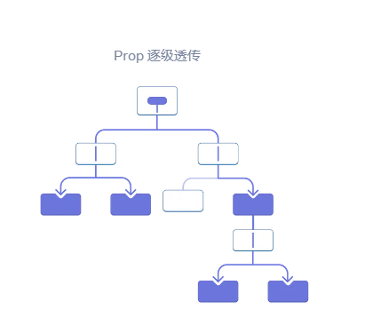
<a name="IsTwz"></a>
## Context：传递 props 的另一种方法 
Context 让父组件可以为它下面的整个组件树提供数据<br />你可以通过以下三个步骤来实现它：

1. **创建** 一个 context。（你可以将其命名为 LevelContext, 因为它表示的是标题级别。)
2. 在需要数据的组件内 **使用** 刚刚创建的 context。（Heading 将会使用 LevelContext。）
3. 在指定数据的组件中 **提供** 这个 context。 （Section 将会提供 LevelContext。

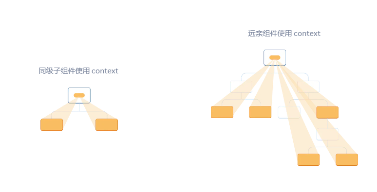

<a name="gEmtf"></a>
## 写在你使用 context 之前 
使用 Context 看起来非常诱人！然而，这也意味着它也太容易被过度使用了。**如果你只想把一些 props 传递到多个层级中，这并不意味着你需要把这些信息放到 context 里**<br />在使用 context 之前，你可以考虑以下几种替代方案：

1. **从 **[**传递 props**](https://zh-hans.react.dev/learn/passing-props-to-a-component)** 开始。** 如果你的组件看起来不起眼，那么通过十几个组件向下传递一堆 props 并不罕见。这有点像是在埋头苦干，但是这样做可以让哪些组件用了哪些数据变得十分清晰！维护你代码的人会很高兴你用 props 让数据流变得更加清晰。
2. **抽象组件并 **[**将 JSX 作为children传递**](https://zh-hans.react.dev/learn/passing-props-to-a-component#passing-jsx-as-children)** 给它们。** 如果你通过很多层不使用该数据的中间组件（并且只会向下传递）来传递数据，这通常意味着你在此过程中忘记了抽象组件。举个例子，你可能想传递一些像 posts 的数据 props 到不会直接使用这个参数的组件，类似 <Layout posts={posts} />。取而代之的是，让 Layout 把 children 当做一个参数，然后渲染 <Layout><Posts posts={posts} /></Layout>。这样就减少了定义数据的组件和使用数据的组件之间的层级
<a name="eTNjg"></a>
## Context 的使用场景 

- **主题：** 如果你的应用允许用户更改其外观（例如暗夜模式），你可以在应用顶层放一个 context provider，并在需要调整其外观的组件中使用该 context。
- **当前账户：** 许多组件可能需要知道当前登录的用户信息。将它放到 context 中可以方便地在树中的任何位置读取它。某些应用还允许你同时操作多个账户（例如，以不同用户的身份发表评论）。在这些情况下，将 UI 的一部分包裹到具有不同账户数据的 provider 中会很方便。
- **路由：** 大多数路由解决方案在其内部使用 context 来保存当前路由。这就是每个链接“知道”它是否处于活动状态的方式。如果你创建自己的路由库，你可能也会这么做。
- **状态管理：** 随着你的应用的增长，最终在靠近应用顶部的位置可能会有很多 state。许多遥远的下层组件可能想要修改它们。通常 [将 reducer 与 context 搭配使用](https://zh-hans.react.dev/learn/scaling-up-with-reducer-and-context)来管理复杂的状态并将其传递给深层的组件来避免过多的麻烦

传递 Context 的方法:

   1. 通过 export const MyContext = createContext(defaultValue) 创建并导出 context。
   2. 在无论层级多深的任何子组件中，把 context 传递给 useContext(MyContext) Hook 来读取它。
   3. 在父组件中把 children 包在 <MyContext.Provider value={...}> 中来提供 context。
<a name="medpR"></a>
# 使用 Reducer 和 Context 拓展你的应用
下面将介绍如何结合使用 reducer 和 context：

1. **创建** context。
2. 将 state 和 dispatch **放入** context。
3. 在组件树的任何地方 **使用** context
<a name="ZSyIj"></a>
# 应急方案
<a name="dSXsR"></a>
# 使用 ref 引用值
当你希望组件“记住”某些信息，但又不想让这些信息 [触发新的渲染](https://zh-hans.react.dev/learn/render-and-commit) 时，你可以使用 **ref** 。
<a name="MCszj"></a>
## 给你的组件添加 ref 
你可以通过从 React 导入 useRef Hook 来为你的组件添加一个 ref：
```js
import { useRef } from 'react';
```
在你的组件内，调用 useRef Hook 并传入你想要引用的初始值作为唯一参数。例如，这里的 ref 引用的值是“0”：
```js
const ref = useRef(0);
```
useRef 返回一个这样的对象:
```js
{ 

  current: 0 // 你向 useRef 传入的值

}
```
```js
import { useRef } from 'react';

export default function Counter() {
  let ref = useRef(0);

  function handleClick() {
    ref.current = ref.current + 1;
    alert('你点击了 ' + ref.current + ' 次！');
  }

  return (
    <button onClick={handleClick}>
      点击我！
    </button>
  );
}

```
**组件不会在每次递增时重新渲染。** 与 state 一样，React 会在每次重新渲染之间保留 ref。但是，设置 state 会重新渲染组件，更改 ref 不会！
<a name="JlP0p"></a>
## ref 和 state 的不同之处
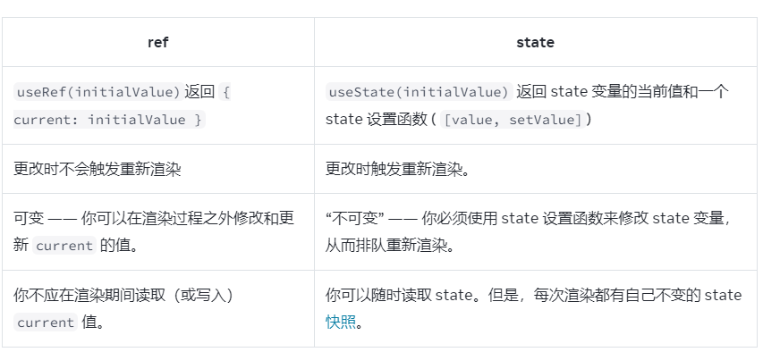
<a name="g9yH8"></a>
#### useRef 内部是如何运行的？
尽管 useState 和 useRef 都是由 React 提供的，原则上 useRef 可以在 useState**的基础上** 实现。 你可以想象在 React 内部，useRef 是这样实现的：
```js
// React 内部

function useRef(initialValue) {

  const [ref, unused] = useState({ current: initialValue });

  return ref;

}
```
<a name="MUlSU"></a>
## 何时使用 ref

- 存储 [timeout ID](https://developer.mozilla.org/docs/Web/API/setTimeout)
- 存储和操作 [DOM 元素](https://developer.mozilla.org/docs/Web/API/Element)，我们将在 [下一页](https://zh-hans.react.dev/learn/manipulating-the-dom-with-refs) 中介绍
- 存储不需要被用来计算 JSX 的其他对象
<a name="o6GkU"></a>
## ref 的最佳实践 
遵循这些原则将使你的组件更具可预测性：

- **将 ref 视为应急方案。** 当你使用外部系统或浏览器 API 时，ref 很有用。如果你很大一部分应用程序逻辑和数据流都依赖于 ref，你可能需要重新考虑你的方法。
- **不要在渲染过程中读取或写入 ref.current。** 如果渲染过程中需要某些信息，请使用 [state](https://zh-hans.react.dev/learn/state-a-components-memory) 代替。由于 React 不知道 ref.current 何时发生变化，即使在渲染时读取它也会使组件的行为难以预测。（唯一的例外是像 if (!ref.current) ref.current = new Thing() 这样的代码，它只在第一次渲染期间设置一次 ref。）
<a name="yhDlK"></a>
# 使用 ref 操作 DOM
<a name="wRv8h"></a>
## 获取指向节点的 ref 
要访问由 React 管理的 DOM 节点，首先，引入 useRef Hook：
```javascript
import { useRef } from 'react';
```
然后，在你的组件中使用它声明一个 ref：
```jsx
const myRef = useRef(null);
```
Finally, pass your ref as the ref attribute to the JSX tag for which you want to get the DOM node:
```jsx
<div ref={myRef}>
```
useRef Hook 返回一个对象，该对象有一个名为 current 的属性。最初，myRef.current 是 null。当 React 为这个 <div> 创建一个 DOM 节点时，React 会把对该节点的引用放入 myRef.current。然后，你可以从 [事件处理器](https://zh-hans.react.dev/learn/responding-to-events) 访问此 DOM 节点，并使用在其上定义的内置[浏览器 API](https://developer.mozilla.org/docs/Web/API/Element)。
```js
// 你可以使用任意浏览器 API，例如：
myRef.current.scrollIntoView();
```

在上面的例子中，ref 的数量是预先确定的。但有时候，你可能需要为列表中的每一项都绑定 ref ，而你又不知道会有多少项。像下面这样做**是行不通的**：
```js
<ul>

  {items.map((item) => {

  // 行不通！

  const ref = useRef(null);

  return <li ref={ref} />;

})}

</ul>
```
这是因为 **Hook 只能在组件的顶层被调用**。不能在循环语句、条件语句或 map() 函数中调用 useRef

<a name="bR5gw"></a>
## 访问另一个组件的 DOM 节点
默认情况下，React 不允许组件访问其他组件的 DOM 节点。甚至自己的子组件也不行<br />**想要** 暴露其 DOM 节点的组件必须**选择**该行为。一个组件可以指定将它的 ref “转发”给一个子组件。下面是 MyInput 如何使用 forwardRef API：
```jsx
const MyInput = forwardRef((props, ref) => {

  return <input {...props} ref={ref} />;

});
```
<a name="JsnXP"></a>
# 使用 Effect 同步
有些组件需要与外部系统同步。例如，你可能希望根据 React state 控制非 React 组件、设置服务器连接或在组件出现在屏幕上时发送分析日志。Effects 会在渲染后运行一些代码，以便可以将组件与 React 之外的某些系统同步<br />在本文和后续文本中，Effect 在 React 中是专有定义——由渲染引起的副作用。为了指代更广泛的编程概念，也可以将其称为“副作用（side effect）

**不要随意在你的组件中使用 Effect**。记住，Effect 通常用于暂时“跳出” React 代码并与一些 **外部** 系统进行同步。这包括浏览器 API、第三方小部件，以及网络等等。如果你想用 Effect 仅根据其他状态调整某些状态，那么 [你可能不需要 Effect](https://zh-hans.react.dev/learn/you-might-not-need-an-effect)。
<a name="uEaVe"></a>
## 如何编写 Effect 
<a name="GXt1B"></a>
### 第一步：声明 Effect 
首先在 React 中引入 [useEffect Hook](https://zh-hans.react.dev/reference/react/useEffect)：
```js
import { useEffect } from 'react';
```
然后，在组件顶部调用它，并传入在每次渲染时都需要执行的代码：
```js
function MyComponent() {

  useEffect(() => {

    // 每次渲染后都会执行此处的代码

  });

  return <div />;

}
```
一般来说，Effect 会在 **每次** 渲染后执行，**而以下代码会陷入死循环中**：
```js
const [count, setCount] = useState(0);

useEffect(() => {

  setCount(count + 1);

});
```
每次渲染结束都会执行 Effect；而更新 state 会触发重新渲染。但是新一轮渲染时又会再次执行 Effect，然后 Effect 再次更新 state……如此周而复始，从而陷入死循环
<a name="EITjN"></a>
### 第二步：指定 Effect 依赖 
一般来说，Effect 会在 **每次** 渲染时执行。**但更多时候，并不需要每次渲染的时候都执行 Effect**。

- 有时这会拖慢运行速度。因为与外部系统的同步操作总是有一定时耗，在非必要时可能希望跳过它。例如，没有人会希望每次用键盘打字时都重新连接聊天服务器。
- 有时这会导致程序逻辑错误。例如，组件的淡入动画只需要在第一轮渲染出现时播放一次，而不是每次触发新一轮渲染后都播放。
```js
 useEffect(() => {
    if (isPlaying) { // isPlaying 在此处使用……
      // ...
    } else {
      // ...
    }
  }, [isPlaying]); // ……所以它必须在此处声明！
```
指定 [isPlaying] 会告诉 React，如果 isPlaying 在上一次渲染时与当前相同，它应该跳过重新运行 Effect<br />没有依赖数组作为第二个参数，与依赖数组位空数组 [] 的行为是不一致的：
```js
useEffect(() => {
  // 这里的代码会在每次渲染后执行
});
useEffect(() => {
  // 这里的代码只会在组件挂载后执行
}, []);
useEffect(() => {
  //这里的代码只会在每次渲染后，并且 a 或 b 的值与上次渲染不一致时执行
}, [a, b]);
```
<a name="zWlIY"></a>
### 第三部：按需添加清理（cleanup）函数 
```js
可以在 Effect 中返回一个 清理（cleanup） 函数。

  useEffect(() => {
    const connection = createConnection();
    connection.connect();
    return () => {
      connection.disconnect();
    };
  }, []);
```
<br /> 每次重新执行 Effect 之前，React 都会调用清理函数；组件被卸载时，也会调用清理函数
<a name="zoPXW"></a>
### 订阅事件 
如果 Effect 订阅了某些事件，清理函数应该退订这些事件：
```js
useEffect(() => {

  function handleScroll(e) {

    console.log(window.scrollX, window.scrollY);

  }

  window.addEventListener('scroll', handleScroll);

  return () => window.removeEventListener('scroll', handleScroll);
}, []);

<a name="l7BUC"></a>
### 触发动画 
如果 Effect 对某些内容加入了动画，清理函数应将动画重置：
```js
useEffect(() => {

  const node = ref.current;

  node.style.opacity = 1; // 触发动画

  return () => {

    node.style.opacity = 0; // 重置为初始值

  };

}, []);
```
<a name="Tyn7N"></a>
### 初始化应用时不需要使用 Effect 的情形 
某些逻辑应该只在应用程序启动时运行一次。比如，验证登陆状态和加载本地程序数据。你可以将其放在组件之外：
```js
if (typeof window !== 'undefined') { // 检查是否在浏览器中运行

  checkAuthToken();

  loadDataFromLocalStorage();

}


function App() {

  // ……

}
```
<a name="lBxdE"></a>
# 你可能不需要 Effect
Effect 是 React 范式中的一个逃脱方案。它们让你可以 “逃出” React 并使组件和一些外部系统同步，比如非 React 组件、网络和浏览器 DOM。如果没有涉及到外部系统（例如，你想根据 props 或 state 的变化来更新一个组件的 state），你就不应该使用 Effect
<a name="fMKi1"></a>
# 响应式 Effect 的生命周期
<a name="otU6p"></a>
## Effect 的生命周期 
每个 React 组件都经历相同的生命周期：

- 当组件被添加到屏幕上时，它会进行组件的 **挂载**。
- 当组件接收到新的 props 或 state 时，通常是作为对交互的响应，它会进行组件的 **更新**。
- 当组件从屏幕上移除时，它会进行组件的 **卸载**