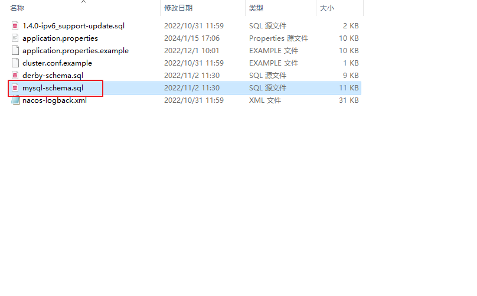
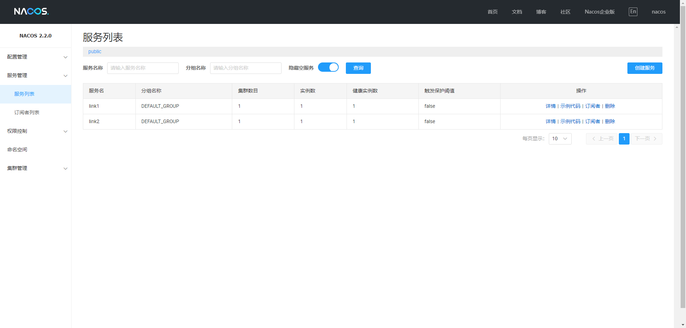

# Spring Cloud

>  与springboot版本对应关系


>  Springcloud-alibaba版本对应

https://github.com/alibaba/spring-cloud-alibaba/wiki/%E7%89%88%E6%9C%AC%E8%AF%B4%E6%98%8E


使用Springboot 2.6.13 springcloud 2021.0.1 spring-cloud-alibaba 2021.0.5.0

```xml

<properties>
        <spring-boot.version>2.6.13</spring-boot.version>
        <spring-cloud.version>2021.0.1</spring-cloud.version>
        <spring-cloud-alibaba.version>2021.0.5.0</spring-cloud-alibaba.version>
    </properties>
<dependencyManagement>
        <dependencies>
            <dependency>
                <groupId>org.springframework.boot</groupId>
                <artifactId>spring-boot-dependencies</artifactId>
                <version>${spring-boot.version}</version>
                <type>pom</type>
                <scope>import</scope>
            </dependency>
            <dependency>
                <groupId>org.springframework.cloud</groupId>
                <artifactId>spring-cloud-dependencies</artifactId>
                <version>${spring-cloud.version}</version>
                <type>pom</type>
                <scope>import</scope>
            </dependency>
            <dependency>
                <groupId>com.alibaba.cloud</groupId>
                <artifactId>spring-cloud-alibaba-dependencies</artifactId>
                <version>${spring-cloud-alibaba.version}</version>
                <type>pom</type>
                <scope>import</scope>
            </dependency>
        </dependencies>
</dependencyManagement>

```


## 服务注册与发现

### Eureka

#### Server 启动

1. 引入依赖

```xml
<dependency>
    <groupId>org.springframework.cloud</groupId>
    <artifactId>spring-cloud-starter-netflix-eureka-server</artifactId>
</dependency>
```

2.在启动类上添加注解 @EnableEurekaServer

3.配置文件 application.properties

```properties
spring.application.name=eureka-app
server.port=20020
eureka.client.service-url.defaultZone=http://127.0.0.1:20020/eureka
```

4.启动后访问 http://127.0.0.1:20020


#### 服务注册

新建服务1

1.引入依赖

```xml
<dependency>
    <groupId>org.springframework.cloud</groupId>
    <artifactId>spring-cloud-starter-netflix-eureka-client</artifactId>
</dependency>
```

2.添加配置

```properties
spring.application.name=link1
server.port=9000
eureka.client.service-url.defaultZone=http://127.0.0.1:20020/eureka
```

3.创建controller

```java
@RequestMapping("service1")
@RestController
public class Link1Controller {
    @GetMapping("link1")
    public String link1(){
        return "微服务链路1执行完毕";
    }
}
```

重复以上,在创建一个服务2

```java
spring.application.name=link2
server.port=9001
eureka.client.service-url.defaultZone=http://127.0.0.1:20020/eureka

@RequestMapping("service2")
@RestController
public class Link2Controller {
    @GetMapping("link2")
    public String link2(){
        return "微服务链路2执行完毕";
    }
}
```

测试可以访问以上两个服务的接口,查看eureka 发现注册成功


#### 服务发现

跨服务调用使用应用层的http协议发送请求, 使用RestTemplate进行

注入RestTemplate

```java
@Bean
@LoadBalanced
public RestTemplate getRestTemplate(){
    return new RestTemplate();
}
```

编写新的controller

```java
@RequestMapping("service1")
@RestController
public class Link1Controller {
    @Autowired
    private RestTemplate restTemplate;

    @GetMapping("link1")
    public String link1(){
        String url = "http://link2/service2/link2";
        String res = restTemplate.getForObject(url, String.class);
        return "微服务链路1执行完毕"+res;
    }

}
```

注意: 必须在restTemplate上添加@LoadBalanced注解,否则无法将服务名解析为ip:port并使用ribbon进行负载均衡

抛出UnknownHostExecption异常

```
报错信息如下:
Servlet.service() for servlet [dispatcherServlet] in context with path [] threw exception [Request processing failed; nested exception is org.springframework.web.client.ResourceAccessException: I/O error on GET request for "http://link2/service/link2": link2; nested exception is java.net.UnknownHostException: link2] with root cause

java.net.UnknownHostException: link2
	at java.net.AbstractPlainSocketImpl.connect(AbstractPlainSocketImpl.java:184) ~[na:1.8.0_392]
	at java.net.PlainSocketImpl.connect(PlainSocketImpl.java:172) ~[na:1.8.0_392]
	at java.net.SocksSocketImpl.connect(SocksSocketImpl.java:392) ~[na:1.8.0_392]
	at java.net.Socket.connect(Socket.java:607) ~[na:1.8.0_392]
	at java.net.Socket.connect(Socket.java:556) ~[na:1.8.0_392]
```

### Nacos


#### Server启动 (nacos2.2.0)

修改配置 application.properties

```properties
spring.datasource.platform=mysql

### Count of DB:
db.num=1

### Connect URL of DB:
db.url.0=jdbc:mysql://127.0.0.1:3306/nacos?characterEncoding=utf8&connectTimeout=1000&socketTimeout=3000&autoReconnect=true&useUnicode=true&useSSL=false&serverTimezone=UTC
db.user.0=root
db.password.0=root
```

创建数据库nacos, 执行该目录下的sql文件创建表结构



单机启动命令

```shell
startup.cmd -m standalone
```


#### 服务注册

1. 引入依赖

```xml
<dependency>
    <groupId>com.alibaba.cloud</groupId>
    <artifactId>spring-cloud-starter-alibaba-nacos-discovery</artifactId>
</dependency>
```

2. 添加配置

```properties
spring.application.name=link1
server.port=9002
spring.cloud.nacos.server-addr=127.0.0.1:8848
```

3.编写controller并启动, 访问 http://localhostL8848/nacos



#### 服务发现

https://blog.csdn.net/weixin_43887184/article/details/124036205

必须添加loadbalancer依赖,否则无法远程调用

```xml
<dependency>
    <groupId>org.springframework.cloud</groupId>
    <artifactId>spring-cloud-loadbalancer</artifactId>
</dependency>
```

#### 服务集群

```properties
spring.cloud.nacos.discovery.cluster-name=xian
```

#### 命名空间

不同环境相互隔离

```properties
spring.cloud.nacos.discovery.namespace=ba332e10-ef24-4e05-b1c2-3f903df60fde
```

#### 配置中心

引入依赖

```xml
<dependency>
    <groupId>com.alibaba.cloud</groupId>
    <artifactId>spring-cloud-starter-alibaba-nacos-config</artifactId>
</dependency>
```

在nacos中编写配置信息:


- Data ID: 应用名-profile.后缀    (yaml 或者 properties)

添加bootstrap依赖, spring cloud2.4后,不在优先读取bootstrap文件

```xml
<dependency>
    <groupId>org.springframework.cloud</groupId>
    <artifactId>spring-cloud-starter-bootstrap</artifactId>
</dependency>
```

编写bootstrap.properties文件, 包括应用名 profile 文件后缀, 配置文件所在命名空间

```properties
spring.application.name=link1
spring.profiles.active=dev
spring.cloud.nacos.config.file-extension=properties
spring.cloud.nacos.config.namespace=ba332e10-ef24-4e05-b1c2-3f903df60fde
prop2From=bootstrap_yaml
```

编写controller, 使用@Value注入所写配置信息并测试

```java
@Slf4j
@RequestMapping("service1")
@RestController
public class Link1Controller {
    @Autowired
    private RestTemplate restTemplate;

    @Value("${propFrom}")
    private String p1;
    @Value("${prop2From}")
    private String p2;
    @Value("${prop3From}")
    private String p3;
    @GetMapping("link1")
    public String link1(){
        String url = "http://link2/service2/link2";
        String res = restTemplate.getForObject(url, String.class);
        return "微服务链路1执行完毕"+res;
    }

    @GetMapping("getProp")
    public String getP(){
        log.info(p1);
        log.info(p2);
        log.info(p3);
        return p1+p2+p3;
    }
}


```

查看日志,或者接口返回信息即可看到成功读取

```java
2024-01-16 16:52:08.010  INFO 14176 --- [nio-9002-exec-1] org.zbq.controller.Link1Controller       : nacos8848
2024-01-16 16:52:08.011  INFO 14176 --- [nio-9002-exec-1] org.zbq.controller.Link1Controller       : bootstrap_yaml
2024-01-16 16:52:08.011  INFO 14176 --- [nio-9002-exec-1] org.zbq.controller.Link1Controller       : app_yaml
```

nacos8848为nacos中的配置propFrom,成功注入到p1

prop2From为bootstrap中的自定义配置

prop3From为application.properties中定义

**配置动态更新方式**:

- 使用@RefreshScope注解,作用于注入远程配置的类上
- ~~不使用@Value注解, 使用@ConfigurationProperties注解代替,无须@RefreshScope即可动态更新~~ 未成功

**多环境配置共享**

微服务启动会从nacos读取以下配置:

- [spring.application.name]-[spring.profiles.active].yaml
- [spring.application.name].yaml  (共享配置可以放在这里)


**多个不同微服务配置共享**

配置信息:


```properties
spring.cloud.nacos.config.extension-configs[0].data-id=extend_common.properties
spring.cloud.nacos.config.shared-configs[0].data-id=shared_common.properties
```

```java
@Slf4j
@RequestMapping("service")
@RestController
@RefreshScope
//@ConfigurationProperties
public class Link1Controller {
    @Autowired
    private RestTemplate restTemplate;

    @Value("${propFrom}")
    private String p1;
    @Value("${prop2From}")
    private String p2;
    @Value("${prop3From}")
    private String p3;
    @Value("${prop4From}")
    private String p4;
    @Value("${prop5From}")
    private String p5;
    @Value("${prop6From}")
    private String p6;
    @GetMapping("link1")
    public String link1(){
        String url = "http://link2/service/link2";
        String res = restTemplate.getForObject(url, String.class);
        return "微服务链路1执行完毕"+res;
    }

    @GetMapping("getProp")
    public String getP(){
        log.info(p1);
        //log.info(propFrom);
        log.info(p2);
        log.info(p3);
        log.info(p4);
        log.info(p5);
        log.info(p6);
        return p1+p2+p3+p4+p5+p6;
        //return propFrom+p2+p3;
    }


}
```

访问getProp接口, 日志如下:

```properties
2024-01-17 10:41:20.565  INFO 6636 --- [nio-9002-exec-1] org.zbq.controller.Link1Controller       : nacos_props
2024-01-17 10:41:20.565  INFO 6636 --- [nio-9002-exec-1] org.zbq.controller.Link1Controller       : bootstrap_yaml
2024-01-17 10:41:20.565  INFO 6636 --- [nio-9002-exec-1] org.zbq.controller.Link1Controller       : app_yaml
2024-01-17 10:41:20.565  INFO 6636 --- [nio-9002-exec-1] org.zbq.controller.Link1Controller       : link1_props
2024-01-17 10:41:20.566  INFO 6636 --- [nio-9002-exec-1] org.zbq.controller.Link1Controller       : extend_common
2024-01-17 10:41:20.566  INFO 6636 --- [nio-9002-exec-1] org.zbq.controller.Link1Controller       : shared_common
```

其中p1来自nacos中的 link1-dev.properties, p2来自本地bootstrap.properties, p3来自本地application.properties

p4来自nacos中link1.properties p5来自nacos中extend_common.properties,p6来自nacos中shared_common.properties


#### 集群搭建

在conf目录下添加cluster.conf文件,内容为:

```
127.0.0.1:8846
127.0.0.1:8847
127.0.0.1:8848
```

将修改好的nacos目录复制2份,修改复制nacos中application.properties端口为8846和8847


依次启动即可 启动命令

```
startup.cmd
```

启动中可能会报错:

```properties
org.springframework.beans.factory.BeanCreationException: Error creating bean with name 'grpcClusterServer': Invocation of init method failed; nested exception is java.io.IOException: Failed to bind
```

这是由于:


即1个8848端口的nacos还会占用9848,9849,7848端口, 因此重新配置cluster.conf文件以及设置nacos端口

```
127.0.0.1:8844
127.0.0.1:8846
127.0.0.1:8848
```


## 负载均衡


eureka包下已经默认有loadbalancer依赖

从 Spring Cloud 2020.0.0-M1 开始, 移除ribbon


目前只有两个默认的策略 轮询和随机


## RPC远程过程调用 

### Feign使用

1. 引入依赖

```xml
<dependency>
    <groupId>org.springframework.cloud</groupId>
    <artifactId>spring-cloud-starter-openfeign</artifactId>
</dependency>
```

2.启动类添加 @EnableFeignClients注解

3.编写接口 (复用Spring MVC的注解)

```java
@FeignClient("link2")
public interface Link2Client {
    @GetMapping("/service/link2")
    String getLink2();
}
```

4.在controller中注入并使用

```java
@RequestMapping("service1")
@RestController
@RefreshScope
public class Link1Controller {
    @Autowired
    private Link2Client link2Client;
    @GetMapping("link1")
    public String link1(){
        String res = link2Client.getLink2();
        return "微服务链路1执行完毕 "+res;
    }
}

```

在当前版本下,feign默认开启使用Apache HttpClient作为底层,使用默认配置即可

## 网关

**Spring Cloud Gateway**

网关作用

- 鉴权
- 路由
- 限流

使用:

1.引入依赖 (**只要是调用其他服务必须引loadbalancer, 否则无法发现服务**)

```xml
<dependency>
    <groupId>com.alibaba.cloud</groupId>
    <artifactId>spring-cloud-starter-alibaba-nacos-discovery</artifactId>
</dependency>
<dependency>
    <groupId>org.springframework.cloud</groupId>
    <artifactId>spring-cloud-starter-gateway</artifactId>
</dependency>
<dependency>
    <groupId>org.springframework.cloud</groupId>
    <artifactId>spring-cloud-loadbalancer</artifactId>
</dependency>
```

2.编写配置文件

```yaml
spring:
  application:
    name: gateway
  cloud:
    nacos:
      server-addr: http://127.0.0.1:8848
      discovery:
        namespace: ba332e10-ef24-4e05-b1c2-3f903df60fde
        cluster-name: xian
    gateway:
      routes:
        - id: link1
          uri: lb://link1
          predicates:
            - Path=/service1/**

        - id: link2
          uri: lb://link2
          predicates:
            - Path=/service2/**

server:
  port: 10001
```

3. 访问: http://127.0.0.1:10001/service1/link1 和 http://127.0.0.1:10001/service2/link2 访问成功

### 路由断言工厂

(更详细的使用 https://www.hxstrive.com/subject/gateway/2605.htm)

1. After

接受一个UTC格式的日期时间格式参数,表示在该时间点之后允许路由

```yaml
spring:
  cloud:
    gateway:
      routes:
      - id: after_route
        uri: https://example.org
        predicates:
        - After=2022-03-13T00:54:30.877+08:00[Asia/Shanghai] 
```

2. Before 

参数同上, 表示某个时间点之前允许路由

```yaml
spring:
  cloud:
    gateway:
      routes:
      - id: before_route
        uri: https://example.org
        predicates:
        - Before=2024-05-20T00:54:30.877+08:00[Asia/Shanghai]
```

3. Between 

跟两个参数, datetime1 datetime2 表示在这个时间段内允许路由

```yaml
spring:
  cloud:
    gateway:
      routes:
      - id: between_route
        uri: https://example.org
        predicates:
        - Between=2024-05-20T00:00:00.000+08:00[Asia/Shanghai],2024-05-21T00:00:00.000+08:00[Asia/Shanghai]
```

4. Cookie

接两个参数, key 和 value, value可以为正则表达式, 即只有携带该cookie key且value匹配才可以路由

```yaml
spring:
  cloud:
    gateway:
      routes:
      - id: cookie_route
        uri: https://example.org
        predicates:
        - Cookie=chocolate, ch.p
```

5. Header

```yaml
spring:
  cloud:
    gateway:
      routes:
      - id: header_route
        uri: http://example.org
        predicates:
        - Header=X-Request-Id, \d+

```

6.Host  (请求头中)

```yaml
spring:
  cloud:
    gateway:
      routes:
      - id: host_route
        uri: https://example.org
        predicates:
        - Host=**.somehost.org,**.anotherhost.org
```

7.Method

```yaml
spring:
  cloud:
    gateway:
      routes:
      - id: method_route
        uri: https://example.org
        predicates:
        - Method=GET,POST
```

上述示例表示只有 GET和POST请求允许路由

8.Path

根据请求路径匹配

```yaml
spring:
    gateway:
      routes:
        - id: link1
          uri: lb://link1
          predicates:
            - Path=/service1/**

        - id: link2
          uri: lb://link2
          predicates:
            - Path=/service2/**
```

9.Query

请求参数中含有名为green的参数即可

```yaml
spring:
  cloud:
    gateway:
      routes:
      - id: query_route
        uri: https://example.org
        predicates:
        - Query=green
```

请求参数中有名为red, 值与gree.匹配的参数时才可访问

```yaml
spring:
  cloud:
    gateway:
      routes:
      - id: query_route
        uri: https://example.org
        predicates:
        - Query=red, gree.
```

10.RemoteAddr

位于该网段下的ip才可访问

```yaml
spring:
  cloud:
    gateway:
      routes:
      - id: remoteaddr_route
        uri: https://example.org
        predicates:
        - RemoteAddr=192.168.1.1/24
```

11.Weight

```yaml
spring:
  cloud:
    gateway:
      routes:
      - id: weight_high
        uri: https://weighthigh.org
        predicates:
        - Weight=group1, 8
      - id: weight_low
        uri: https://weightlow.org
        predicates:
        - Weight=group1, 2
```

80%请求访问weighthigh.org, 20%请求访问weightlow.org

### 网关过滤工厂

1. AddRequestHeader
2. RemoveRequestHeader
3. AddResponseHeader
4. RemoveResponseHeader
5. RequestRateLimiter

... 更多请参考https://docs.spring.io/spring-cloud-gateway/reference/spring-cloud-gateway/gatewayfilter-factories.html

**默认过滤器**,对所有的路由生效

```yaml
spring:
  cloud:
    gateway:
      default-filters:
      - AddResponseHeader=X-Response-Default-Red, Default-Blue
      - PrefixPath=/httpbin
```

**全局过滤器**

自定义编码实现

```java
@Component
@Order(-1)
public class CustomGlobalFilter implements GlobalFilter {

    @Override
    public Mono<Void> filter(ServerWebExchange exchange, GatewayFilterChain chain) {
        return null;
    }
}
```

过滤器 order值越小,优先级越高

order值相同时, 顺序为: defaultFilter -> 路由过滤器 -> GlobalFilter

### 跨域处理

#### 全局跨域配置

```yaml
spring:
  cloud:
    gateway:
      globalcors:
        cors-configurations:
          '[/**]':
            allowedOrigins: "https://docs.spring.io"
            allowedMethods:
            - GET
```

- /** 表示作用于所有请求
- allowedOrigins: 允许哪些网站的跨域请求
- allowedMethods: 允许跨域的请求方式

#### 单个微服务跨域配置

```yaml
spring:
  cloud:
    gateway:
      routes:
      - id: cors_route
        uri: https://example.org
        predicates:
        - Path=/service/**
        metadata:
          cors
            allowedOrigins: '*'
            allowedMethods:
              - GET
              - POST
            allowedHeaders: '*'
            maxAge: 30
```

## 微服务保护

### 雪崩

微服务调用链路中的某个服务故障,引发整个链路中的所有微服务不可用

解决:

- 超时处理
- 舱壁模式: 限定每个业务能使用的线程数
- 熔断降级: 超出访问阈值则拦截一切请求
- 流量控制
- 


